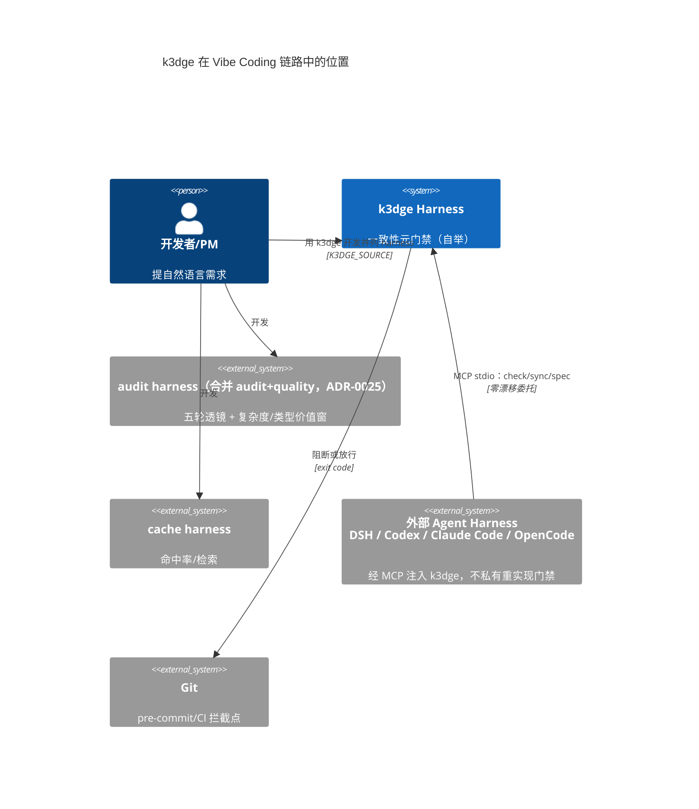
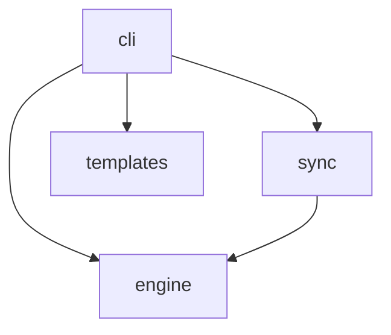
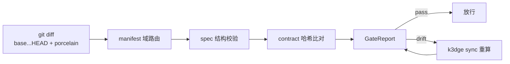
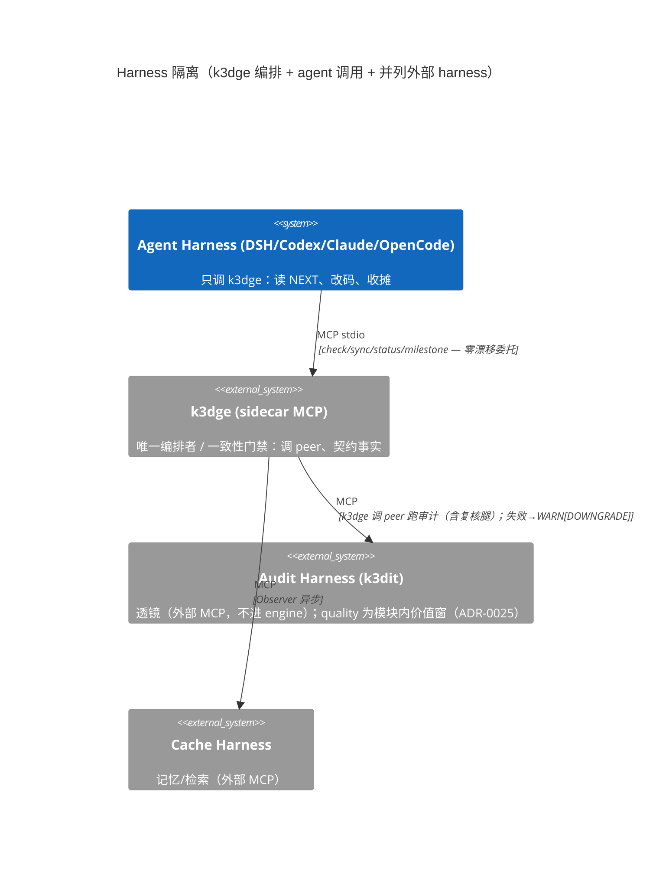
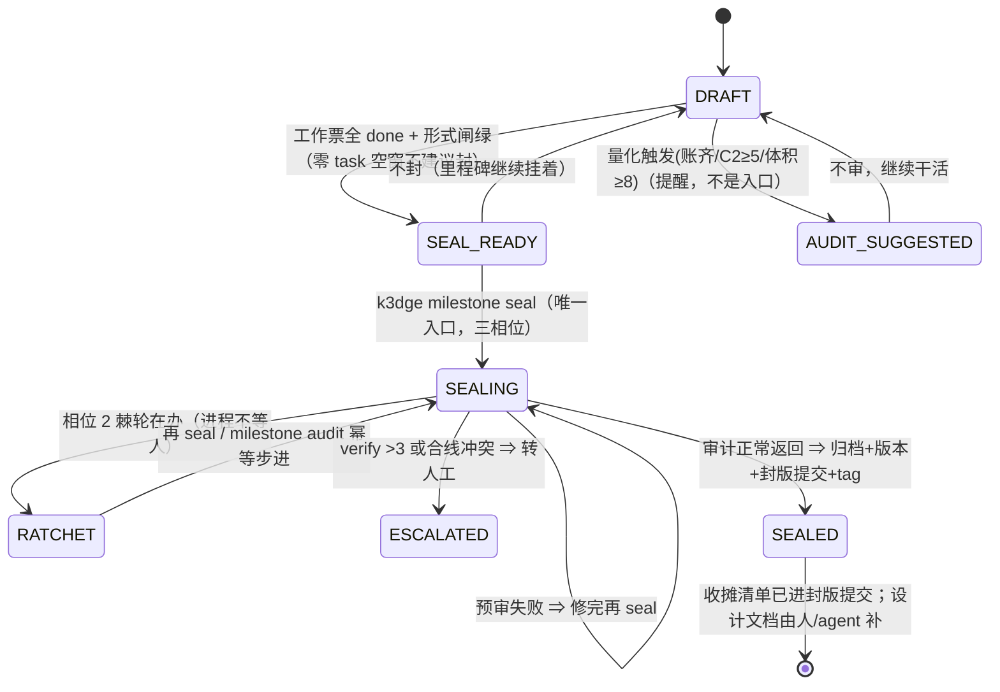
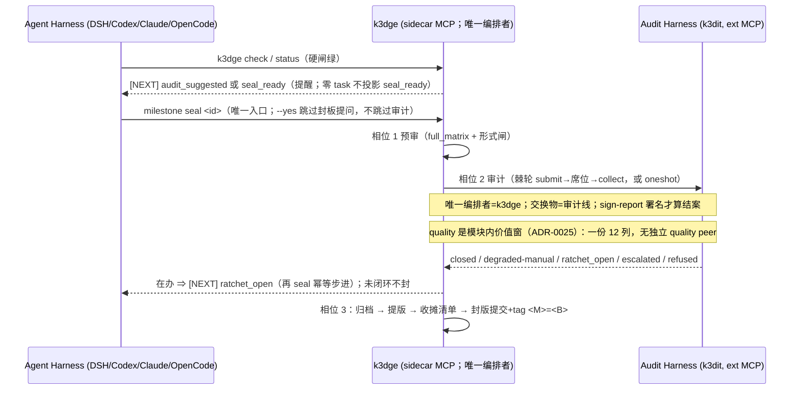

# Architecture — 系统全貌（System Overview）

> 人写常驻；§1 域表由 `k3dge check` 与 `.agent/manifest.json` 对账（`ARCH_TABLE_DRIFT`）。域级契约在 `docs/specs/<domain>/spec.md`，本文件只讲**域间关系与全局不变量**。
> 想快速定向 / 查术语 / 找文档入口，先看 [`encyclopedia.md`](encyclopedia.md)（知识地图，非第二套叙事）。
> 本文档遵循 **Diátaxis**（`guides`=教程/操作指南、`generated`=Reference 自动生成、`architecture` 本文件=`解释`）与 **C4-C1** 上下文视图。

## 0. C4-C1 系统上下文

## 1. 域地图（事实源：`.agent/manifest.json`）

| Domain | Source | Spec | Description |
| --- | --- | --- | --- |
| cli | `src/k3dge/cli` | `docs/specs/cli/spec.md` | 本仓终端/CI + 对外 harness 的 MCP 注入面 |
| engine | `src/k3dge/engine` | `docs/specs/engine/spec.md` | 门禁核心：diff / manifest / spec_schema / contract / evaluator / milestone / version / TEMPLATE_DRIFT |
| sync | `src/k3dge/sync` | `docs/specs/sync/spec.md` | spec 接口块与契约哈希回写；`docs/generated/` 机器文档（Diátaxis Reference） |
| templates | `src/k3dge/templates` | `docs/specs/templates/spec.md` | 脚手架生成器（k3dge-init.sh） |

## 2. 依赖方向

* `engine` 为门禁判定与生命周期治理核心，不依赖 `cli/sync/templates`。
* `sync` 依赖 `engine.contract`。
* `cli` 分两路：`main` 本仓；`mcp` 外部 harness 注入（ADR-0006）。
* `templates` 仅 `scaffolding`；`cli→templates` 仅 `init` 装配（ADR-0001）。

## 3. 数据流（提交门禁）

## 4. 全局不变量

* `GateReport.passed ⇔ violations.is_empty` —— 门禁语义基线（ADR-0001）
* `Contract Hash` 锚定公开签名；改 `src/<domain>/` 公开接口须 `k3dge sync` 回写哈希（双向绑定）—— ADR-0001
* `TEMPLATE_DRIFT` 仅自举、不 import `templates/` —— ADR-0001（`pairs.py:1`）
* spec 是契约、ADR 是决策事实源：操作层以指针引用 ADR 编号，不复写其正文 —— ADR-0001 / docs/adr/README.md
* 文档类型合同：`docs/<type>/AUTHORING.md`（软）+ `docs/<type>/.schema.json`（硬闸）；寻址公式在 `AGENTS.md`；薄索引 `docs/generated/docs-index.json` —— ADR-0018 §2.2–§2.4
* 协议仅 audit 两层 fallback，配置在 `.agent/pipeline.toml`，由 `PIPELINE_PROTOCOL_NOT_FOUND` 校验 —— ADR-0018
* MCP 为外部 harness 调用 engine 事实/工具的唯一面，禁止私有重实现门禁 —— ADR-0006

## 5. 组件解耦（通用模板）

## 6. Milestone 状态机（通用）

> **一次声明 + 一条链**（ADR-0004 §2.1.9）：`k3dge milestone seal <id>` 是唯一入口（预审 → 审计 → 审核后自动）。封板没有尺子；审计正常返回（闭集 `closed` / 带署名的 `degraded-manual`）才推进版号。独立入口 `milestone audit` 只补证据、不封板。`[NEXT] audit_suggested` 是量化提醒，不是「先审才能封」。发现用 `k3dit:pending <ID>` 钉在 `位置` 处，`check`/`status` 报 `pending_findings`。外来源 `k3dge milestone audit-submit`。架构/`overview.md` 更新不是钩子，在 closure 里做。零 task 空窗不投影 `seal_ready`。

## 7. 审计→封板时序（通用模板）

> 命令结果末尾统一附 `[NEXT] state=… milestone=…` 一行提示（MCP 同构 JSON `next` 字段），只给合法下一步、不替人决定；优先级 `pending_findings > ratchet_open > seal_ready > audit_suggested`，状态与 reasons 的唯一来源在 `engine/nextstep.STATE_OPTIONS` + `engine/audit_trigger.py`，与本节同一张状态机。新建 `src/` 域给 `new_domain`（是否算持久设计、写得对不对仍归 k3dit/人）；`overview.md` 更新已移出钩子、进 closure。
>
> **T-01 边界（doc 合规，ADR-0022 §2.2 🅰1）**：`check` 恒静态、不跑透镜。原「docs 改动 → `check` 绿后 `[NEXT] doc_audit` → `k3dge doc-audit`（非阻断）出报告 + 建带 `Milestone` 的 task」路径**已退休**（实测未走通：透镜说明/落点被丢弃、票绑错报告）。文档改动现在由**三层**承接：① 提交时结构闸（`.schema.json` + pre-commit）与**新建首次排查**（`DOC_NEW_UNSCREENED`，阻断一次，判定归 agent）；② `k3dge doc fix` 的确定性规约化（闭集规则、幂等；seal 轮跑）；③ 作者合规透镜（**里程碑审计**轮，`docs/protocols/audit_default.md` Doc Audit 节）。耐久＝**闸**不是票：封板前置 `docs_normalized` 要求 detector 零偏差。ADR 冲突/覆盖同样只在里程碑审计（`k3dge_adr_index` 出事实 + k3dit 判），不进每次 commit。

## 8. 决策与有意留索引

已定案决策：寻址用 `k3dge doc list --type adr`；主题见 [`docs/adr/README.md`](../adr/README.md)（历史编号不维护映射表，ADR-0023 §2.3）。

有意留（活文档常驻表）：[`docs/reviews/LEFTOVERS.md`](../reviews/LEFTOVERS.md) 为唯一事实源。
