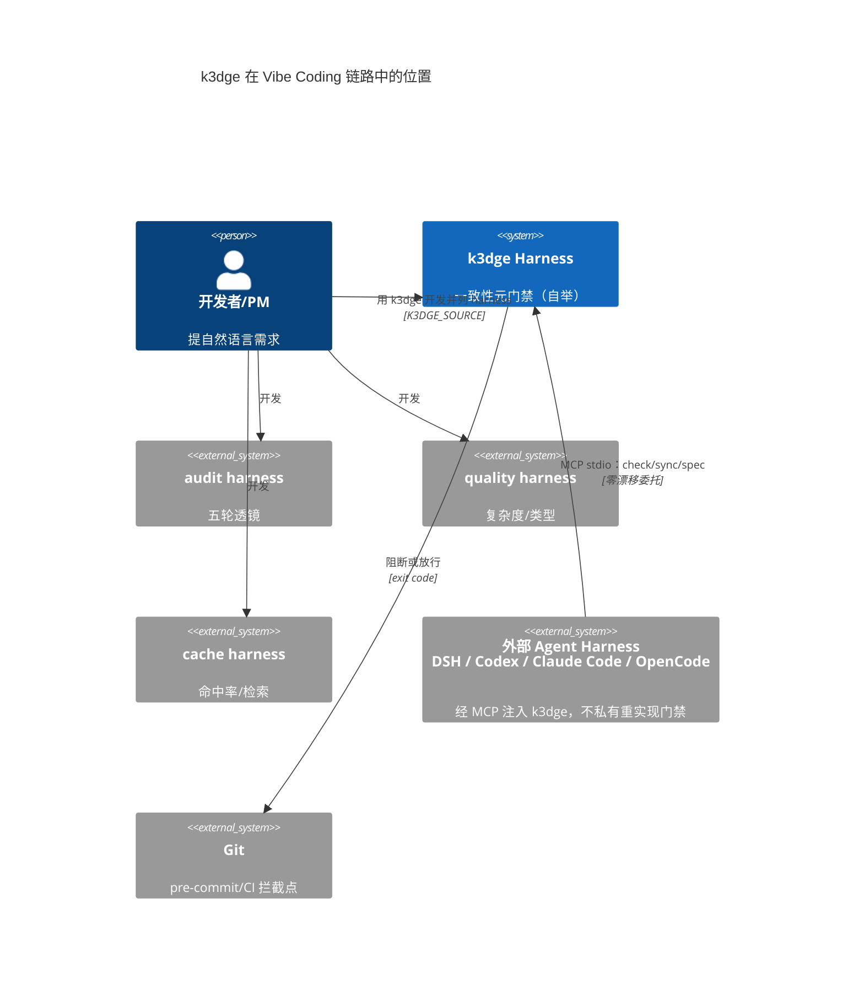
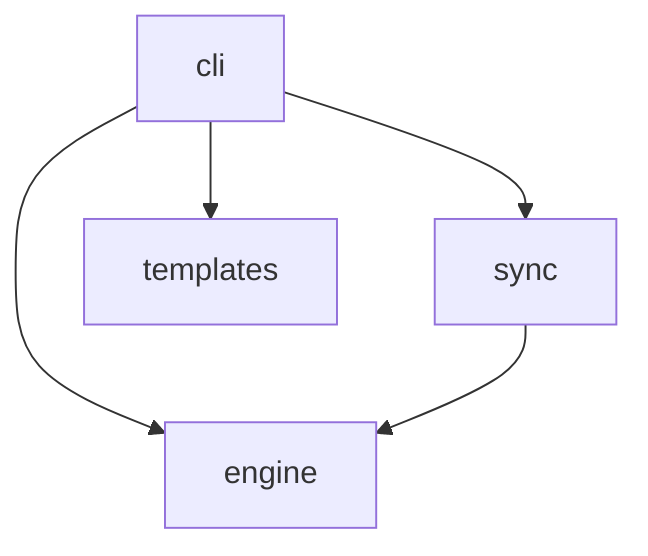
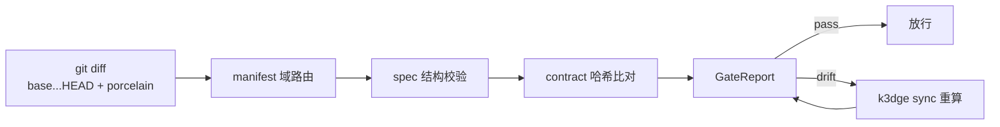
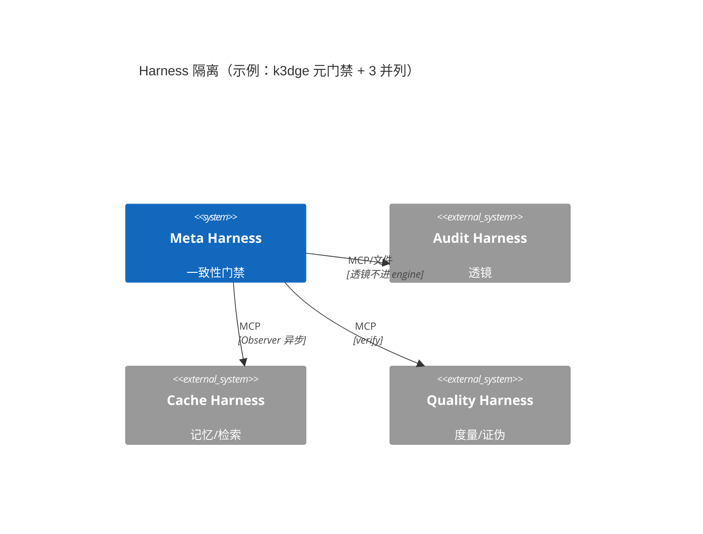
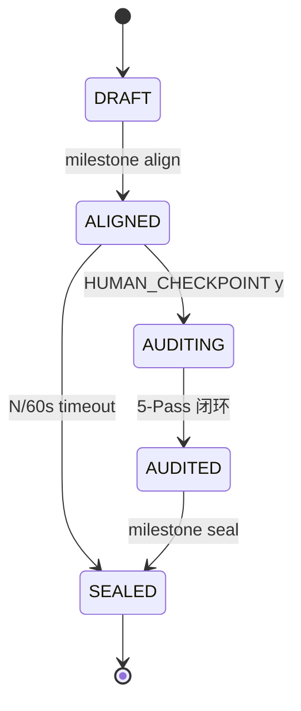
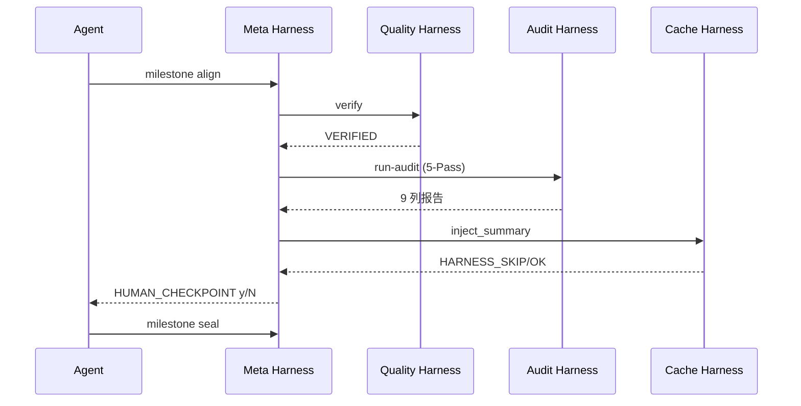

# Architecture — 系统全貌（System Overview）

> 人写常驻 + `k3dge sync` 聚合校验。域级契约在 `docs/specs/<domain>/spec.md`，本文件只讲**域间关系与全局不变量**。
> 本文档遵循 **Diátaxis**（`guides`=教程/操作指南、`generated`=Reference 自动生成、`architecture` 本文件=`解释`）与 **C4-C1** 上下文视图。

## 0. C4-C1 系统上下文

## 1. 域地图（事实源：`.agent/manifest.json`）

| Domain | Source | Spec | Description |
| --- | --- | --- | --- |
| cli | `src/k3dge/cli` | `docs/specs/cli/spec.md` | 本仓终端/CI + 对外 harness 的 MCP 注入面 |
| engine | `src/k3dge/engine` | `docs/specs/engine/spec.md` | 门禁核心：diff / manifest / spec_schema / contract / evaluator |
| sync | `src/k3dge/sync` | `docs/specs/sync/spec.md` | spec 接口块与契约哈希回写；`docs/generated/` 机器文档（Diátaxis Reference） |
| templates | `src/k3dge/templates` | `docs/specs/templates/spec.md` | 脚手架生成器（k3dge-init.sh） |

## 2. 依赖方向

* `engine` 为门禁判定与生命周期治理核心，不依赖 `cli/sync/templates`。
* `sync` 依赖 `engine.contract`。
* `cli` 分两路：`main` 本仓；`mcp` 外部 harness 注入（ADR 0006）。
* `templates` 仅 `scaffolding`；`cli→templates` 仅 `init` 装配（ADR 0018）。

## 3. 数据流（提交门禁）

## 4. 全局不变量

* `GateReport.passed ⇔ violations.is_empty`
* `Contract Hash` 锚定公开签名，`TEMPLATE_DRIFT` 仅自举（`pairs.py:1`）

## 5. 组件解耦（通用模板）

## 6. Milestone 状态机（通用）

## 7. 对齐协作时序（通用模板）

## 8. 决策与有意留索引

* 已定案决策：`docs/adr/README.md`（按编号索引）
* 有意留：`docs/reviews/SUMMARY.md` 顶部常驻表为唯一事实源（历史 `overview.md §5.1` 已迁移至此，此处不再维护）
