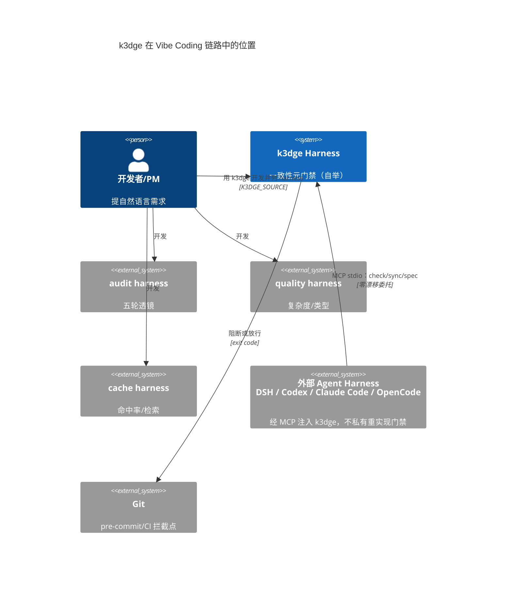
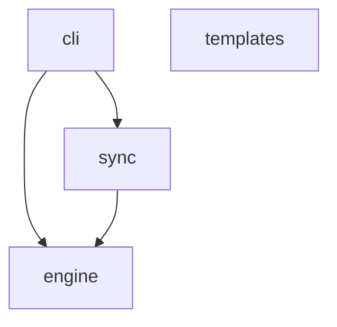
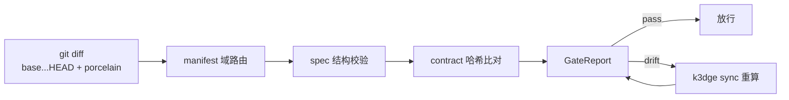

# Architecture — 系统全貌（System Overview）

> 人写常驻 + `k3dge sync` 聚合校验。域级契约在 `docs/specs/<domain>/spec.md`，本文件只讲**域间关系与全局不变量**。
> 本文档遵循 **Diátaxis**（`guides`=教程/操作指南、`reference`=参考、`architecture` 本文件=`解释`）与 **C4-C1** 上下文视图。

## 0. C4-C1 系统上下文

## 1. 域地图（事实源：`.agent/manifest.json`）

| Domain | Source | Spec | Description |
| --- | --- | --- | --- |
| cli | `src/k3dge/cli` | `docs/specs/cli/spec.md` | 本仓终端/CI + 对外 harness 的 MCP 注入面 |
| engine | `src/k3dge/engine` | `docs/specs/engine/spec.md` | 门禁核心：diff / manifest / spec_schema / contract / evaluator |
| sync | `src/k3dge/sync` | `docs/specs/sync/spec.md` | spec 接口块与契约哈希回写；docs/reference 机器文档 |
| templates | `src/k3dge/templates` | `docs/specs/templates/spec.md` | 脚手架生成器（k3dge-init.sh） |

## 2. 依赖方向

* `engine` 为门禁判定与生命周期治理核心（`diff/manifest/spec_schema/contract/evaluator` + `milestone` 状态机 + `version` 镜像闸 + 自举 `TEMPLATE_DRIFT`），不依赖 `cli/sync/templates`。
* `sync` 依赖 `engine.contract` 做接口提取与哈希。
* `cli` 分两路、都不含判定：`main` = 本仓 shell/pre-commit/CI；`mcp` = DSH/Codex/Claude Code/OpenCode 等外部 harness 的注入适配（ADR 0006）。不加 `k3dge audit`（ADR 0005）。
* `templates` 仅做 scaffolding（零运行时依赖 `engine`）。`TEMPLATE_DRIFT` 的 `PAIRS` 在 `engine.pairs`，比对磁盘 `templates/assets`，仅自举仓启用（ADR 0018）。
* `engine` 内两块：**判定**（`ConsistencyEngine` → `GateReport`）与 **生命周期副作用**（`milestone` 写 reviews / 搬 tasks）。不拆第五域。
* 审计透镜不在本图。并列仓 **k3dit**（`../k3dit`），由本仓 k3dge 门禁开发（ADR 0008）。

## 3. 数据流（提交门禁）

## 4. 全局不变量

* `GateReport.passed ⇔ violations.is_empty`；`docs/` 根直放文件被 `DOCS_ROOT_DISALLOWED` 拦截。
* `Contract Hash` 仅覆盖 **Python 顶层公开签名**（见 engine spec §3）；函数体/注释/`__init__.py` 不改哈希。TypeScript 为尽力而为。
* **文档语义边界**：`docs/reference/*` 是 manifest 投影，可随时重建，**永不作为一致性判据**；一致性判据仅 `docs/specs/*` 与本文件。看似冗余的成对产物，动前必查 `docs/adr/`（见 ADR 0002），无据则询问用户。
* **`.agent/` 是 k3dge 进程配置**（ADR 0014，修正 0013）：`AGENTS.md` 广播怎么干；`.agent/manifest.json` 按路径直取、管在哪干；`rules/` 是 how 切片。不要浏览点目录。

## 5. 已定案决策速查（do NOT re-litigate）

> 每行一句结论 + 出处。重提前先读对应记录；要推翻必须显式改 ADR 并留下痕迹。

| 决策 | 结论 | 出处 |
| --- | --- | --- |
| 门禁时机 | 按 branch（merge-base 基准），不做同 commit 强绑 spec | ADR 0001 |
| 契约范围 | 哈希只锚定公开接口签名；函数体/注释变更不触发 | ADR 0001 / engine spec §3 |
| 自愈方式 | `k3dge sync` 确定性生成，Agent 审阅不发明 | ADR 0001 |
| README 地位 | 人写常驻、收尾脚本刷新布局；脚手架不生成 README | 会话决议 2026-08-20 |
| pre-commit 实现 | `language: python` + `scripts/gate.py`；不用 `additional_dependencies: ["."]` 自装 | 会话实测（pre-commit `.` 解析到占位仓库） |
| 文档语义 | reference=投影 / architecture+specs=判据，禁止合并 | ADR 0002 |
| Mermaid 选型 | 架构/状态机统一 mermaid 文本块；契约保持代码文本 | memo 2026-08-21-mermaid-uml-discussion |
| L2 范围 | 本地默认 `k3dge check` 只验 git 触及域；CI 与 `milestone align` 用 `--force-full` | ADR 0005；CI 2026-08-25 |
| 质量闸归属 | 简洁性/全局优化不进 k3dge 门禁；走 `.agent/rules/02-simplification.md` 流程 + 外部质量 harness | memo 2026-08-21-code-quality-discussion |
| 本地自用 | init 默认 `pip install -e ".[dev]"`（含 mcp）；下游 `pip install -e "${K3DGE_SOURCE}[mcp]"` | ADR 0005 |
| 开发阶段 | **自举**：用 k3dge 开发 k3dge；生产 ready = 本仓门禁可用，不是 PyPI 产品 | ADR 0007 |
| L2 执行集 | `manifest.tests` 目录；矩阵只验文件存在；align = `evaluate(force_full)` | ADR 0005 |
| 审计位置 | 透镜在 `harnesses/audit/`，不进 `src/k3dge`、不加 `k3dge audit` | ADR 0005 |
| MCP 角色 | 外部 harness 注入面，不是第二套 TUI | ADR 0006 |
| 并列 harness | 用本仓 k3dge 开发 audit / quality / cache，禁止长进 `src/k3dge` | ADR 0008 |
| 文档时机 | 用户只说做什么；Agent 按 AGENTS.md §12 触发维护，不必再喊 | ADR 0009 |
| Agent 对齐 | 先读已敲定 ADR，再用用户的粗意图去映射；禁止逼用户重设计 | ADR 0010 |
| 存在目的 | 罩住后续项目的 Agent 失败态（漂移/幻觉/局部坏整体等，不必穷举） | ADR 0011 |
| `.agent/rules` | 协议切片，不是第二份协议；`AGENTS.md` 为准；init 写出完整 00–03（含 02） | ADR 0012 |
| `.agent/` 目录 | 进程配置：AGENTS.md 广播怎么干，manifest 按路径管在哪干；不要浏览点目录 | ADR 0014（修正 0013） |
| 断言证据链 | 对本仓的事实断言须有产物+消费者+到达方式；缺链不得下结论；不进 `k3dge check` | ADR 0015 |
| 活文档接续 | 搬走/删除被点名的事实源时同轮改指针；memo 晋升目标消失则搬回顶层 | ADR 0016 |
| 版本与日志 | `pyproject.toml` 单源 ↔ `manifest`/`__init__.py` 镜像 + `CHANGELOG.md`；`VERSION_MISMATCH` 门禁；`seal` 自动 `patch` | ADR 0017 |
| 脚手架漂移锁 | `PAIRS` 在 engine；仅自举仓比对 `templates/assets`；engine 不 import templates | ADR 0018 |
| 下游 init | 至少一域否则 `NO_DOMAINS`；协议包不带本仓审计索引；AGENTS 读本仓 adr/overview | ADR 0019 |

### 5.1 审计有意留（勿当未修缺陷重开）

> 有意留 = 已看见、已否决落地，不是漏修。新审计先读本表；要推翻必须改本表并留下痕迹。完整否决过程在对应 `docs/reviews/` 报告。

| ID | 现象 | 为什么留下 | 何时重开 |
| --- | --- | --- | --- |
| A-11 | `diff._run` 调 git 无 timeout | 本地 git 通常立刻返回。pytest 的 300s timeout 是因为测试可能真跑很久；给 git 加 timeout 会把仓库卡锁变成门禁假失败，且没有一个既不误杀又有用的秒数。热路径，不拿冷路径的 timeout 套过来。 | git 调用在 CI 上可复现地挂死，或门禁开始走远程 git |
| S-13 | MCP `workspace_path` 可指向任意目录再 `check`/`seal` | 当前是本机 stdio 桥：能调 MCP 的人已经是这台机器上的 OS 用户。再拦「必须含 `.agent`」挡不住同用户，只增加摩擦。 | MCP 改为网络可达（别的机器/别的用户能调）时必须重开，不能再当有意留 |
| F-14 / LR-5 | `_replace_between_all` 多轮切片 O(N²) | 只切 spec 接口块，单文件 ≪ 100KB，实际微秒级。改成一次扫描更难读，还容易把「折叠重复标记」搞错。 | 单 spec 经常超过约 100KB，或 sync 成为可测瓶颈 |
| F-15 / LR-6 | `milestone` align/seal 各自扫一遍 `docs/tasks/*.md` | 活跃任务按设计很少（seal 会归档），OS 页缓存够用。缓存列表还要处理「刚写完又读」的一致性，收益低于复杂度。 | 顶层活跃任务经常 >20，或扫描成为可测瓶颈 |
| R3-1 | README 布局 / `docs/reference/domains.md` / overview 三处拼域表行 | 只有 4 个域。抽公共函数会把「投影」和「判据」耦在一起；ADR 0002 规定 reference 可重建、overview 是人写判据，本来就不该合成一个生成器。 | 域数量大到手写/投影明显分叉，或第三次发生「Agent 要合并域表」事故（ADR 0002 升级条件） |
| R3-4 | L2 跑测试时函数内 `import subprocess` | 冷路径：没 `--with-tests` 根本不走。挪到文件顶对性能和可读性几乎没差，属于风格。 | 该 import 被热路径（无 `--with-tests` 的 `check`）调用时 |
| P1-06 | `K3DGE_BASE_SHA` 未校验就进 git 修订范围 | 参数是 `{sha}...HEAD` 单个 argv，不是 shell 拼接。本地环境。 | 该变量来自不可信环境 |
| P1-09 | `test_command_template` 未白名单 | 能改 manifest 的人已能改测试命令（同 S-13 信任面） | 同 S-13：MCP/配置改为网络可达 |
| P2-PUR-04 | `render_readme_layout` 公开、`sync_all` 不再调用 | `scripts/generate-docs` 仍调用 | 该函数无任何调用方 |
| D-01 / D-02 / D-03 / D-06 / D-10 / D-11 | 提取器 ABC/OCP 注册/TS `include_doc`/装饰器残/IO 不对称/布尔隔离 | 只有 Python+TS 两提取器，本仓零 TS 文件；register/ABC/双类型无消费者 | 新增第三语言，或本仓出现须进哈希的 `.ts` 域，或公开 API 用上 overload/setter/类饰 |
| D-07 / D-08 / D-12 | MCP 用 CLI 私有符号、payload 扩展 `ok`、seal 无 `no_version_bump` | mcp 与 main 同域适配；本地 stdio；MCP seal 恒 bump 可接受 | MCP 改网络，或下游依赖 `ok`/`render_output`，或需要「归档不 bump」 |
| D-09 | `version.py` 正则只认双引号、`part` 与 `set_version` 静默互斥 | 本仓 `pyproject` `[project]` 双引号形态固定；canonical 闸已在 | TOML 出现单引号 version，或 `bump(set+part)` 成为须互斥的公开 API |
| P4-05 / P4-08 | architecture 模板与运行时状态不进 `PAIRS` | G-04 刻意豁免；分类写在 `pairs.py` 模块注释 | 决定把 architecture 与本仓 overview 字节锁死，或把 `.agent/milestone` 当模板 |
| P4-06 | `cmd_doc`/`audit`/`task` 无矩阵行 | doc/task 薄路由；audit 去留见 M1 P2-PUR-06，不另开矩阵债 | 三命令不再是薄路由 |
| P4-07 | 矩阵引用 ≠ L2 执行集 | ADR 0005：L2=`manifest.tests`，矩阵只验存在 | 推翻 ADR 0005 的 L2 范围 |
| P5-02 / P5-03 / P5-04 / P5-05 / P5-06 / P5-07 | TS Parser 每文件重建、PAIRS 每次 44 读、`intersection`、version 双解析、任务双 glob、scaffold eager | 规模阈值未到，OS 页缓存够 | 首个 TS 域 / `check`>1s 或 `PAIRS`>40 / `py-spy` 热点 / 活跃任务>20 / 启动>200ms |

已关闭、不再算有意留：R3-2（sync 每域抽接口两遍）已由 F-13 的 `iface_cache`/`doc_cache` 取代。
