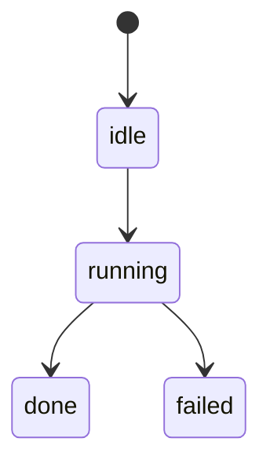

# Domain Specification: <domain>

- **Status**: Active
- **Module Path**: `src/<domain>`
- **Contract Hash**:
- **Last Updated**: 2026-08-20

## 1. Domain Boundary & Responsibilities
- **In Scope**:
- **Out of Scope**:

## 2. Public Interfaces & Type Contracts
<!-- k3dge:interfaces-start -->
```python
```
<!-- k3dge:interfaces-end -->

## 3. State Machine & Invariants



## 4. Verification Matrix
| Scenario ID | Level | Input Condition | Expected Outcome | Test File |
| --- | --- | --- | --- | --- |
