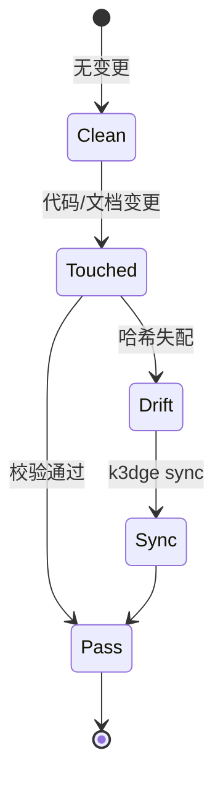

# Domain Specification: engine

- **Status**: Active
- **Module Path**: `src/k3dge/engine`
- **Contract Hash**: `sha256:259d3af3c6de994a0a51073a259534d2e35c8e710d27bdadcf7298a201ca0bdb`
- **Last Updated**: 2026-09-30

## 1. Domain Boundary & Responsibilities
- **In Scope**:
  - 解析并校验 `.agent/manifest.json`（域路由、包根、忽略规则）。
  - 提取当前 Git 工作区相对 `merge-base(main, HEAD)` 的变更文件列表。
  - 校验 `spec.md` 的 L0 结构完整性（必需章节）。
  - 从域源码提取公开接口签名并计算归一化哈希（L1 契约）。
  - 判定 `src/<domain>` 与 `docs/specs/<domain>` 之间的一致性，生成 `GateReport`。
  - 里程碑生命周期治理：扫描 `docs/tasks/` 的 `Status/Milestone`、全域回退检验（`regression`，旧合规被新闸误判的退化）、tasks 物理归档至 `docs/tasks/archive/<id>/`、本里程碑 reviews 归档至 `docs/reviews/archive/<id>/` 并改写 `docs/reviews/LEFTOVERS.md` 相对链接。**约定＝里程碑任务留 `docs/tasks/` 顶层，由 `milestone seal` 封板时 batch archive**；提前手工归档会让顶扫看不到任务，align/seal 经 `premature_archive_hint` 给可操作提示（不再只报 `No tasks found`）。closure 清单记 bump 后**终版**。
  - 版本三件套镜像（`VERSION_MISMATCH`）。canonical 全缺不阻断；无 `VERSION_MISSING`。
  - 自举仓脚手架字节锁（`TEMPLATE_DRIFT`）：`engine.pairs.PAIRS` 比对 `templates/assets`，不 import `k3dge.templates`（ADR-0001）。
  - 协议治理：`docs/protocols/*.md`（`audit_default.md` / `verify_default.md`）为 pipeline manual fallback；类型写法在各 `docs/<type>/AUTHORING.md`；结构闸是 `docs/<type>/.schema.json`。`engine.doc_catalog` 解析该 JSON、建薄索引、提供 `list_docs` / `where_doc` / `grep_docs`（正文只回 path/line）。`engine.protocol.write_incident` 把持续偏离写入 `docs/incidents/`。
  - 空 `manifest.domains` 报 `NO_DOMAINS`（下游空壳不得假绿）。
  - 其余引擎面：`markers`（钉语法 v2 解析/校验）、`nextstep`（`[NEXT]` 状态机边 + 纵深指针）、`audit_trigger`（审计触发/闭环计数）、`audit_checklist`、`audit_flow`（审计线消费侧）、`worktree`（审计线 worktree）、`pipeline_runner`（peer 出向 MCP/降级）、`pipeline_schema`（`pipeline.toml` 结构闸）、`gates`（硬闸契约加载）、`adr_gate`（封版 ADR 闸）、`process_audit`（证据链完整性/可追溯闸）、`search`（受控检索）。
- **Out of Scope**:
  - 终端彩色渲染与 CLI 解析（由 `cli` 域负责）。
  - spec 接口块的生成与回写（由 `sync` 域负责）。
  - 项目脚手架初始化（由 `templates` 域负责）。下游仓不跑 `TEMPLATE_DRIFT`。

## 2. Public Interfaces & Type Contracts
<!-- k3dge:interfaces-start -->
```python
from __future__ import annotations
from pathlib import Path
from typing import List
from typing import Optional
from typing import Tuple
adrs_all_accepted(workspace: Path) -> Optional[str]
adr_landed(workspace: Path) -> Optional[str]
reconcile_supersedes(workspace: Path) -> Optional[str]
amend_format(workspace: Path) -> Optional[str]
from __future__ import annotations
from pathlib import Path
from typing import List
from typing import Optional
from typing import Tuple
from k3dge.engine import gates
from k3dge.engine.evaluator import ConsistencyEngine
from k3dge.engine.task_index import MilestoneTask
from k3dge.engine.task_index import scan_milestone_tasks
from k3dge.engine.task_index import work_pending
run_milestone_alignment(workspace: Path, milestone_id: str) -> Tuple[bool, str, List[MilestoneTask]]
from __future__ import annotations
from pathlib import Path
atomic_write_text(path: Path, text: str, encoding: str='utf-8') -> None
from __future__ import annotations
from pathlib import Path
from typing import List
from typing import Optional
from typing import Tuple
PREFIX = 'k3dge-commit: '
DEFAULT_SECRET = 'k3dge-local-attest-v1'
WORDLIST = ['aura', 'brick', 'cedar', 'delta', 'ember', 'flux', 'glyph', 'haven', 'iris', 'jolt', 'kiwi', 'lumen', 'moss', 'nexus', 'onyx', 'prism', 'quill', 'rune', 'sage', 'tide', 'umber', 'vault', 'wisp', 'xenon', 'yarn', 'zephyr']
LINE_RE = re.compile('^k3dge-commit: (.+?) @ (.+?) #([a-z]+)$')
secret() -> str
tree_hash(workspace: Path) -> str
utc_minute(when_iso: str)
window(when_iso: str) -> str
windows(when_iso: str) -> List[str]
token(workspace: Path, when_iso: str) -> str
line(workspace: Path, who: str='') -> str
append_to_message(workspace: Path, msg: str, who: str='') -> str
verify_commit(workspace: Path, h: str) -> Tuple[bool, str]
from __future__ import annotations
from pathlib import Path
from typing import Dict
from typing import List
from typing import Optional
from typing import Tuple
SUPPORTED_BUNDLE_VERSIONS = (1,)
K3DIT_ENV = 'K3DIT_BIN'
audit_cache_root() -> Path
tool_state_dir(workspace: Path) -> Path
bundle_input_matches(bundle_input: object, expect_input: object) -> bool
find_k3dit(workspace: Path) -> Optional[List[str]]
run_path_audit(workspace: Path, out: Path, *, mode: str='full', pins: str='inplace', scope: str='', timeout: int=3600, k3dit: Optional[List[str]]=None) -> dict
salvage_bundle(workspace: Path, out: Path, *, k3dit: Optional[List[str]]=None, timeout: int=300) -> dict
write_run_digest(out: Path, **facts: object) -> str
verify_bundle(bundle: Path, *, expect_input: str='', require_closed: bool=False, accept_baseline_drift: str='') -> dict
bundle_facts(bundle: Path) -> dict
bundle_digest(bundle: Path) -> str
apply_bundle(workspace: Path, bundle: Path, *, dry_run: bool=False, allow_dirty: bool=False, exclude: Optional[List[str]]=None, exclude_hunks: Optional[Dict[str, List[int]]]=None) -> dict
ESCALATION_UNCLOSED = '待验：未闭环（转人工）'
ESCALATION_NOTLANDED = '升级：本次未落'
ESCALATION_MARKERS = (ESCALATION_UNCLOSED, ESCALATION_NOTLANDED)
reconcile_report_rows(body: str, excluded: Optional[List[str]]=None, escalated: Optional[List[str]]=None) -> Dict[str, object]
land_report(workspace: Path, milestone_id: str, out: Path, *, extra_files: Optional[List[str]]=None, why: str='', note: str='', excluded: Optional[List[str]]=None, escalated: Optional[List[str]]=None) -> dict
commit_applied(workspace: Path, message: str, files: List[str]) -> Tuple[str, str]
consume(workspace: Path, bundle: Path, *, dry_run: bool=False, k3dit: Optional[List[str]]=None, expect_input: Optional[str]=None, require_closed: bool=True, accept_baseline_drift: str='', exclude: Optional[List[str]]=None, landing: str='partial') -> dict
from __future__ import annotations
from pathlib import Path
from typing import Optional
CHECK_LIST_PATH = '.agent/audit_checklist.json'
build_checklist(workspace: Path, milestone_id: Optional[str]=None) -> dict
read_checklist(workspace: Path, milestone_id: Optional[str]=None) -> Optional[dict]
ensure_checklist(workspace: Path, milestone_id: Optional[str]=None) -> dict
reset_for_audit(workspace: Path, milestone_id: Optional[str]=None) -> dict
get_verify_attempts(workspace: Path) -> int
bump_verify_attempt(workspace: Path) -> int
reset_verify_attempts(workspace: Path) -> None
from __future__ import annotations
from pathlib import Path
from typing import Dict
from typing import Optional
from k3dge.engine import report_table
from k3dge.engine.pipeline_runner import run_action
STATE_REL = '.agent/audit_jobs.json'
AUDIT_RESULTS = ('closed', 'degraded-manual', 'escalated', 'refused')
SEALABLE_AUDIT_RESULTS = ('closed', 'degraded-manual')
audit_call_result(produced) -> str
audit_result_of(status: str) -> Optional[str]
audit_evidence(workspace: Path, milestone_id: str) -> dict
prune_finished(workspace: Path) -> Dict[str, object]
from __future__ import annotations
from pathlib import Path
from typing import Any
from typing import Dict
from typing import Iterable
from typing import List
from typing import Optional
from typing import Set
from k3dge.engine.audit_verify import replay_to_baseline
touched_files(bundle: Path) -> Set[str]
hunks_overlapping(patch_text: str, rel: str, lines: List[int], *, slack: int=2) -> Dict[str, Any]
merge_into(workspace: Path, bundle: Path, *, exclude: Iterable[str]=()) -> Dict[str, Any]
patch_rels(bundle: Path, name: str) -> Set[str]
union_pins(workspace: Path, bundle: Path, rel: str) -> Dict[str, Any]
from __future__ import annotations
from pathlib import Path
from k3dge.engine import report_table
from __future__ import annotations
from pathlib import Path
from typing import List
from typing import Optional
from typing import Tuple
from k3dge.engine import gates
from k3dge.engine.milestone_pointer import get_current_milestone
from k3dge.engine.task_index import scan_milestone_tasks
compute_audit_suggestion(workspace: Path) -> Tuple[bool, List[str]]
audit_closed(workspace: Path, milestone_id: str) -> bool
from __future__ import annotations
from pathlib import Path
from typing import Any
from typing import Dict
from typing import List
from typing import Optional
from typing import Tuple
from k3dge.engine.report_table import REPORT_STATUSES
from k3dge.engine.report_table import TABLE_HEADER
from k3dge.engine.report_table import parse_rows
REPORT_COLUMNS = tuple(TABLE_HEADER.split('|'))
OPEN_STATES = tuple(sorted(_OPEN_KINDS))
CLOSED_STATES = tuple((k for k in _MARKER_KINDS if k not in _OPEN_KINDS))
ROW_STATE_ZH = {'fixed': '已修', 'leftover': '有意留', 'pending': '待修', 'fixnote': '待验证', 'disputed': '待裁'}
REQUIRED_CELLS = ('ID', '日期', '严重度', '优先级', '类型', '问题描述', '位置', '状态', '处置')
has_marker_line(text: str, rel: str) -> bool
strip_markers(text: str, rel: str) -> str
replay_to_baseline(bundle: Path, dest: Optional[Path]=None, only: Optional[List[str]]=None) -> Dict[str, Any]
verify_bundle_local(bundle: Path, *, expect_input: str='', require_closed: bool=True, accept_baseline_drift: str='') -> dict
from __future__ import annotations
from pathlib import Path
mechanical_commit(sha: str, subject: str, body: str) -> bool
build_notes_from_range(workspace: Path, previous_tag: str='') -> tuple
from __future__ import annotations
from pathlib import Path
from typing import List
from typing import Optional
from typing import Tuple
INTERFACE_START = '<!\x2d\x2d k3dge:interfaces\x2dstart \x2d\x2d>'
INTERFACE_END = '<!\x2d\x2d k3dge:interfaces\x2dend \x2d\x2d>'
class ContractExtractor
    can_handle(self, path: Path) -> bool
    extract(self, path: Path, include_doc: bool=False) -> str
class PythonExtractor(ContractExtractor)
    can_handle(self, path: Path) -> bool
    extract(self, path: Path, include_doc: bool=False) -> str
register_extractor(ext: ContractExtractor, *, override: bool=False) -> None
extract_python_interface(source: str, include_doc: bool=False) -> str
normalize(interface: str) -> str
compute_hash(interface: str) -> str
collect_domain_interface(src_dir: Path, manifest=None, workspace_root: Path | None=None, include_doc: bool=False) -> str
verify_contract(src_dir: Path, spec_content: str, manifest=None, workspace_root: Path | None=None) -> Tuple[bool, Optional[str], str]
symbol_diff(spec_content: str, src_dir: Path, manifest=None, workspace_root: Path | None=None) -> dict
from __future__ import annotations
from pathlib import Path
from typing import List
BASE_CANDIDATES = ('origin/main', 'origin/master', 'main', 'master')
class GitError(RuntimeError)
resolve_base(workspace: Path) -> str
get_changed_files(workspace: Path) -> List[str]
from __future__ import annotations
from pathlib import Path
from typing import Any
from typing import Dict
from typing import Iterable
from typing import List
from typing import Optional
from typing import Tuple
from k3dge.engine.models import Violation
from k3dge.engine.pure_schema import check_section_order
from k3dge.engine.pure_schema import parse_doc_schema
SCHEMA_FILE = '.schema.json'
INDEX_REL = 'docs/generated/docs-index.json'
AUTHORING_FILE = 'AUTHORING.md'
AUX_NAMES = frozenset({'README.md', '_template.md', 'AUTHORING.md', 'summary.md', 'SUMMARY.md', 'LEFTOVERS.md', 'leftovers.md'})
SKIP_TYPES = frozenset({'generated'})
iter_doc_types(workspace: Path) -> List[str]
iter_managed_files(workspace: Path, typ: str, *, include_archive: bool=False, include_retired: bool=False) -> List[Path]
build_card(workspace: Path, typ: str, path: Path) -> dict
build_docs_index(workspace: Path, *, include_archive: bool=False, include_retired: bool=False) -> dict
retired_ledger_cards(workspace: Path) -> List[dict]
write_docs_index(workspace: Path) -> Path
list_docs(workspace: Path, *, typ: Optional[str]=None, ident: Optional[str]=None, q: Optional[str]=None, include_archive: bool=False, include_retired: bool=False) -> List[dict]
where_doc(workspace: Path, ident: str, *, include_retired: bool=True) -> List[dict]
GREP_MAX_FILES = 20
GREP_MAX_LINES_PER_FILE = 8
grep_docs(workspace: Path, query: str, *, typ: Optional[str]=None, line: bool=False, include_archive: bool=False, max_files: int=GREP_MAX_FILES, ignore_case: bool=True) -> List[dict]
validate_docs(workspace: Path, types: Optional[Iterable[str]]=None) -> List[Violation]
validate_docs_index(workspace: Path) -> List[Violation]
analyze_adr_coverage(workspace: Path) -> dict
from __future__ import annotations
from pathlib import Path
from typing import Dict
from typing import List
from typing import Tuple
from k3dge.engine import pure_refs
FIXABLE_RULES: Tuple[str, ...] = ('MD_TRAILING_WS', 'MD_CRLF', 'MD_NO_FINAL_NEWLINE', 'TASK_BODY_META_REDUNDANT', 'ADR_AMEND_ORDER', 'ADR_FOOTNOTE_TAIL', 'ADR_FOOTNOTE_LINE', 'ADR_FOOTNOTE_SEQ', 'ADR_AMEND_MARKER_TEXT', 'INCIDENT_ID_REDUNDANT')
BY_COMMAND: Dict[str, str] = {'DOC_INDEX_STALE': 'k3dge sync', 'CONTRACT_DRIFT': 'k3dge sync', 'CONTRACT_HASH_MISSING': 'k3dge sync', 'ADR_SUPERSEDE_UNRECONCILED': 'k3dge sync', 'VERSION_MISMATCH': 'k3dge version bump', 'EXTRACTOR_PLUGIN_STALE': 'k3dge extractor sync', 'SYMBOL_INDEX_STALE': 'k3dge index', 'DOCS_GENERATED_STALE': 'k3dge sync', 'MCP_JSON_PEER_MISSING': 'k3dge mcp sync'}
managed_docs(workspace: Path) -> List[Path]
scan(workspace: Path) -> List[Dict[str, str]]
apply(workspace: Path, *, dry_run: bool=False) -> Dict[str, object]
from __future__ import annotations
from pathlib import Path
from typing import Optional
AUTHORING = 'AUTHORING.md'
WS: Path = _detect_workspace()
set_workspace(workspace: Path) -> None
staged_files() -> list[str]
staged_added() -> list[str]
relevant_for_check(files: list[str]) -> bool
check_one(rel: str) -> list[str]
missing_declared_facts(code: str, facts: dict, gate_facts=None) -> list
run_schema_gate(files: list[str], pure_schema, pure_refs, gate_facts=None) -> tuple[list[str], list[str]]
run_screen_gate(added: list[str], pure_refs, gate_facts=None) -> list[tuple[str, str]]
main(argv: Optional[list]=None) -> int
from __future__ import annotations
from pathlib import Path
from typing import List
from typing import Optional
from typing import Set
from k3dge.engine import contract
from k3dge.engine import diff
from k3dge.engine import spec_schema
from k3dge.engine.diff import GitError
from k3dge.engine.manifest import Manifest
from k3dge.engine.manifest import ManifestError
from k3dge.engine.models import GateReport
from k3dge.engine.models import Violation
from k3dge.engine.pairs import PAIRS
class ConsistencyEngine
    evaluate(self, run_tests: bool=False, force_full: bool=False, staged: bool=False) -> GateReport
from __future__ import annotations
from pathlib import Path
from typing import Any
emit(workspace: Path, evt: str, **data: Any) -> None
read_events(workspace: Path, last: int=20) -> list[dict[str, Any]]
from __future__ import annotations
from pathlib import Path
from typing import Any
from typing import Dict
from typing import List
from typing import Optional
from typing import Tuple
CONFIG_REL = '.agent/extractors.toml'
PLUGDIR_REL = '.agent/extractors'
MARKER = '# GENERATED by `k3dge extractor sync`'
DEFAULT_LANGS: Dict[str, Dict[str, Any]] = {'typescript': {'grammar': 'tree_sitter_typescript', 'package': 'tree-sitter-typescript', 'lang_func': 'language_typescript', 'lang_name': 'typescript', 'suffixes': ['.ts', '.tsx', '.js'], 'wrapper': ['export_statement'], 'wrapper_kw': 'export', 'fn': ['function_declaration', 'method_definition'], 'container': ['class_declaration'], 'body': ['class_body'], 'member': ['method_definition', 'public_field_definition', 'field_definition'], 'type': ['interface_declaration', 'type_alias_declaration', 'enum_declaration'], 'lexical_nodes': ['lexical_declaration'], 'lexical_markers': ['=>', 'function'], 'lexical': True}, 'go': {'grammar': 'tree_sitter_go', 'package': 'tree-sitter-go', 'lang_func': 'language', 'lang_name': 'go', 'suffixes': ['.go'], 'wrapper': [], 'wrapper_kw': '', 'fn': ['function_declaration', 'method_declaration'], 'container': [], 'body': [], 'member': [], 'type': ['type_declaration', 'const_declaration'], 'lexical_nodes': [], 'lexical_markers': [], 'lexical': False}, 'rust': {'grammar': 'tree_sitter_rust', 'package': 'tree-sitter-rust', 'lang_func': 'language', 'lang_name': 'rust', 'suffixes': ['.rs'], 'wrapper': [], 'wrapper_kw': '', 'fn': ['function_item'], 'container': ['impl_item', 'trait_item'], 'body': ['declaration_list'], 'member': ['function_item', 'function_signature_item', 'const_item', 'type_item', 'associated_type'], 'type': ['struct_item', 'enum_item', 'const_item', 'type_item'], 'lexical_nodes': [], 'lexical_markers': [], 'lexical': False}, 'c': {'grammar': 'tree_sitter_c', 'package': 'tree-sitter-c', 'lang_func': 'language', 'lang_name': 'c', 'suffixes': ['.c', '.h'], 'wrapper': [], 'wrapper_kw': '', 'fn': ['function_definition'], 'container': [], 'body': [], 'member': [], 'type': ['type_definition', 'struct_specifier', 'enum_specifier', 'preproc_def'], 'lexical_nodes': [], 'lexical_markers': [], 'lexical': False}}
class ExtractorConfigError(ValueError)
resolve_languages(workspace: Path) -> Dict[str, Dict[str, Any]]
render_plugin(name: str, row: Dict[str, Any]) -> str
sync_extractors(workspace: Path) -> Dict[str, Any]
describe_extractors(workspace: Path) -> List[str]
from __future__ import annotations
from typing import Any
from typing import Dict
from typing import List
from typing import Optional
SEVERITIES: tuple = ('block', 'warn', 'observe')
DEFAULT_SEVERITY = 'block'
GATE_FACTS: Dict[str, Dict[str, Any]] = {'CONTRACT_DRIFT': {'severity': 'block', 'fix': 'deterministic', 'fix_hint': 'k3dge sync（回写契约哈希 + 重生 docs/generated）', 'fact': '公有接口变了，spec 的契约哈希没跟上（spec={expected_hash} ≠ code={actual_hash}）；哈希由 `k3dge sync` 回写，不手写', 'options': ['k3dge sync（回写契约哈希 + 重生 docs/generated）', '接口本不该变 → 回退代码改动，再跑 k3dge check'], 'pointers': ['AGENTS.md Core Invariants 2', 'k3dge sync']}, 'DOC_INDEX_STALE': {'severity': 'block', 'fix': 'deterministic', 'fix_hint': 'k3dge sync（重生 docs/generated/docs-index.json）', 'fact': '`docs/generated/docs-index.json` 与重建结果不一致（{reason}）——它是**投影**，由 `k3dge sync` 重生，不手改', 'options': ['k3dge sync（重生 docs-index + 回写契约哈希）', '索引本不该变 → 回退本轮 docs 改动，再跑 k3dge check'], 'pointers': ['k3dge sync', 'docs/generated/', 'AGENTS.md §12']}, 'ARCH_STATE_DOC_DRIFT': {'severity': 'block', 'fix': 'judgment', 'fact': '`{path}` 没列全状态闭集（缺 `{missing}`）——`[NEXT]` 态与 task 态的**唯一源在代码**（`engine/nextstep.STATE_OPTIONS` / `engine/state_machine.py`），文档缺项会让新状态在架构总览里不存在', 'options': ['在 `overview.md` §6.2/§6.3 的表里补上缺的态（反引号写标识符）', '状态刚改名 → 同步改文档表；确属新增实验态 → 仍要写进表（闭集是给人看的）'], 'pointers': ['docs/architecture/overview.md §6', 'engine/nextstep.py', 'engine/state_machine.py']}, 'EXTRACTOR_PLUGIN_STALE': {'severity': 'block', 'fix': 'deterministic', 'fix_hint': 'k3dge extractor sync（按 .agent/extractors.toml 重生 .agent/extractors/*.py）', 'fact': '抽取器插件与配置不一致（{languages}）——插件是配置的**渲染物**，改了配置没 sync 就会用旧规则抽接口（契约哈希随之失真）', 'options': ['k3dge extractor sync（重生插件）', '配置本不该变 → 回退 .agent/extractors.toml 的改动'], 'pointers': ['.agent/extractors.toml', 'k3dge extractor sync', 'docs/specs/sync/spec.md']}, 'DOCS_TOML_KEY_UNKNOWN': {'severity': 'warn', 'fix': 'judgment', 'fact': '`.agent/docs.toml` 的 `{key} = true` 没有落点——键表由 `scripts/generate-docs.sh` 的 `gen` 行持有，写下脚本不认识的键（或目标文件尚未生成）只会静默落空', 'options': ['收尾时跑 `./scripts/generate-docs.sh`（按配置生成桩）', '键写错了 → 改成脚本支持的键（见该脚本的 gen 行）'], 'pointers': ['.agent/docs.toml', 'scripts/generate-docs.sh']}, 'ARCH_TABLE_DRIFT': {'severity': 'block', 'fix': 'judgment', 'fact': '`{path}` 的域表与 `.agent/manifest.json` 不一致（`{domain}` 的 `{col}`）——表行是事实投影（域/源码/spec/tests/depends_on），描述列是散文不在本闸判据内。**方向要人判**：是文档过时，还是 manifest 改了没同步', 'options': ['文档过时 → 按 manifest 改表行（或重跑 k3dge sync 后对照 docs/generated/domains.md）', 'manifest 才是错的 → 先改 manifest，再同步两张表与两张 Reference 表'], 'pointers': ['docs/architecture/overview.md §1', 'docs/architecture/encyclopedia.md §2', '.agent/manifest.json', 'k3dge sync']}, 'SYMBOL_INDEX_STALE': {'severity': 'block', 'fix': 'deterministic', 'fix_hint': 'k3dge index（重生 docs/generated/symbol-index.json）', 'fact': '`docs/generated/symbol-index.json` 与重建结果不一致（{reason}）——它是 `k3dge where` 的判据面，旧了会静默给出错的 file:line；投影不手改', 'options': ['k3dge index（重生符号索引）', '索引本不该变 → 回退本轮 src/ 改动'], 'pointers': ['k3dge index', 'k3dge where', 'docs/generated/']}, 'DOCS_GENERATED_STALE': {'severity': 'block', 'fix': 'deterministic', 'fix_hint': 'k3dge sync（重生 docs/generated/ 下的 api.md 与 domains.md）', 'fact': '`{path}` 与 `k3dge sync` 的重建结果不一致（{reason}）——它是**投影**（api.md↔代码接口、domains.md↔manifest），不手改', 'options': ['k3dge sync（重生 docs/generated/ 下的派生文档）', '内容本不该变 → 回退本轮改动'], 'pointers': ['k3dge sync', 'docs/generated/', 'AGENTS.md §12']}, 'MCP_JSON_PEER_MISSING': {'severity': 'block', 'fix': 'deterministic', 'fix_hint': 'k3dge mcp sync（把声明 enabled 的 peer 合入 `.mcp.json`）', 'fact': '`.mcp.json` 与 `.agent/pipeline.toml` 的 peer 声明不一致（peer={peer}）——外部 harness 拿不到该工具面，而声明面说它可用', 'options': ['k3dge mcp sync（合入缺的 peer / k3dge 自身条目）', 'peer 不该启用 → 在 pipeline.toml 里改 enabled'], 'pointers': ['.mcp.json', '.agent/pipeline.toml', 'k3dge mcp sync']}, 'CONTRACT_HASH_MISSING': {'severity': 'block', 'fix': 'deterministic', 'fix_hint': 'k3dge sync（写入契约哈希）', 'fact': '`{spec}` 没有 Contract Hash 行（域 {domain}）——契约哈希由 `k3dge sync` 写入，不手写', 'options': ['k3dge sync（写入/回写契约哈希）', '该域本不该有契约 → 核对 .agent/manifest.json 的域声明与 spec 路径'], 'pointers': ['AGENTS.md Core Invariants 2', 'k3dge sync', '.agent/manifest.json']}, 'VERSION_MISMATCH': {'severity': 'block', 'fix': 'deterministic', 'fix_hint': 'k3dge version bump（以 pyproject 为权威同步三处）', 'fact': '版本号在三处各存一份、必须同值（pyproject.toml / .agent/manifest.json / src/k3dge/__init__.py）：{drift}。三处逐个写、非原子事务，半漂移由本闸暴露（有意留 BV-01，不引入跨文件原子）', 'options': ['k3dge version bump（以 pyproject 为权威同步三处）', '本轮不该提版 → 把三处改回同值，再跑 k3dge check'], 'pointers': ['k3dge version show', 'docs/reviews/LEFTOVERS.md（BV-01）']}, 'TEMPLATE_DRIFT': {'fix': 'judgment', 'severity': 'block', 'fact': '字节锁两侧不一致：`{asset}` ≠ `{repo}`（PAIRS 见 engine/pairs.py）。**方向要靠意图判**：本仓改协议面 ⇒ 仓→资产；升级下游 ⇒ 资产→仓。进程不知道意图，故此码**不属确定性可修**', 'options': ['本轮改的是仓内协议面 → 把仓内文件同步进 src/k3dge/templates/assets/', '本轮改的是模板资产 → 把资产同步进仓内文件', '两侧都该改 → 改完再跑 k3dge check'], 'pointers': ['src/k3dge/engine/pairs.py', 'docs/guides/downstream.md']}, 'DOC_NEW_UNSCREENED': {'fix': 'judgment', 'severity': 'block', 'fact': '新建受管文档 `{path}`（主观撰写类）未经重复/覆盖排查——首次提交拦一次，回执后不再提示。值不值得建由你判（进程判不了语义覆盖与子项关系），本闸只负责把排查送到动手这一刻', 'options': ['并入既存 → 目标文档收编本节、删掉本文件、写并入说明，再 k3dge sync', '确认新建 → k3dge doc screen {path}', '指明并入目标 → k3dge doc screen {path} --into docs/<type>/<target>.md'], 'pointers': ['AGENTS.md §12', 'docs/adr/AUTHORING.md「先并入，后新建」', 'k3dge doc list --type <type>']}, 'ARCHIVE_NO_DEST': {'fix': 'judgment', 'severity': 'warn', 'fact': '`{path}` 进了 `archive/` 但没写去向标记——归档是有意动作，「为什么归档」应留在文件里（ADR-0023 §2.2）', 'options': ['补 `Superseded-by: <新文档>` 或 `Legacy note: <一句话>`', '确属有意留（纯降权留档）→ 不处理，本条只观测不拦'], 'pointers': ['docs/adr/0023-low-authority-archive-tier.md', 'docs/*/AUTHORING.md']}, 'INCIDENT_ID_REDUNDANT': {'fix': 'deterministic', 'fix_hint': '删掉 frontmatter 的 `id:` 行（身份唯一源＝文件名）', 'severity': 'block', 'fact': '`{path}` 的 frontmatter 有 `id`，它是文件名的副本——没有任何消费者读它（卡片 id 取 `path.stem`，schema 也无 id 规则）⇒ 只能漂移', 'options': ['删掉 `id:` 行（身份走文件名）', '文件名本身该改 → `git mv` 改名，别只改 id'], 'pointers': ['docs/incidents/AUTHORING.md', 'docs/incidents/README.md']}, 'ADR_NUMBER_HOLE': {'fix': 'judgment', 'severity': 'block', 'fact': '`{path}` 所在号池有空洞——1 到最大号之间有的号既不是现役 ADR，也没有退役墓碑。下一号只能是 max(本仓 adr ∪ obsolete ∪ 账本)+1，不能跳去别的仓的号', 'options': ['把跳号文件改成下一个空号（本仓 max+1），并改 H1 与全部引用', '空洞是删掉的旧 ADR → 补 obsolete 墓碑或退役账本行，不要留一个没解释的号'], 'pointers': ['docs/adr/AUTHORING.md「编号分配」', 'docs/adr/obsolete/README.md']}, 'ADR_NUMBER_REUSE': {'fix': 'judgment', 'severity': 'block', 'fact': '`{path}` 占了一个**已永久退役**的 ADR 号——`Numbers are never reused`：号一次分配即永久绑定那一个决策，退役号不得再发出（否则旧引用静默指错）', 'options': ['改用下一个安全号 = max(docs/adr ∪ obsolete ∪ 账本表)+1，并同步 H1 与 README Topics', '这不是新决策 → 按「先并入，后新建」并入既存 ADR（写 Amended-by，不新开号）'], 'pointers': ['docs/adr/obsolete/README.md（退役账本）', 'docs/adr/AUTHORING.md「编号分配」']}, 'ADR_RETIRED_NO_DEST': {'fix': 'judgment', 'severity': 'block', 'fact': '`{path}` 已移入 `obsolete/` 但没写去向——**合并没有自动化**（`reconcile_supersedes` 只管 `Supersedes:` 与 `Rejected`），忘写就会变成「retired 但不知去哪」', 'options': ['补 `merged-into: ADR-XXXX §Y`（并入宿主 ADR 时）', '补 `superseded_by: ADR-XXXX`（被取代时）', '该 ADR 是被否决的提议 → 写 `Status: Rejected`（从未生效即其去向）'], 'pointers': ['docs/adr/obsolete/README.md（归档约定）', 'docs/adr/AUTHORING.md「编号分配/删除/改名」']}, 'ADR_REF_RETIRED': {'fix': 'judgment', 'severity': 'block', 'fact': '`{path}` 引用了已退役的 ADR 号——那条决策已被合并/改名，引用会静默指错对象', 'options': ['改指去向（账本表里记了 merged-into / superseded-by 的小节）', '确属历史陈述 → 去掉 `ADR-` 前缀写成事件（如「原 0020 harness 职责划分」）'], 'pointers': ['docs/adr/obsolete/README.md（退役账本）', 'k3dge doc list --type adr']}, 'ADR_AMEND_ORDER': {'severity': 'block', 'fix': 'deterministic', 'fix_hint': '`k3dge doc fix`：补 `🅰N |` 前缀 + 按 **append 序（升序）** 重排 Amended-by', 'fact': '`{path}` 的 `Amended-by` 前缀缺失/号重复/非升序——纯格式，进程按固定规则修', 'options': ['`k3dge doc fix` 自动修（幂等）', '确需非常规顺序 → 改 AUTHORING/schema（改声明，不改闸）'], 'pointers': ['docs/adr/AUTHORING.md', 'k3dge doc fix']}, 'ADR_FOOTNOTE_TAIL': {'severity': 'block', 'fix': 'deterministic', 'fix_hint': '`k3dge doc fix`：把 `[^🅰…]:` 定义块整体移到文末', 'fact': '`{path}` 的 ADR 脚注定义穿插在正文中——纯排版，进程可修', 'options': ['`k3dge doc fix` 自动修', '定义该留在正文 → 改 AUTHORING（改声明，不改闸）'], 'pointers': ['docs/adr/AUTHORING.md']}, 'ADR_AMEND_MARKER_TEXT': {'severity': 'block', 'fix': 'deterministic', 'fix_hint': '`k3dge doc fix`：`（🅰N，…）` → 该 N 的唯一脚注引用', 'fact': '`{path}` 正文用了带文字的括号标记，而不是脚注引用——固定写法，进程可修', 'options': ['`k3dge doc fix` 自动修', 'N 有多个脚注定义（歧义）→ 人/席指定用哪条'], 'pointers': ['docs/adr/AUTHORING.md']}, 'ADR_AMEND_REF': {'severity': 'block', 'fix': 'judgment', 'fix_hint': '在正文描述该改动的那句话尾补 `[^🅰N.M]`（位置需要读懂语义）', 'fact': '`{path}` 的某条修订在正文没有任何引用——读者顺号找不到落点', 'options': ['补引用（人/席判断落点）', '该修订不该留痕 → 从 Amended-by 删掉并说明'], 'pointers': ['docs/adr/AUTHORING.md']}, 'ADR_FOOTNOTE_ORPHAN': {'severity': 'block', 'fix': 'judgment', 'fix_hint': '定义了却没引用 ⇒ 删定义或补引用；引用了却没定义 ⇒ 补定义', 'fact': '`{path}` 的脚注引用与定义不闭合（双向）', 'options': ['补齐闭合（人/席）', '确属历史残留 → 删除该定义'], 'pointers': ['docs/adr/AUTHORING.md']}, 'ADR_FOOTNOTE_LINE': {'severity': 'block', 'fix': 'deterministic', 'fix_hint': '`k3dge doc fix`：把脚注定义的续行并回同一行', 'fact': '`{path}` 的修订脚注定义折了行——Markdown 在换行处结束脚注，后文掉进正文', 'options': ['`k3dge doc fix` 自动修（幂等）', '这行不是脚注续文 → 改到定义之外并空行隔开'], 'pointers': ['docs/adr/AUTHORING.md「内联修订标记」', 'k3dge doc fix']}, 'ADR_FOOTNOTE_SEQ': {'severity': 'block', 'fix': 'deterministic', 'fix_hint': '`k3dge doc fix`：小标号按正文出现序改成 1..k', 'fact': '`{path}` 的修订脚注小标号不从 1 连续（跳号，或用了条款号当小标号）', 'options': ['`k3dge doc fix` 自动修（幂等；只改本文件的引用与定义）', '小标号有意指向别的编号体系 → 改 AUTHORING（改声明，不改闸）'], 'pointers': ['docs/adr/AUTHORING.md「内联修订标记」', 'k3dge doc fix']}, 'ADR_AMEND_SPLIT': {'severity': 'block', 'fix': 'judgment', 'fix_hint': '同一个节被多条 Amended-by 各写一遍时，并成一个修订号，落点用 🅰N.1、🅰N.2', 'fact': '`{path}` 把同一个节拆成了多条修订——一条修订是一个主题，不是一次补写', 'options': ['并成一个 Amended-by 号；各处落点用从 1 连续的小标号，定义各占一行', '后一次是另一个不变量 → 另开号，但不要再让好几条都只写同一个节'], 'pointers': ['docs/adr/AUTHORING.md「内联修订标记」']}, 'ADR_AMEND_DRAFT': {'severity': 'block', 'fix': 'judgment', 'fix_hint': 'Draft/Proposed 把决定写进正文，`Amended-by: -`，删掉修订脚注；规范只在脚注里的，先收进正文', 'fact': '`{path}` 还没 Accepted 就记了修订留痕——起草过程不是修订，一个主题不该拆成多个号', 'options': ['规范收进正文后删 `Amended-by` 列表和脚注', '决策已经 Accepted → 把 Status 改为 Accepted（须先有 Landed-by）'], 'pointers': ['docs/adr/AUTHORING.md「内联修订标记」']}, 'MD_TRAILING_WS': {'severity': 'block', 'fix': 'deterministic', 'fix_hint': '删掉行尾空白（幂等，无需判断）', 'fact': '`{path}` 有行尾空白——纯格式偏差，进程可按固定规则修', 'options': ['删掉行尾空白后重新提交', '该文件不该进受管面 → 在 .schema.json/排查面里声明排除（改声明，不改闸）'], 'pointers': ['docs/*/AUTHORING.md', 'scripts/pre-commit']}, 'MD_CRLF': {'severity': 'block', 'fix': 'deterministic', 'fix_hint': 'CRLF → LF（幂等）', 'fact': '`{path}` 用了 CRLF 行尾——纯格式偏差，进程可按固定规则修', 'options': ['转成 LF 后重新提交', '确需 CRLF → 在 .gitattributes 声明（改声明，不改闸）'], 'pointers': ['scripts/pre-commit']}, 'MD_NO_FINAL_NEWLINE': {'severity': 'block', 'fix': 'deterministic', 'fix_hint': '文件末尾补一个换行（幂等）', 'fact': '`{path}` 末尾缺换行——纯格式偏差，进程可按固定规则修', 'options': ['补末尾换行后重新提交', '该文件是二进制/生成物 → 声明排除'], 'pointers': ['scripts/pre-commit']}, 'MD_FENCE_UNCLOSED': {'severity': 'block', 'fix': 'judgment', 'fact': '`{path}` 有未闭合的代码围栏（``` 或 ~~~ 数量为奇数）——补在哪、围哪段要读懂内容', 'options': ['补上缺失的围栏（确认围住的是哪一段）', '删掉多余的围栏（若本不该有代码块）'], 'pointers': ['docs/*/AUTHORING.md']}, 'MD_CONFLICT_MARKER': {'severity': 'block', 'fix': 'judgment', 'fact': '`{path}` 里留着 git 冲突标记（<<<<<<< / >>>>>>>）——合并结果必须由人判', 'options': ['解冲突：保留正确一侧并删标记', '放弃本次合并（git merge --abort）后重来'], 'pointers': ['docs/branches/AUTHORING.md']}, 'MD_ENCODING': {'severity': 'block', 'fix': 'judgment', 'fact': '`{path}` 不是合法 UTF-8——受管文档一律 UTF-8', 'options': ['转成 UTF-8 后重新提交', '该文件不该是文本 → 移出 docs/ 或声明排除'], 'pointers': ['scripts/pre-commit']}, 'TASK_BODY_META_REDUNDANT': {'severity': 'block', 'fix': 'deterministic', 'fix_hint': '删掉正文里复写 frontmatter 的元数据行（frontmatter 是唯一源）', 'fact': '`{path}` 的正文复写了 frontmatter 已有的任务元数据——第二源只能漂移', 'options': ['删掉正文的 `- **Status|Milestone|Priority|Date|Report**:` 行', '该字段确实只该在正文 → 改 docs/tasks/.schema.json 与 AUTHORING（改声明，不双写）'], 'pointers': ['docs/tasks/AUTHORING.md']}, 'TASK_CLOSURE_MISSING': {'fix': 'judgment', 'severity': 'block', 'fact': '`{path}` 已翻 done 但没有结案记录——票是自包含事实源，不留落地痕迹，后续就会出现「票里说待办、实际已做」的漂移', 'options': ['补一个结案类段并写清落地情况（`## 结案` / `## 落地` / `## 关闭理由` / `## 收尾` / `## 回填` / `## 进度`）', '票其实没做完 → 把 frontmatter status 改回 in-progress 并去掉 .done 后缀'], 'pointers': ['docs/tasks/AUTHORING.md', 'k3dge ADR-0012']}, 'TASK_STATUS_MISMATCH': {'severity': 'block', 'fix': 'judgment', 'fact': '`{path}` 的 frontmatter `status` 与文件名 `.done.md` 后缀不一致——哪边是真的要人判', 'options': ['票确实做完了 → `k3dge task done <path>`（它同时改名，别手改）', '票没做完 → 把 frontmatter status 改回 idea/in-progress 并去掉 .done 后缀'], 'pointers': ['docs/tasks/AUTHORING.md', 'k3dge task done']}, 'TASK_MILESTONE_MISMATCH': {'severity': 'block', 'fix': 'judgment', 'fact': '`{path}` 的 frontmatter `milestone` 与文件名里的里程碑号不一致', 'options': ['改 frontmatter 对齐文件名（文件名是归档/扫描的依据）', '改里程碑归属 → 连文件名一起改（`git mv`），别只改一边'], 'pointers': ['docs/tasks/AUTHORING.md', 'k3dge milestone status <id>']}, 'ADR_NUMBER_MISMATCH': {'severity': 'block', 'fix': 'judgment', 'fact': '`{path}` 的文件名号与正文 H1/引用号不一致。**不得机械改号**：文档会老化，机械改会把对的一侧改错——要先判哪边是真号，并同步 README 索引与全部引用点', 'options': ['以文件名为准 → 改 H1 与文内自引，并核对 README Topics', '以 H1 为准 → `git mv` 改文件名，并全仓改引用（`k3dge doc grep ADR-<号>`）'], 'pointers': ['docs/adr/AUTHORING.md', 'docs/adr/README.md', 'k3dge doc grep']}, 'ADR_SUPERSEDE_UNRECONCILED': {'severity': 'block', 'fix': 'deterministic', 'fix_hint': 'k3dge sync（`adr_gate.reconcile_supersedes` 自动标记旧 ADR 并移入 obsolete/）', 'fact': '`{path}` 声明了 Supersedes 但旧 ADR 未被标记/归档——这一步是机械的，由 sync 完成', 'options': ['k3dge sync（自动 reconcile：改 frontmatter + 移入 obsolete/）', 'Supersedes 写错了 → 改指向真正被取代的那条'], 'pointers': ['docs/adr/AUTHORING.md「obsolete/ 归档闸」', 'k3dge sync']}, 'DANGLING_ADR_REF': {'severity': 'block', 'fix': 'judgment', 'fact': '`{path}` 引用了一个在 docs/adr/（含 obsolete/）找不到的 ADR 号——要么号写错，要么那条 ADR 已被物理删除（历史退役号见 obsolete/README.md）', 'options': ['改成正确的 ADR 号（`k3dge doc list --type adr` 查现役）', '该决策已并入别条 → 改指宿主 ADR 与其小节', '确属历史陈述 → 去掉 `ADR-` 前缀写成事件描述（如「原 0020」）'], 'pointers': ['k3dge doc list --type adr', 'docs/adr/README.md']}, 'DANGLING_REPORT_REF': {'severity': 'block', 'fix': 'judgment', 'fact': '`{path}` 的 `report:` 指针指向不存在的文件——票与报告的绑定断了', 'options': ['补上报告（`k3dge milestone audit-submit <id>`）', '改指真正对应的那份报告', '这张票不该绑报告 → 删掉 frontmatter 的 report 字段'], 'pointers': ['docs/reviews/', 'k3dge ADR-0022']}, 'DANGLING_FOOTNOTE': {'severity': 'block', 'fix': 'judgment', 'fact': '`{path}` 有 `[^X]` 引用但没有对应定义（行内 code span 里的字面量已排除）', 'options': ['补上 `[^X]:` 定义（Amended-by 的内联修订标记见 docs/adr/AUTHORING.md）', '删掉这个引用（若本不需要脚注）'], 'pointers': ['docs/adr/AUTHORING.md「内联修订标记」']}, 'DOC_SCHEMA_INVALID': {'severity': 'block', 'fix': 'judgment', 'fact': '`{path}` 不符合该类型的 `.schema.json`（frontmatter/章节/文件名/索引）——缺的通常是**要写的内容**，不是格式，故不自动修', 'options': ['按 docs/<type>/_template.md 与 AUTHORING.md 补齐缺的部分', '规则本身不对 → 改 docs/<type>/.schema.json（改声明，同步模板资产）'], 'pointers': ['docs/*/AUTHORING.md', 'docs/*/_template.md']}, 'DOC_SECTION_ORDER': {'severity': 'block', 'fix': 'judgment', 'fact': '`{path}` 的编号章节没有升序（或有重号）——重排会移动散文，必须人判', 'options': ['把编号改回升序（不移动内容）', '内容确需换序 → 连编号一起重排，并核对文内自引'], 'pointers': ['docs/adr/AUTHORING.md「杂项」']}, 'MANIFEST_INVALID': {'fix': 'judgment', 'severity': 'block', 'fact': '`.agent/manifest.json` 不可用（{reason}）——它是域划分的唯一源，坏了闸就没有判据', 'options': ['修 manifest（JSON 语法 / 缺字段 / 字段类型）后重跑 k3dge check', '刚 init 的仓 → 按 docs/guides/downstream.md 补域声明（src/spec/tests 三件）'], 'pointers': ['.agent/manifest.json', 'k3dge ADR-0005 §2.8']}, 'NO_DOMAINS': {'fix': 'judgment', 'severity': 'block', 'fact': 'manifest.domains 是空的——没有任何域被登记，闸无从保护这个仓', 'options': ['登记至少一个域（src / spec / tests 三件齐）', '本仓确实无代码域 → 在 manifest 里显式声明 ignore，而不是留空'], 'pointers': ['.agent/manifest.json', 'k3dge ADR-0005 §2.8']}, 'GIT_UNAVAILABLE': {'fix': 'judgment', 'severity': 'block', 'fact': '拿不到 git 改动集（{reason}）——闸靠 diff 定范围，没有它就只能全量或失败', 'options': ['在 git 仓里重跑（浅克隆需 --unshallow 或 fetch-depth: 0）', 'CI 里指定基线 → 导出 K3DGE_BASE_SHA', '本就想全量 → k3dge check --force-full'], 'pointers': ['k3dge check --help', 'docs/guides/downstream.md']}, 'TEST_ENV_MISSING': {'fix': 'judgment', 'severity': 'block', 'fact': '域 {domain} 要跑测试但 pytest 不可用——这是**环境**缺失，不是仓内文件偏差，故不自动修', 'options': ["装 dev 依赖（.venv/bin/pip install -e '.[dev]'）后重跑", '本轮不跑测试 → 去掉 --with-tests（硬闸仍跑静态部分）'], 'pointers': ['scripts/init.sh', 'k3dge check --with-tests']}, 'TEST_FAILURE': {'fix': 'judgment', 'severity': 'block', 'fact': '域 {domain} 的测试未过（{reason}）——改代码还是改测试要人判\n{pytest_tail}', 'options': ['修代码让测试过（测试是契约）', '测试本身过期 → 改测试并同轮更新 spec 的 Verification Matrix', '确实卡住 → 按 AGENTS.md §12 转 docs/branches/ 并 stash，不第四次重试'], 'pointers': ['docs/specs/<domain>/spec.md', 'AGENTS.md §12']}, 'PIPELINE_SCHEMA_INVALID': {'fix': 'judgment', 'severity': 'block', 'fact': '`.agent/pipeline.toml` 语义校验未过（{reason}）——它声明角色/peer/传输链，坏了出向编排就没有依据', 'options': ['按 docs/protocols/peer_contract.md 修声明（角色→peer→actions→transports）', '刚继承自模板 → 对照 src/k3dge/templates/assets/pipeline.toml.template'], 'pointers': ['.agent/pipeline.toml', 'docs/protocols/peer_contract.md']}, 'AUDIT_TRAIL_APPEND_ONLY': {'fix': 'judgment', 'severity': 'block', 'fact': '`{path}` 违反审计留痕 append-only（{reason}）——改史必须人判，进程不代改', 'options': ['恢复被改写/删除的历史行（append-only：只增不改）', '确需更正 → 追加新行说明更正，不动旧行'], 'pointers': ['k3dge ADR-0025', 'docs/reviews/AUTHORING.md']}, 'DOCS_ROOT_DISALLOWED': {'fix': 'judgment', 'severity': 'block', 'fact': '`{path}` 直接躺在 docs/ 根上——受管文档必须住在 docs/<type>/ 里（每个 type 有 README + AUTHORING + .schema.json）', 'options': ['移进合适的 docs/<type>/（`k3dge doc list` 看现有类型）', '确属新类型 → 建 docs/<type>/ 并补齐 README.md + AUTHORING.md（+ .schema.json）'], 'pointers': ['docs/README.md', 'AGENTS.md「Docs — locate, then load」']}, 'UNREGISTERED_DOMAIN': {'fix': 'judgment', 'severity': 'block', 'fact': '`{path}` 在 package_root 下但没有域映射它——新代码域未登记，闸与契约都看不见它', 'options': ['补 manifest 域声明 + docs/specs/<domain>/spec.md + tests/，再 k3dge sync 回写契约哈希', '它属既有域 → 调整该域的 src 路径使其覆盖', '确不该纳管 → 在 manifest 的 ignore 里显式声明'], 'pointers': ['.agent/manifest.json', 'k3dge ADR-0005 §2.8', 'k3dge sync']}, 'SPEC_NOT_FOUND': {'fix': 'judgment', 'severity': 'block', 'fact': '域 {domain} 的 spec 找不到（{spec}）——零假设纪律要求 manifest → spec → src，缺 spec 就没有判据', 'options': ['按 docs/specs/_template/spec.md 补写该域 spec', 'manifest 里的 spec 路径写错 → 改路径', '该域已废弃 → 从 manifest 删域声明'], 'pointers': ['docs/specs/_template/spec.md', '.agent/manifest.json']}, 'SPEC_DECODE_FAILED': {'fix': 'judgment', 'severity': 'block', 'fact': '域 {domain} 的 spec 不是合法 UTF-8（{reason}）——无法解析即无判据', 'options': ['转成 UTF-8', '文件已损坏 → 从 git 历史恢复（git show <sha>:<path>）'], 'pointers': ['docs/specs/<domain>/spec.md']}, 'SPEC_MISSING_SECTION': {'fix': 'judgment', 'severity': 'block', 'fact': '域 {domain} 的 spec 缺必需章节（{reason}）——缺的是**要写的内容**，不是格式，故不自动修', 'options': ['按 docs/specs/_template/spec.md 补齐缺的章节', '该域契约形态确实不同 → 改模板与 spec_schema（改声明，同步资产）'], 'pointers': ['docs/specs/_template/spec.md', 'src/k3dge/engine/spec_schema.py']}, 'MISSING_TEST_FILE': {'fix': 'judgment', 'severity': 'block', 'fact': '域 {domain} 的 Verification Matrix 引用了不存在的测试 `{ref}`——矩阵行必须可解析到具体测试（ADR-0001 决策点 6）', 'options': ['补上该测试文件', '测试已改名/移动 → 更新矩阵行', '该场景不再验 → 删掉矩阵行（并说明为何不再需要）'], 'pointers': ['docs/specs/<domain>/spec.md', 'k3dge ADR-0001 §2']}, 'MATRIX_TEST_UNRESOLVED': {'fix': 'judgment', 'severity': 'block', 'fact': '域 {domain} 的 Verification Matrix 行绑到 `{ref}` 但解析不到具体测试（{reason}）——文件在、场景不在＝红', 'options': ['把矩阵行细化到真实存在的测试（文件::用例）', '补上缺的那个测试场景', '跨域引用是有意为之 → 标注清楚，别让它冒充本域验证面'], 'pointers': ['docs/specs/<domain>/spec.md', 'k3dge ADR-0001 §2']}, 'CONTRACT_EXTRACT_FAILED': {'fix': 'judgment', 'severity': 'block', 'fact': '域 {domain} 的公有符号抽取失败（{reason}）——抽不出接口就算不出契约哈希', 'options': ['修抽取器配置（.agent/extractors.toml / .agent/extractors/）后 k3dge extractor sync', '该语言的抽取器缺失 → 按 docs/specs/sync/spec.md 补一个并注册', 'spec 的接口块格式不对 → 对照模板修正'], 'pointers': ['.agent/extractors.toml', 'k3dge extractor sync', 'docs/specs/sync/spec.md']}, 'DOMAIN_IMPORT_VIOLATION': {'fix': 'judgment', 'severity': 'block', 'fact': '域 {domain} 反向 import 了 `{target}` 但未声明 depends_on——**方向要人判**：是依赖该声明，还是这次耦合本就不该存在', 'options': ['确属正当依赖 → 在 manifest 的该域 depends_on 里声明，再 k3dge sync', '不该耦合 → 把共用的东西下沉到叶子模块，或反转依赖方向', '边界划错了 → 按 .agent/rules/08-design-discipline.md 重划事实归属（走 ADR）'], 'pointers': ['.agent/manifest.json', '.agent/rules/08-design-discipline.md', 'k3dge ADR-0001 §2']}, 'ORPHAN_SCAN': {'fix': 'judgment', 'severity': 'warn', 'fact': '孤儿扫描（spec/test/adr 零引用）自身异常：{path}', 'options': ['按提示修 manifest/权限/JSON 后重跑 `k3dge check`', '确认工具故障 → 本条只观测不拦（工具坏不得阻断提交）'], 'pointers': ['src/k3dge/engine/doc_gate.py', 'k3dge ADR-0012']}, 'ORPHAN_TEST': {'fix': 'judgment', 'severity': 'warn', 'fact': '`{path}` 没有被任何 Verification Matrix 行引用——测试存在但不在验证面上', 'options': ['在对应 spec 的 Verification Matrix 里补一行引用它', '确认是有意留（探索性/临时测试）→ 不处理，本条只观测不拦'], 'pointers': ['docs/specs/<domain>/spec.md', 'k3dge ADR-0005 §2.5']}, 'ORPHAN_SPEC': {'fix': 'judgment', 'severity': 'warn', 'fact': '`{path}` 没有被 manifest 的任何域引用——spec 存在但不是任何域的判据', 'options': ['在 .agent/manifest.json 的域里补 spec 指针', '确认是有意留（跨域说明/模板）→ 不处理，本条只观测不拦'], 'pointers': ['.agent/manifest.json', 'k3dge ADR-0005 §2.8']}, 'TASK_MILESTONE_AFTER_BOUNDARY': {'fix': 'judgment', 'severity': 'warn', 'fact': '`{path}` 在 `{milestone}` 的边界（`tag <M> = <B>`）那一版里**还不存在**，却挂在 `{milestone}` 上——按 ADR-0004 §2.1.9，边界之后的改动归下一个里程碑', 'options': ['重挂到它实际所属的里程碑：`k3dge milestone reassign {milestone} --to <目标>`', '确认它确实属于 `{milestone}`（边界 tag 立错/补记）→ 不处理，本条只观测不拦'], 'pointers': ['k3dge ADR-0004 §2.1.9', 'k3dge milestone reassign']}, 'DUP_CHECK': {'fix': 'judgment', 'severity': 'observe', 'fact': '新建票据与集存内容可能重复（候选见下）——是不是真重复由你判，本条不阻断、不裁决', 'options': ['确属重复 → 并入既存票据（`k3dge task done <旧票>` 记关闭理由），不新开', '确属新事 → 保留本票，无需动作'], 'pointers': ['docs/tasks/AUTHORING.md', 'k3dge task list --json']}, 'ORPHAN_ADR': {'fix': 'judgment', 'severity': 'warn', 'fact': '`{path}` 未列入 docs/adr/README.md 的 Topics——决策存在但索引找不到它', 'options': ['在 README 的 Topics 里补一行（按类归入）', '该 ADR 已退役 → 移入 docs/adr/obsolete/（reconcile 由 k3dge sync 跑）'], 'pointers': ['docs/adr/README.md', 'docs/adr/AUTHORING.md']}}
FIX_KINDS: tuple = ('deterministic', 'judgment')
fix_kind(code: str) -> str
is_declared(code: str) -> bool
severity(code: str) -> str
fill(template: str, facts: Optional[Dict[str, Any]]) -> str
render(code: str, facts: Optional[Dict[str, Any]]=None, *, where: str='', detail: str='') -> str
projection(code: str, facts: Optional[Dict[str, Any]]=None) -> dict
facts_of(code: str) -> List[str]
from __future__ import annotations
from pathlib import Path
from typing import Any
from typing import Dict
class Rejection(str)
rejection(message: Any, fallback_gate_id: str) -> Rejection
REL = '.agent/pipeline.toml'
LEGACY_REL = '.agent/gates.toml'
INTERNAL_GATE_IDS: tuple = ('unknown_gate_id', 'unknown_action_id', 'audit_report_missing', 'audit_open_declined', 'audit_noop', 'audit_degraded_unsigned', 'milestone_id_invalid', 'no_tasks', 'invalid_task_status', 'align_failed', 'archive_failed')
DEFAULTS: Dict[str, Any] = {'audit_trigger': {'c2_nesting_max': 5, 'volume_max': 8}, 'search': {'context_max': 3}, 'markers': {'max_note': 80, 'max_note_pending': 500}, 'output': {'default_lines': 10}, 'checks': {'seal': {'preconditions': ['tasks_all_done', 'align_pass', 'guides_filled', 'adrs_all_accepted', 'adr_landed', 'adr_amend_format', 'docs_normalized'], 'actions': ['full_matrix', 'audit', 'archive', 'version_bump', 'closure_note', 'seal_record', 'prune']}, 'align': {'preconditions': ['tasks_all_done'], 'actions': ['full_matrix']}, 'sync': {'actions': ['sync_extractors', 'reconcile_adrs', 'sync_domains', 'sync_manual_docs', 'sync_docs_index']}, 'audit': {'stages_produce': [], 'stages_verify': []}}}
load(workspace: Path) -> Dict[str, Any]
legacy_config_present(workspace: Path) -> bool
get(workspace: Path, section: str, key: str) -> Any
preconditions(workspace: Path, kind: str) -> list
stages(workspace: Path, kind: str, phase: str) -> list
all_stage_refs(workspace: Path) -> list
actions(workspace: Path, kind: str) -> list
from __future__ import annotations
from pathlib import Path
from typing import Dict
from typing import Optional
from k3dge.engine import contract
from k3dge.engine.manifest import Manifest
render_manual_docs_content(workspace: Path, manifest: Manifest, doc_cache: dict[str, str] | None=None) -> Dict[Path, str]
LAYOUT_START = '<!-- k3dge:layout-start -->'
LAYOUT_END = '<!-- k3dge:layout-end -->'
render_readme_layout(workspace: Path, manifest: Manifest) -> Optional[Path]
from __future__ import annotations
from pathlib import Path
from typing import Any
from typing import Dict
from typing import List
from typing import Optional
MANIFEST_PATH = '.agent/manifest.json'
class ManifestError(ValueError)
class Manifest
    depends_on(self, domain: str) -> List[str]
    @classmethod
    load(cls, workspace: Path) -> 'Manifest'
    domain_for_src(self, path: str) -> Optional[str]
    domain_for_spec(self, path: str) -> Optional[str]
    src_path(self, domain: str) -> Optional[str]
    spec_path(self, domain: str) -> Optional[str]
    is_ignored(self, path: str) -> bool
    under_package_root(self, path: str) -> bool
from __future__ import annotations
from dataclasses import dataclass
from pathlib import Path
from typing import Iterable
from typing import List
from typing import Sequence
from typing import Tuple
KINDS = ('pending', 'leftover', 'disputed', 'fixnote', 'fixed')
OPEN_KINDS = frozenset({'pending', 'disputed', 'fixnote'})
SCOPES = ('line', 'file', 'repo')
SIDECAR = 'AUDIT.md'
MARKER_RE = re.compile('(?:#|//|<!--)[ \\t]*k3dit:(?P<kind>pending|leftover|disputed|fixnote|fixed)[ \\t]+(?P<id>[A-Za-z0-9][A-Za-z0-9._#-]*)(?:[ \\t]*@(?P<scope>line|file|repo)(?![A-Za-z0-9_-]))?' + _ATTRS + '[ \\t]*(?P<note>[^\\n]*?)[ \\t]*(?:-->)?[ \\t]*$', re.M)
MARKER_RE_MD = re.compile('<!--[ \\t]*k3dit:(?P<kind>pending|leftover|disputed|fixnote|fixed)[ \\t]+(?P<id>[A-Za-z0-9][A-Za-z0-9._#-]*)(?:[ \\t]*@(?P<scope>line|file|repo)(?![A-Za-z0-9_-]))?' + _ATTRS + '(?P<note>[^\\n]*?)[ \\t]*-->[ \\t]*$', re.M)
class Marker
    file: str
    line: int
    kind: str
    id: str
    scope: str
    note: str
    sev: str = ''
    prio: str = ''
    type: str = ''
    key(self) -> Tuple[str, str]
head_block_end(lines: Sequence[str]) -> int
parse_text(rel: str, text: str, *, max_note: int=_MAX_NOTE, max_note_pending: int=_MAX_NOTE_PENDING) -> Tuple[List[Marker], List[str]]
parse_sidecar(text: str) -> Tuple[List[Marker], List[str]]
extract(workspace: Path, roots: Sequence[str]=('src', 'docs')) -> Tuple[List[Marker], List[str]]
validate(workspace: Path, markers: Sequence[Marker]) -> List[str]
counts(markers: Iterable[Marker]) -> dict
open_samples(markers: Sequence[Marker]) -> List[str]
closure_ok(markers: Sequence[Marker]) -> Tuple[bool, dict]
from __future__ import annotations
from pathlib import Path
from typing import Any
from typing import Dict
from typing import Optional
from typing import Set
from typing import Tuple
load_mcp_document(workspace: Path) -> Optional[Dict[str, Any]]
load_mcp_endpoints(workspace: Path) -> Dict[str, Any]
mcp_server_names(workspace: Path) -> Optional[Set[str]]
probe_peer_mcp(workspace: Path, pid: str) -> Tuple[Optional[Path], Optional[str], Optional[str]]
from __future__ import annotations
from pathlib import Path
from typing import List
from typing import Optional
from typing import Tuple
from k3dge.engine import gates
scan_pending_findings(workspace: Path) -> Tuple[int, List[str]]
persist_external_audit_report(workspace: Path, milestone_id: str, content: str, scope: str='external', kind: str='audit') -> Path
run_audit_flow(workspace: Path, milestone_id: str, *, prompter: Optional[_Prompt]=None, max_verify_attempts: int=3, fresh_baseline: str='') -> Tuple[str, str]
from __future__ import annotations
from pathlib import Path
from typing import List
from typing import Tuple
milestone_tags(workspace: Path) -> dict
tasks_after_boundary(workspace: Path) -> List[Tuple[str, str, str]]
from __future__ import annotations
from pathlib import Path
from typing import Optional
class MilestoneError(ValueError)
get_current_milestone(workspace: Path) -> str
set_current_milestone(workspace: Path, milestone_id: str) -> None
bump_milestone(workspace: Path) -> str
from __future__ import annotations
from dataclasses import dataclass
from typing import Optional
from typing import Tuple
class Violation
    rule_id: str
    message: str
    domain: Optional[str] = None
    file_path: Optional[str] = None
    detail: Optional[dict] = None
    format(self) -> str
class GateReport
    passed: bool
    changed_files: Tuple[str, ...] = ()
    modified_domains: Tuple[str, ...] = ()
    violations: Tuple[Violation, ...] = ()
    render(self) -> str
from __future__ import annotations
from dataclasses import dataclass
from pathlib import Path
from typing import Optional
from typing import TextIO
STATE_OPTIONS: dict = {'normal': {'priority': 9, 'fact': '常规提交门禁通过', 'pointers': ['AGENTS.md §12']}, 'pending_findings': {'priority': 1, 'fact': '代码/文档里有 findings 钉（`k3dit:pending`）未处置；怎么处置由你决定', 'options': ['修完删 `k3dit:pending <ID>` 标记', '有意留 → 改成 `k3dit:leftover <ID>` 指针（处置仍以 12 列报告 + tasks 为准，标记只是指针）', '本轮不处理（钉仍在，下次照旧提示）'], 'pointers': ['peer_contract §8', 'k3dge ADR-0025']}, 'audit_suggested': {'priority': 4, 'fact': '里程碑 <id> 命中审计触发条件（reason 见上）；审与不审由你决定', 'options': ['k3dge milestone audit <id>（必审，待修=0 才谈封板）', '不审，继续干活（触发条件仍在，下次照旧提示）'], 'pointers': ['k3dge ADR-0004 §2.1.5', 'k3dge milestone audit <id>']}, 'seal_ready': {'priority': 4, 'fact': '里程碑 <id> 形式闸与票已齐；是否收这一章由你决定（seal 会跑：预审 → 审计 → 收摊）', 'fact_blocked': '里程碑 <id> 形式闸未齐（见 reasons）；先修完再 seal（seal 会跑：预审 → 审计 → 收摊）', 'fact_with_blockers': '；预审待办：<blockers>', 'question': '里程碑 <id>：封板？', 'options': ['k3dge milestone seal <id>（预审 → 审计 → 归档+版本+指针）', '不封（里程碑继续挂着，当普通提交结束）'], 'pointers': ['k3dge ADR-0004 §2.1.9', 'docs/reviews/']}, 'doc_fix': {'priority': 2, 'fact': 'docs/ 有 <n> 处**可确定修**的规约偏差（<rules>）；改与不改由你决定（不改则封板前置 `docs_normalized` 会拦）', 'options': ['k3dge doc fix --dry-run（先看要改哪里）', 'k3dge doc fix（按闭集规则改；改完自己 review diff 再提交）', '不处理（偏差留着，封板前会被闸拦）'], 'pointers': ['docs/tasks/AUTHORING.md', 'k3dge ADR-0022 §2.2']}, 'audit_open': {'priority': 2, 'fact': '里程碑 <id> 审计发现 <n> 项待修，环未闭环；由谁修由你决定', 'question': '里程碑 <id>：<n> 项待修，agent 修？', 'options': ['agent 修 → 修完重跑 k3dge milestone audit <id>（重审）', '不由 agent 修 → stop / 转人工干预'], 'pointers': ['k3dge ADR-0022', 'k3dge milestone audit <id>']}, 'escalated': {'priority': 1, 'fact': 'verify 连续 >3 次未闭环，已转人工干预（k3dge milestone audit-submit <id> 或人工复核）', 'pointers': ['k3dge milestone audit-submit <id>', 'docs/incidents/']}, 'sealed': {'priority': 9, 'fact': '已封板（归档+版本+指针）；收摊在压缩上下文：见 docs/reviews/*-closure.md → 更新设计文档 → 提交里程碑', 'pointers': ['docs/reviews/*-closure.md', 'k3dge ADR-0004 §2.1.4']}, 'seal_declined': {'priority': 9, 'fact': '已放弃封板（当普通提交结束）', 'pointers': ['AGENTS.md §12']}, 'rejected': {'priority': 3, 'fact': '操作被拒（原因见上）', 'pointers': ['AGENTS.md §12', 'k3dge milestone status <id>']}, 'new_domain': {'priority': 4, 'fact': '新建 src/ 域未在 manifest 注册（硬闸不红，但有文件级信号）', 'options': ['补 manifest + spec + tests，再 k3dge sync 回写契约哈希', '有意不注册 → 在 manifest `ignore` 里声明'], 'pointers': ['k3dge ADR-0005 §2.8', 'k3dge sync']}}
GATE_NEXT: dict = {'audit_report_missing': ('rejected', 'audit_missing'), 'audit_noop': ('rejected', 'audit_noop'), 'audit_degraded_unsigned': ('rejected', 'audit_degraded_unsigned'), 'audit_open_declined': ('rejected', 'audit_open_declined'), 'tasks_all_done': ('rejected', 'tasks_pending')}
REJECTION_FACTS: dict = {'audit_missing': '审计缺失：先落盘报告（k3dge milestone audit-submit <id>）或 k3dge milestone audit <id>', 'audit_noop': '审计未真跑：这一跳被跳过或失败——空转不得当闭环（ADR-0004 §2.1.11）；检查传输链/透镜可达后重跑 k3dge milestone audit <id>', 'audit_degraded_unsigned': '审计降级到 manual 但报告无署名/来源——降级不静默：补署名后可记 degraded-manual（ADR-0004 §2.1.11）', 'audit_open_declined': 'stop / 转人工干预（待修未修复且 agent 拒绝修复）', 'tasks_pending': '票据未全 done：先干活或改挂里程碑，再谈 align/seal'}
class NextStep
    state: str
    milestone: str
    pending: Optional[int] = None
    priority: int = 5
    fact: Optional[str] = None
    options: Optional[list] = None
    question: Optional[str] = None
    reasons: Optional[list] = None
    pointers: Optional[list] = None
    @classmethod
    from_state(cls, state: str, milestone: str, *, pending: Optional[int]=None, reasons: Optional[list]=None) -> 'NextStep'
    filled_options(self) -> list
    render_cli(self) -> str
    render_mcp(self) -> dict
begin_run(workspace: Path) -> None
persist(workspace: Path, ns: NextStep) -> None
emit(workspace: Path, ns: NextStep, *, stream: Optional[TextIO]=None) -> str
emit_all(workspace: Path, steps: list, *, stream: Optional[TextIO]=None) -> list
load_all(workspace: Path) -> list
load_persisted(workspace: Path) -> Optional[dict]
seal_ready_for(workspace: Path, milestone_id: str) -> 'NextStep'
next_for_rejection(milestone: str, message, gate_id: Optional[str]=None) -> NextStep
question_text(state: str, milestone: str, *, n: Optional[int]=None) -> str
from __future__ import annotations
from pathlib import Path
from typing import Any
from typing import Callable
from typing import Dict
from typing import Optional
from typing import Tuple
from k3dge.engine import gates
NODE_DEFAULTS: Dict[str, Dict[str, Any]] = {'tasks_all_done': {'kind': 'projection', 'on_error': 'stop'}, 'align_pass': {'kind': 'projection', 'on_error': 'stop'}, 'guides_filled': {'kind': 'projection', 'on_error': 'stop'}, 'adrs_all_accepted': {'kind': 'projection', 'on_error': 'stop'}, 'adr_landed': {'kind': 'projection', 'on_error': 'stop'}, 'adr_amend_format': {'kind': 'projection', 'on_error': 'stop'}, 'docs_normalized': {'kind': 'projection', 'on_error': 'stop'}, 'full_matrix': {'kind': 'projection', 'on_error': 'stop', 'satisfies': ['align_pass']}, 'audit': {'kind': 'fact', 'on_error': 'stop', 'on_rerun': 'append'}, 'archive': {'kind': 'fact', 'on_error': 'rollback', 'on_rerun': 'reject', 'produces': ['archived_paths']}, 'version_bump': {'kind': 'fact', 'on_error': 'continue', 'on_rerun': 'append'}, 'seal_record': {'kind': 'fact', 'on_error': 'stop', 'on_rerun': 'append', 'produces': ['audit_baseline', 'audit_seal_commit']}, 'closure_note': {'kind': 'projection', 'on_error': 'continue'}, 'prune': {'kind': 'fact', 'on_error': 'continue', 'on_rerun': 'append'}, 'align_tasks_all_done': {'kind': 'projection', 'on_error': 'stop'}, 'sync_extractors': {'kind': 'projection', 'on_error': 'continue'}, 'reconcile_adrs': {'kind': 'fact', 'on_error': 'continue', 'on_rerun': 'append', 'produces': ['adr_report']}, 'sync_domains': {'kind': 'projection', 'on_error': 'stop', 'produces': ['changed']}, 'sync_manual_docs': {'kind': 'projection', 'on_error': 'stop', 'produces': ['docs_updated']}, 'sync_docs_index': {'kind': 'projection', 'on_error': 'stop'}}
decl(workspace: Path, node_id: str) -> Dict[str, Any]
kind(workspace: Path, node_id: str) -> str
on_error(workspace: Path, node_id: str) -> str
satisfied_ids(workspace: Path, op: str) -> set
NodeFn = Callable[[Dict[str, Any]], Any]
run_phase(workspace: Path, op: str, phase: str, registry: Dict[str, NodeFn], ctx: Dict[str, Any]) -> Tuple[bool, Any]
from __future__ import annotations
PAIRS: list[tuple[str, str]] = [('gate.py', 'scripts/gate.py'), ('gate.sh', 'scripts/gate.sh'), ('gate.ps1', 'scripts/gate.ps1'), ('init.sh', 'scripts/init.sh'), ('init.ps1', 'scripts/init.ps1'), ('k3dge-init-wrapper.sh', 'k3dge-init.sh'), ('k3dge-init-wrapper.ps1', 'k3dge-init.ps1'), ('generate-docs.sh', 'scripts/generate-docs.sh'), ('generate-docs.ps1', 'scripts/generate-docs.ps1'), ('agents.md', 'AGENTS.md'), ('agent-readme.md', '.agent/README.md'), ('extractors-readme.md', '.agent/extractors/README.md'), ('rules/00-core-discipline.md', '.agent/rules/00-core-discipline.md'), ('rules/01-docs-structure.md', '.agent/rules/01-docs-structure.md'), ('rules/02-simplification.md', '.agent/rules/02-simplification.md'), ('rules/03-self-contained.md', '.agent/rules/03-self-contained.md'), ('rules/04-milestone.md', '.agent/rules/04-milestone.md'), ('rules/05-branches.md', '.agent/rules/05-branches.md'), ('rules/06-memo.md', '.agent/rules/06-memo.md'), ('rules/07-audit.md', '.agent/rules/07-audit.md'), ('rules/08-design-discipline.md', '.agent/rules/08-design-discipline.md'), ('rules/09-absorption.md', '.agent/rules/09-absorption.md'), ('rules/10-structure-over-prose.md', '.agent/rules/10-structure-over-prose.md'), ('rules/11-next-sidecar.md', '.agent/rules/11-next-sidecar.md'), ('rules/12-introduction-discipline.md', '.agent/rules/12-introduction-discipline.md'), ('docs.toml.template', '.agent/docs.toml'), ('pipeline.toml.template', '.agent/pipeline.toml'), ('spec.md.template', 'docs/specs/_template/spec.md'), ('tasks-readme.md', 'docs/tasks/README.md'), ('reviews-readme.md', 'docs/reviews/README.md'), ('reviews/AUTHORING.md', 'docs/reviews/AUTHORING.md'), ('tasks/_template.md', 'docs/tasks/_template.md'), ('memo/_template.md', 'docs/memo/_template.md'), ('branches/_template.md', 'docs/branches/_template.md'), ('adr/_template.md', 'docs/adr/_template.md'), ('adr/AUTHORING.md', 'docs/adr/AUTHORING.md'), ('adr/.schema.json', 'docs/adr/.schema.json'), ('tasks/AUTHORING.md', 'docs/tasks/AUTHORING.md'), ('memo/AUTHORING.md', 'docs/memo/AUTHORING.md'), ('branches/AUTHORING.md', 'docs/branches/AUTHORING.md'), ('incidents/AUTHORING.md', 'docs/incidents/AUTHORING.md'), ('tasks/.schema.json', 'docs/tasks/.schema.json'), ('memo/.schema.json', 'docs/memo/.schema.json'), ('branches/.schema.json', 'docs/branches/.schema.json'), ('incidents/.schema.json', 'docs/incidents/.schema.json'), ('pre-commit.yaml.template', '.pre-commit-config.yaml'), ('branches-readme.md', 'docs/branches/README.md'), ('memo-readme.md', 'docs/memo/README.md'), ('downstream.md', 'docs/guides/downstream.md'), ('protocols/audit_default.md', 'docs/protocols/audit_default.md'), ('specs/README.md', 'docs/specs/README.md'), ('specs/AUTHORING.md', 'docs/specs/AUTHORING.md'), ('guides/README.md', 'docs/guides/README.md'), ('guides/AUTHORING.md', 'docs/guides/AUTHORING.md'), ('protocols/README.md', 'docs/protocols/README.md'), ('protocols/AUTHORING.md', 'docs/protocols/AUTHORING.md'), ('architecture/README.md', 'docs/architecture/README.md'), ('architecture/AUTHORING.md', 'docs/architecture/AUTHORING.md'), ('generated/README.md', 'docs/generated/README.md'), ('generated/AUTHORING.md', 'docs/generated/AUTHORING.md'), ('pre-commit', 'scripts/pre-commit'), ('commit-msg', 'scripts/commit-msg'), ('protocols/verify_default.md', 'docs/protocols/verify_default.md'), ('protocols/quality_default.md', 'docs/protocols/quality_default.md')]
from __future__ import annotations
from dataclasses import dataclass
from dataclasses import field
from pathlib import Path
from typing import Any
from typing import Dict
from typing import List
from typing import Optional
from typing import Tuple
from k3dge.engine.mcp_json import load_mcp_endpoints
from k3dge.engine.pipeline_schema import resolve_action
from k3dge.engine.pipeline_schema import resolve_role
class TransportResult
    ok: bool
    provider: Optional[str]
    detail: str
    skipped: bool = False
    downgrades: List[str] = field(default_factory=list)
    payload: str = ''
load_pipeline_config(workspace: Path) -> dict
resolve_endpoint_command(workspace: Path, endpoint: dict) -> Tuple[Optional[str], str]
build_server_params(workspace: Path, endpoint: dict, command: str) -> dict
call_mcp_tool(params: dict, tool: str, arguments: dict, timeout: int) -> Tuple[bool, str, List[str], str]
probe_servers(workspace: Path, timeout: int=20) -> List[Tuple[str, bool, str, List[str]]]
run_action(workspace: Path, action_ref: str, *, io=None, timeout_default: int=60, arguments: Optional[dict]=None) -> TransportResult
from __future__ import annotations
from pathlib import Path
from typing import List
from typing import Optional
from typing import Tuple
PipelineViolation = Tuple[str, str]
resolve_role(pipeline: dict, name: str) -> str
resolve_action(pipeline: dict, action_ref: str) -> Optional[List[dict]]
validate_pipeline_config(workspace: Path) -> List[PipelineViolation]
from __future__ import annotations
sign_missing(text: str) -> list
from __future__ import annotations
class Prompt
    @classmethod
    default(cls) -> 'Prompt'
    isatty(self) -> bool
    ask(self, question: str, *, countdown=None, default_yes=False) -> bool
from __future__ import annotations
from pathlib import Path
write_incident(workspace: Path, target: str | None, task_type: str | None, task_id: str, detail: str) -> Path
from __future__ import annotations
from pathlib import Path
from typing import List
from typing import Optional
from typing import Tuple
from k3dge.engine.pure_schema import AUX_NAMES
from k3dge.engine.pure_schema import parse_frontmatter_pairs
Ref = Tuple[str, str]
inside_workspace(workspace: Path, ref: str) -> bool
strip_fences(text: str) -> str
strip_code_spans(text: str) -> str
check_dangling_adr(workspace: Path, rel: str, text: str) -> List[Ref]
check_report_pointer(workspace: Path, rel: str, text: str) -> List[Ref]
check_footnotes(rel: str, text: str) -> List[Ref]
has_milestone_token(text: str, milestone_id: str) -> bool
check_task_consistency(rel: str, text: str) -> List[Ref]
check_task_body_meta_redundant(rel: str, text: str) -> List[Ref]
check_supersede_unreconciled(workspace: Path, rel: str, text: str) -> List[Ref]
check_adr_consistency(rel: str, text: str) -> List[Ref]
check_markdown_bytes(raw: bytes, rel: str) -> List[Ref]
check_markdown_text(text: str, rel: str) -> List[Ref]
find_orphan_specs(workspace: Path, manifest_spec_paths: List[str]) -> List[Ref]
find_orphan_tests(workspace: Path) -> List[Ref]
find_orphan_adrs(workspace: Path) -> List[Ref]
DETERMINISTIC_DOC_PREFIXES: Tuple[str, ...] = ('docs/generated/', 'docs/specs/', 'docs/tasks/', 'docs/reviews/')
INIT_DELIVERED_DOCS: Tuple[str, ...] = ('docs/architecture/overview.md', 'docs/protocols/audit_default.md', 'docs/protocols/verify_default.md', 'docs/protocols/quality_default.md', 'docs/guides/mcp-bridge.md', 'docs/guides/downstream.md')
SCREEN_ACK_REL = '.protocol-ack/doc-screen'
is_screenable_new_doc(rel: str) -> bool
screen_ack_path(workspace: Path, rel: str) -> Path
find_unscreened_new_docs(workspace: Path, added_rels) -> List[Ref]
screen_target_exists(workspace: Path, into: str) -> bool
record_screen_ack(workspace: Path, rel: str, *, into: Optional[str]=None) -> Path
retired_adr_numbers(workspace: Path) -> dict
accounted_adr_numbers(workspace: Path) -> set
check_adr_number_holes(workspace: Path) -> List[Ref]
check_adr_number_reuse(workspace: Path, rel: str) -> List[Ref]
check_adr_ref_retired(workspace: Path, rel: str, text: str) -> List[Ref]
check_task_closure_record(rel: str, text: str) -> List[Ref]
check_retired_adr_dest(rel: str, text: str) -> List[Ref]
find_unguarded_archives(workspace: Path, changed_rels) -> List[Ref]
check_incident_id_redundant(rel: str, text: str) -> List[Ref]
from __future__ import annotations
from pathlib import Path
from typing import Any
from typing import Dict
from typing import Iterable
from typing import List
from typing import Optional
from typing import Tuple
AUX_NAMES = frozenset({'README.md', '_template.md', 'AUTHORING.md', 'summary.md', 'SUMMARY.md', 'LEFTOVERS.md', 'leftovers.md'})
Check = Tuple[str, str, str]
parse_doc_schema(text: str) -> Optional[dict]
parse_frontmatter_pairs(content: str) -> List[tuple]
parse_headers(text: str) -> Dict[str, str]
check_section_order(text: str) -> Optional[Tuple[str, str]]
code_for(codes: Dict[str, Any], key: str, default: str) -> str
check_filename(filename_pat: Optional[str], codes: Dict[str, Any], schema_rel: str, filename: str) -> Tuple[List[Check], str, bool]
check_h1(h1_pat: Optional[str], codes: Dict[str, Any], text: str, filename: str, ident: str) -> List[Check]
check_sections_when(sections_when: Optional[Dict[str, Any]], codes: Dict[str, Any], filename: str, text: str) -> List[Check]
check_sections(sections: Optional[List[str]], codes: Dict[str, Any], filename: str, text: str) -> List[Check]
check_section_ordering(enabled: Any, codes: Dict[str, Any], filename: str, text: str) -> List[Check]
check_frontmatter(fm_spec: Optional[Dict[str, Any]], codes: Dict[str, Any], filename: str, text: str) -> List[Check]
check_headers(hdr_spec: Optional[Dict[str, Any]], codes: Dict[str, Any], filename: str, text: str) -> List[Check]
check_index_ref(index_text: str, token: str, codes: Dict[str, Any], index_rel: str, filename: str) -> List[Check]
check_amend(block: Any, codes: Dict[str, Any], filename: str, text: str) -> List[Check]
check_content(schema: Dict[str, Any], filename: str, text: str, ident: str) -> List[Check]
check_file(schema: Dict[str, Any], filename: str, text: str, *, schema_rel: str='.schema.json') -> Tuple[List[Check], str, bool]
from __future__ import annotations
from typing import Dict
from typing import List
from typing import Optional
from typing import Tuple
TABLE_HEADER = 'ID|日期|严重度|优先级|类型|问题描述|位置|状态|处置|验证|复审|验收'
STATUSES = ('待修', '有意留', '已修')
has_table(text: str) -> bool
find_table(text: str, required: Tuple[str, ...]=('ID', '状态'))
parse_rows(text: str, required: Tuple[str, ...]=('ID', '状态')) -> Tuple[Optional[List[str]], List[Tuple[int, Dict[str, str]]]]
count_statuses(text: str) -> Dict[str, object]
from __future__ import annotations
from pathlib import Path
from typing import List
from typing import Optional
from typing import Tuple
from __future__ import annotations
from pathlib import Path
from typing import List
from typing import Optional
from typing import Tuple
from k3dge.engine import adr_gate
from k3dge.engine import gates
from k3dge.engine.milestone_pointer import bump_milestone
from k3dge.engine.task_index import MilestoneTask
from k3dge.engine.task_index import scan_milestone_tasks
from k3dge.engine import task_index
GUIDE_STUB_RE = re.compile('<!--\\s*k3dge:guide-stub\\s*-->', re.IGNORECASE)
scan_unfilled_guides(workspace: Path) -> List[str]
seal_preconditions_error(workspace: Path, milestone_id: str) -> Optional[gates.Rejection]
seal_checklist(workspace: Path, milestone_id: str) -> list
unmet_seal_preconditions(workspace: Path, milestone_id: str) -> list
render_checklist(workspace: Path, milestone_id: str) -> str
SEAL_TRAILER_KEYS = ('seal-milestone', 'audit-baseline', 'audit-seat', 'audit-result')
head_commit(workspace: Path) -> str
format_seal_trailers(milestone_id: str, baseline: str, seat: str, result: str) -> str
parse_seal_trailers(text: str) -> dict
tag_audit_baseline(workspace: Path, milestone_id: str, baseline: str, *, trailers: str='') -> Tuple[bool, str]
seal_record(workspace: Path, milestone_id: str, *, baseline: str, seat: str='', result: str='', subject: str='') -> Tuple[bool, str]
seal_milestone(workspace: Path, milestone_id: str) -> Tuple[bool, str]
from __future__ import annotations
from pathlib import Path
from typing import Optional
from typing import Tuple
from k3dge.engine import gates
from k3dge.engine.align import run_milestone_alignment
from k3dge.engine import seal_mod
from k3dge.engine.seal import seal_milestone
from k3dge.engine.seal import seal_preconditions_error
run_seal_flow(workspace: Path, milestone_id: str, *, prompter: Optional[_Prompt]=None, skip_enter_prompt: bool=False, no_version_bump: bool=False) -> Tuple[str, str]
from __future__ import annotations
from dataclasses import dataclass
from pathlib import Path
from typing import Dict
from typing import List
from typing import Optional
from typing import Tuple
from k3dge.engine import gates
INDEX_REL = 'docs/generated/symbol-index.json'
class Location
    file: str
    line: Optional[int] = None
    snippet: Optional[str] = None
    render(self) -> str
index_path(workspace: Path) -> Path
build_symbol_index(workspace: Path) -> Dict[str, List[dict]]
write_symbol_index(workspace: Path) -> Path
INDEX_META_REL = '.k3dge/symbol-index.meta.json'
index_meta_path(workspace: Path) -> Path
write_index_meta(workspace: Path) -> None
class IndexUnavailable(RuntimeError)
where(workspace: Path, symbol: str) -> List[Location]
search(workspace: Path, query: str, *, snippet: bool=True, context: int=2, max_snippet: int=240) -> List[Location]
from __future__ import annotations
from typing import List
from typing import Optional
from typing import Tuple
REQUIRED_SECTIONS: List[Tuple[str, 're.Pattern[str]']] = [('Domain Boundary & Responsibilities', re.compile(_HEADING_PREFIX + 'Domain Boundary\\b', re.MULTILINE)), ('Public Interfaces & Type Contracts', re.compile(_HEADING_PREFIX + 'Public Interfaces\\b', re.MULTILINE)), ('Verification Matrix', re.compile(_HEADING_PREFIX + 'Verification Matrix\\b', re.MULTILINE))]
CONTRACT_HASH_RE = re.compile('\\*\\*Contract Hash\\*\\*:\\s*`?sha256:([0-9a-f]{64})(?![0-9a-f])`?', re.IGNORECASE)
validate_structure(content: str) -> List[str]
extract_contract_hash(content: str) -> Optional[str]
from __future__ import annotations
from enum import Enum
from typing import Dict
from typing import List
from typing import NamedTuple
from typing import Optional
from typing import Sequence
from typing import Set
class TaskState(Enum)
    IDEA = 'idea'
    DEFERRED = 'deferred'
    IN_PROGRESS = 'in-progress'
    DONE = 'done'
class TaskMove(Enum)
    DEFER = 'defer'
    START = 'start'
    FINISH = 'finish'
class Transition(NamedTuple)
    source: TaskState
    move: TaskMove
    target: TaskState
INITIAL: TaskState = TaskState.IDEA
TERMINAL_STATES: frozenset = frozenset({TaskState.DONE})
TRANSITIONS: tuple = (Transition(TaskState.IDEA, TaskMove.DEFER, TaskState.DEFERRED), Transition(TaskState.IDEA, TaskMove.START, TaskState.IN_PROGRESS), Transition(TaskState.IDEA, TaskMove.FINISH, TaskState.DONE), Transition(TaskState.DEFERRED, TaskMove.START, TaskState.IN_PROGRESS), Transition(TaskState.DEFERRED, TaskMove.FINISH, TaskState.DONE), Transition(TaskState.IN_PROGRESS, TaskMove.FINISH, TaskState.DONE))
resolve(state: TaskState, move: TaskMove) -> Optional[TaskState]
check_completeness(transitions: Sequence[Transition], states: Set[TaskState], terminals: frozenset, initial: TaskState) -> List[str]
completeness_violations() -> List[str]
summary() -> Dict[str, object]
from __future__ import annotations
from graphlib import CycleError
from graphlib import TopologicalSorter
from pathlib import Path
from typing import Dict
from typing import List
blocking_graph(workspace: Path) -> Dict[str, List[str]]
blocking_dangling(workspace: Path) -> Dict[str, List[str]]
blocking_cycles(workspace: Path) -> Dict[str, object]
critical_path(workspace: Path) -> Dict[str, object]
summary(workspace: Path) -> Dict[str, object]
from __future__ import annotations
from dataclasses import dataclass
from pathlib import Path
from typing import List
from typing import Optional
from k3dge.engine.state_machine import TaskState
audit_job_ticket_paths(workspace: Path) -> set
work_pending(tasks: List[MilestoneTask], workspace: Optional[Path]=None) -> List[MilestoneTask]
STATUS_RE = re.compile('-\\s+\\*\\*Status\\*\\*:\\s*([\\w-]+)', re.IGNORECASE)
MILESTONE_RE = re.compile('-\\s+\\*\\*Milestone\\*\\*:\\s*([^\\n\\r]+)', re.IGNORECASE)
PRIORITY_RE = re.compile('-\\s+\\*\\*Priority\\*\\*:\\s*(\\S+)', re.IGNORECASE)
TITLE_RE = re.compile('^#\\s+(.+)$', re.MULTILINE)
has_frontmatter(content: str) -> bool
parse_frontmatter(content: str) -> dict[str, str]
class MilestoneTask
    path: Path
    slug: str
    status: str
    milestone: str
class TaskIndex
    path: Path
    title: str
    status: str
    milestone: str
    priority: str
list_tasks(workspace: Path, milestone_id: Optional[str]=None, status: Optional[str]=None) -> List[TaskIndex]
archived_milestone_tasks(workspace: Path, milestone_id: str) -> List[TaskIndex]
premature_archive_hint(workspace: Path, milestone_id: str) -> Optional[str]
scan_milestone_tasks(workspace: Path, milestone_id: str) -> List[MilestoneTask]
from __future__ import annotations
from pathlib import Path
from typing import List
from typing import Optional
from typing import Tuple
from k3dge.engine import report_table
from k3dge.engine.milestone_pointer import get_current_milestone
from k3dge.engine.task_index import MILESTONE_RE
from k3dge.engine.task_index import TITLE_RE
from k3dge.engine.task_index import parse_frontmatter
create_task(workspace: Path, title: str, *, typ: str='fix', slug: Optional[str]=None, milestone: Optional[str]=None, priority: str='P2', report: Optional[str]=None, context: Optional[str]=None) -> Tuple[bool, str, Optional[Path]]
mark_task_done(workspace: Path, ident: str) -> Tuple[bool, str, Optional[Path]]
split_task_name(name: str) -> Optional[dict]
build_task_name(parts: dict, milestone: Optional[str]) -> str
reassign_task_milestone(workspace: Path, path: Path, new_milestone: Optional[str], *, dry_run: bool=False) -> Tuple[bool, str, Optional[Path]]
reassign_milestone(workspace: Path, from_milestone: str, to_milestone: str, *, dry_run: bool=False) -> Tuple[bool, List[str]]
from __future__ import annotations
from pathlib import Path
from typing import Tuple
from k3dge.engine.models import Violation
parse_version(v: str) -> Tuple[int, int, int]
format_version(major: int, minor: int, patch: int) -> str
get_pyproject_version(workspace: Path) -> str | None
manifest_read_error(workspace: Path) -> str
get_manifest_version(workspace: Path) -> str | None
get_init_version(workspace: Path) -> str | None
get_version(workspace: Path) -> str | None
validate_versions(workspace: Path) -> list[Violation]
bump_version(workspace: Path, part: str='patch', set_version: str | None=None) -> str
append_changelog(workspace: Path, new_version: str, notes: str | None=None, change_type: str | None=None) -> Path
consume_unreleased(workspace: Path) -> str
from __future__ import annotations
from pathlib import Path
from typing import Optional
from k3dge.engine.markers import Marker
from k3dge.engine.markers import extract
from k3dge.engine.markers import parse_text
branch_name(job: str) -> str
worktree_path(workspace: Path, job: str) -> Path
ensure(workspace: Path, job: str, base: Optional[str]=None) -> Path
present(workspace: Path, job: str, commit: Optional[str]=None) -> list
advance(workspace: Path, job: str) -> Optional[str]
strip_pins(workspace: Path, job: str) -> dict
merge_back(workspace: Path, job: str, accept_dirty: tuple=()) -> dict
prune(workspace: Path, job: str) -> dict
remove(workspace: Path, job: str) -> None
pin_baseline(workspace: Path, name: str, oid: str) -> bool
materialize(workspace: Path, rev: str, dest: Path) -> Path
```
<!-- k3dge:interfaces-end -->

## 3. State Machine & Invariants



- `GateReport.passed == True` 当且仅当 `violations` 为空。
- 变更集以 merge-base 为基准，覆盖 committed + staged + unstaged + untracked。`force_full=True` 时 git 不可用仍校验全部域。
- **L1 契约范围（Python）**：模块顶层公开函数/类签名（含 `property`/`classmethod`/`staticmethod`/`abstractmethod`/`final`/`cached_property`）。不覆盖：`__init__.py`、嵌套 class、动态 `__all__`、函数体与注释。TypeScript 为可选 extra、尽力而为，严格度低于 Python。
- **L2 执行集** = 各域 `manifest.tests` 目录；Verification Matrix 只保证所列测试文件存在。`milestone align` 调用 `evaluate(run_tests=True, force_full=True)`，不复制 L2。
- 非 `package_root` 且非 `docs/specs/` 的文件不计入门禁范围（如 pyproject、ADR、tasks）。
- **Task 状态机**（`state_machine.TRANSITIONS`，初始 `IDEA`、终态 `DONE`，六条迁移）：迁移表与 `[NEXT]` 态集见 `docs/architecture/overview.md` §6.2/§6.3（跨域总览的唯一列处；本 spec 不复制表格）；合法性校验走 `task_index._ALLOWED_STATUS`（由 `TaskState` 派生）。
- 里程碑 Status 只认 `idea|deferred|in-progress|done` 与终态 `done`，不验状态边。seal 要求 reviews 含 `<!-- k3dge:align-pass:<id> -->` 且无 `align-stub`。guides 只拦 `<!-- k3dge:guide-stub -->`。seal 将本里程碑 living reviews 移入 `docs/reviews/archive/<id>/`（文件名属其他里程碑的留下），并把 `docs/reviews/LEFTOVERS.md` 中 `](file.md)` / `](./file.md)` 改写成 `](archive/<id>/file.md)`；失败回滚移动并还原 LEFTOVERS.md。`LEFTOVERS.md` 是辅助面，不进 `k3dge doc list`。

## 4. Verification Matrix
| Scenario ID | Level | Input Condition | Expected Outcome | Test File |
| --- | --- | --- | --- | --- |
| TC-ENG-01 | L1 | 变更公开签名但未同步 spec | 违反 CONTRACT_DRIFT | `tests/unit/engine/test_evaluator.py::test_contract_drift_detected` |
| TC-ENG-02 | L0 | spec 缺失必需章节 | 违反 SPEC_MISSING_SECTION | `tests/unit/engine/test_schema.py::test_missing_sections` |
| TC-ENG-03 | L1 | spec 缺少 Contract Hash | 违反 CONTRACT_HASH_MISSING | `tests/unit/engine/test_contract.py::test_verify_contract_missing_hash` |
| TC-ENG-04 | L1 | 接口哈希与代码一致 | 无违反 | `tests/unit/engine/test_contract.py::test_verify_contract_matches` |
| TC-ENG-05 | L1 | milestone 状态机扫描与归档 | 正确解析 `Status/Milestone`；tasks 与本里程碑 reviews 物理归档；leftovers href 改写；他里程碑 reviews 留下 | `tests/unit/engine/test_milestone.py::test_seal_archives_to_archive_dir` |
| TC-ENG-06 | L1 | 版本三件套不一致 | 违反 `VERSION_MISMATCH`（canonical 全缺不阻断；无 `VERSION_MISSING`） | `tests/unit/engine/test_version.py::test_validate_mismatch_pyproject_vs_manifest` |
| TC-ENG-07 | L1 | `manifest.domains` 为空 | 违反 `NO_DOMAINS` | `tests/unit/engine/test_evaluator.py::test_empty_domains_is_violation` |
| TC-ENG-08 | L1 | `docs/guides/*.md` 含 `<!-- k3dge:guide-stub -->` | seal 阻断，`scan_unfilled_guides` 非空 | `tests/unit/engine/test_milestone.py::test_seal_rejects_unfilled_guides` |
| TC-ENG-09 | L1 | `CHANGELOG.md ## [Unreleased]` 正文的追加与提取 | `mark_task_done` 追加 subsection、 `consume_unreleased` 原子提取并清空、失败时 WARN | `tests/unit/engine/test_version.py::test_append_changelog` |
| TC-ENG-10 | L1 | `pipeline.toml` 或 `.mcp.json` 损坏/缺解析器 | `.mcp.json` 损坏 WARN 不覆盖、 `pipeline.toml` 解析失败返回错、缺 `tomllib/tomli` 跳过 peer 合并不假失败 | `tests/unit/cli/test_mcp.py::test_sync_and_task_create_done` |
| TC-ENG-11 | L1 | `pipeline.toml` 的 `mcp` transport 缺 `tool` | 违反 `PIPELINE_SCHEMA_INVALID` | `tests/unit/engine/test_pipeline_schema.py::test_valid_config_passes` |
| TC-ENG-12 | L1 | `pipelines.<hook>.stages` 引用未声明的 action | 违反 `PIPELINE_UNRESOLVED_STAGE` | `tests/unit/engine/test_pipeline_schema.py::test_valid_config_passes` |
| TC-ENG-13 | L1 | `manual` transport 的 `protocol` 指向磁盘不存在文件 | 违反 `PIPELINE_PROTOCOL_NOT_FOUND` | `tests/unit/engine/test_pipeline_schema.py::test_valid_config_passes` |
| TC-ENG-14 | L1 | `.agent/pipeline.toml` 文件不存在 | 优雅跳过，无违反 | `tests/unit/engine/test_pipeline_schema.py::test_valid_config_passes` |
| TC-ENG-15 | L1 | `write_incident` 持续偏离上报 `docs/incidents/` | incident 文件落 `docs/incidents/`，内容含偏离描述 | `tests/unit/engine/test_protocol.py` |
| TC-ENG-16 | L1 | `docs/<type>/.schema.json` 与文件名/章节不符 | `DOC_SCHEMA_INVALID` 或类型 `codes` | `tests/unit/engine/test_doc_catalog.py::test_collision` |
| TC-ENG-17 | L1 | `k3dge doc list` 不返回 README/`_template.md`/archive | 卡片仅正文 path | `tests/unit/engine/test_doc_catalog.py::test_list_excludes_aux_and_archive` |
| TC-ENG-18 | L1 | `grep_docs` 扫正文 | 仅 `path` 或 `path+line`，无 snippet | `tests/unit/engine/test_doc_catalog.py::test_grep_returns_path_only` |
| TC-ENG-19 | L1 | 闸核模块 import 生命周期/门面 | 不变量测试红（gate ↛ lifecycle） | `tests/unit/engine/test_gate_imports.py::test_gate_cluster_imports_no_lifecycle` |
| TC-ENG-20 | L1 | `.mcp.json` 缺/坏/合法 | `load_mcp_endpoints` 得 `{}` 或 map；`mcp_server_names` 缺文件为 None | `tests/unit/engine/test_mcp_json.py::test_missing_file` |
| TC-ENG-21 | L1 | 符号索引与重建不一致 | 违反 `SYMBOL_INDEX_STALE`；缺文件不报 | `tests/unit/engine/test_generated_projections.py::test_stale_symbol_index_is_violation` |
| TC-ENG-22 | L1 | `docs/generated/{api,domains}.md` 与重建不一致 | 违反 `DOCS_GENERATED_STALE`；缺文件不报 | `tests/unit/engine/test_generated_projections.py::test_stale_generated_docs_is_violation` |
| TC-ENG-23 | L1 | 声明 enabled 且可探到 sibling 的 peer 缺席 `.mcp.json` | 违反 `MCP_JSON_PEER_MISSING`；探不到 ⇒ 不报 | `tests/unit/engine/test_generated_projections.py::test_enabled_resolvable_peer_missing_from_mcp_json_is_violation` |
| TC-ENG-24 | L1 | 架构文档自上个边界 tag 起未更新而 `src/`/`docs/specs/` 变过 | seal 收摊事实行报「未更新」；已更新/无改动/首个里程碑各报对账结论 | `tests/unit/engine/test_architecture_freshness.py::test_src_changed_without_overview_warns` |
| TC-ENG-25 | L1 | `docs/architecture/{overview,encyclopedia}.md` 的域表与 manifest 的事实列不一致（域集/src/spec/tests/depends_on） | 违反 `ARCH_TABLE_DRIFT`；缺文件或非域表不报；depends_on 顺序不敏感 | `tests/unit/engine/test_architecture_tables.py::test_wrong_src_cell_is_violation` |
| TC-ENG-26 | L1 | seal 相位 3 刷纯投影（`docs/generated/{api,domains}.md`/`docs-index`/符号索引/README 自动块） | 陈旧的被刷回并报「派生件: …」；幂等（第二次为空）；**不碰 specs/ADR** | `tests/unit/engine/test_projection_refresh.py::test_stale_generated_doc_is_refreshed_and_reported` |
| TC-ENG-27 | L1 | `k3dge where` 遇陈旧/缺失索引 | 自愈重建（mtime 启发式）；权威判据仍是 `SYMBOL_INDEX_STALE` | `tests/unit/engine/test_projection_refresh.py::test_stale_index_is_rebuilt_on_where` |
| TC-ENG-28 | L1 | `docs/architecture/overview.md` 未列全 `[NEXT]` 态或 task 态（反引号标识符） | 违反 `ARCH_STATE_DOC_DRIFT`；缺文件不报 | `tests/unit/engine/test_state_doc_coverage.py::test_missing_next_state_is_violation` |
| TC-ENG-29 | L1 | `.agent/extractors.toml` 改了但 `.agent/extractors/*.py` 未重生（或用旧渲染/手改过） | 违反 `EXTRACTOR_PLUGIN_STALE`；无配置不报 | `tests/unit/engine/test_projection_drift_gates.py::test_hand_edited_plugin_is_violation` |
| TC-ENG-30 | L1 | `.agent/docs.toml` 有脚本不认识的 `= true` 键，或目标文件不存在 | 违反 `DOCS_TOML_KEY_UNKNOWN`（warn）；读不到 `gen` 行则跳过 | `tests/unit/engine/test_projection_drift_gates.py::test_unknown_key_is_violation` |
| TC-ENG-31 | L1 | 文档状态表的 priority 数字与 `STATE_OPTIONS` 不符 | 违反 `ARCH_STATE_DOC_DRIFT`（同码，detail 给 got/want） | `tests/unit/engine/test_state_doc_coverage.py::test_full_state_set_passes` |
| TC-ENG-32 | L1 | k3dit 交付包消费：异版/未闭环/自证失败/脏树/输入身份不符 | 各自 fail-clear 拒绝；标准 `git apply` 按序落补丁、dry-run 零改动 | `tests/unit/engine/test_audit_bundle.py` |
| TC-ENG-33 | L1 | `scripts/pre-commit` 薄壳把 staged 文档接进 `engine/doc_gate.run_schema_gate`（三层闸接线） | 干净 doc 通过；坏文件名/坏 frontmatter/号空洞/复写 frontmatter 各按闭集码 block；warn 与 errs 分流 | `tests/unit/scripts/test_precommit.py` |

## 5. Fact-Source Gate Matrix (三元门禁矩阵)

`k3dge` 的事实源门禁由三条独立支柱构成，覆盖空间路由、接口契约与生命周期协同。三者互为正交，任一支柱失败即 `GateReport.passed = False`：

| 支柱 | 事实源 | 违规码 | 拦截点 |
| --- | --- | --- | --- |
| 空间与域路由 | `.agent/manifest.json` | `MANIFEST_INVALID` | `engine/evaluator` |
| 代码接口契约 | `docs/specs/*/spec.md` | `CONTRACT_DRIFT` | `engine/contract` |
| 协同与生命周期 | `.agent/pipeline.toml` | `PIPELINE_*` | `engine/pipeline_schema` |

### 5.1 pipeline.toml 语义门禁（`engine/pipeline_schema`）

纯静态、零物理探测：不连 MCP Server、不执行 CLI、不触网。仅做结构合法性 + 内部符号引用（`stage → peer[.actions.<a>]`）+ `manual.protocol` 文件物理存在性。文件不存在则优雅跳过（下游最小化工程可无此文件）；一旦存在则 100% 严格。

| 规则码 | 触发条件 | 拦截点 |
| --- | --- | --- |
| `PIPELINE_SYNTAX_ERROR` | `.agent/pipeline.toml` 无法通过 TOML 解析器（缺引号/格式错乱/缺 `tomllib`/`tomli`） | `k3dge check` / CI |
| `PIPELINE_SCHEMA_INVALID` | `peers` 结构非法；或 `transports` 中 provider 必填字段缺失（`mcp` 漏 `tool`、`cli` 漏 `command`、`manual` 漏 `protocol`、`provider` 越界、空 `transports`） | `k3dge check` / CI |
| `PIPELINE_UNRESOLVED_STAGE` | `pipelines.<hook>.stages` 条目无法在 `peers` 或 `peers.<p>.actions` 中解析（拦截 Phantom Orchestration 虚假编排） | `k3dge check` / CI |
| `PIPELINE_PROTOCOL_NOT_FOUND` | `manual` transport 的 `protocol` Markdown 路径在磁盘上不存在（消除 404 悬空引用） | `k3dge check` / CI |
