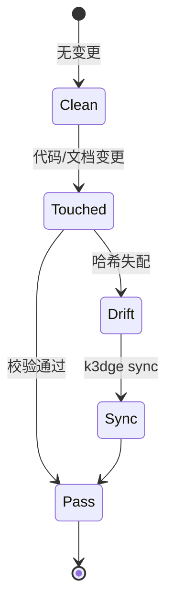

# Domain Specification: engine

- **Status**: Active
- **Module Path**: `src/k3dge/engine`
- **Contract Hash**: `sha256:67c98e371de0003b8a7862ed8a1ef720cdf773e9682d90cce5b170c079dc1976`
- **Last Updated**: 2026-09-01

## 1. Domain Boundary & Responsibilities
- **In Scope**:
  - 解析并校验 `.agent/manifest.json`（域路由、包根、忽略规则）。
  - 提取当前 Git 工作区相对 `merge-base(main, HEAD)` 的变更文件列表。
  - 校验 `spec.md` 的 L0 结构完整性（必需章节）。
  - 从域源码提取公开接口签名并计算归一化哈希（L1 契约）。
  - 判定 `src/<domain>` 与 `docs/specs/<domain>` 之间的一致性，生成 `GateReport`。
  - 里程碑生命周期治理：扫描 `docs/tasks/` 的 `Status/Milestone`、全域回退检验（`regression`，旧合规被新闸误判的退化）、tasks 物理归档至 `docs/tasks/archive/<id>/`、本里程碑 reviews 归档至 `docs/reviews/archive/<id>/` 并改写 leftovers 相对链接。
  - 版本三件套镜像（`VERSION_MISMATCH`）。canonical 全缺不阻断；无 `VERSION_MISSING`。
  - 自举仓脚手架字节锁（`TEMPLATE_DRIFT`）：`engine.pairs.PAIRS` 比对 `templates/assets`，不 import `k3dge.templates`（ADR-0014）。
  - 协议治理：`docs/protocols/*.md`（`audit_default.md` / `verify_default.md`）为 pipeline manual fallback；类型写法在各 `docs/<type>/AUTHORING.md`；结构闸是 `docs/<type>/.schema.json`。`engine.doc_catalog` 解析该 JSON、建薄索引、提供 `list_docs` / `where_doc` / `grep_docs`（正文只回 path/line）。`engine.protocol.write_incident` 把持续偏离写入 `docs/incidents/`。
  - 空 `manifest.domains` 报 `NO_DOMAINS`（下游空壳不得假绿）。
- **Out of Scope**:
  - 终端彩色渲染与 CLI 解析（由 `cli` 域负责）。
  - spec 接口块的生成与回写（由 `sync` 域负责）。
  - 项目脚手架初始化（由 `templates` 域负责）。下游仓不跑 `TEMPLATE_DRIFT`。

## 2. Public Interfaces & Type Contracts
<!-- k3dge:interfaces-start -->
```python
extract_ts_interface(path: Path) -> str
class ContractExtractor
    can_handle(self, path: Path) -> bool
    extract(self, path: Path, include_doc: bool=False) -> str
class PythonExtractor(ContractExtractor)
    can_handle(self, path: Path) -> bool
    extract(self, path: Path, include_doc: bool=False) -> str
class TypeScriptExtractor(ContractExtractor)
    can_handle(self, path: Path) -> bool
    extract(self, path: Path, include_doc: bool=False) -> str
extract_python_interface(source: str, include_doc: bool=False) -> str
extract_typescript_interface(path: Path) -> Optional[str]
normalize(interface: str) -> str
compute_hash(interface: str) -> str
collect_domain_interface(src_dir: Path, manifest=None, workspace_root: Path | None=None, include_doc: bool=False) -> str
verify_contract(src_dir: Path, spec_content: str, manifest=None, workspace_root: Path | None=None) -> Tuple[bool, Optional[str], str]
symbol_diff(spec_content: str, src_dir: Path, manifest=None, workspace_root: Path | None=None) -> dict
class GitError(RuntimeError)
resolve_base(workspace: Path) -> str
get_changed_files(workspace: Path) -> List[str]
parse_doc_schema(text: str) -> Optional[dict]
iter_doc_types(workspace: Path) -> List[str]
iter_managed_files(workspace: Path, typ: str, *, include_archive: bool=False) -> List[Path]
build_card(workspace: Path, typ: str, path: Path) -> dict
build_docs_index(workspace: Path, *, include_archive: bool=False) -> dict
write_docs_index(workspace: Path) -> Path
list_docs(workspace: Path, *, typ: Optional[str]=None, ident: Optional[str]=None, q: Optional[str]=None, include_archive: bool=False) -> List[dict]
where_doc(workspace: Path, ident: str) -> List[dict]
grep_docs(workspace: Path, query: str, *, typ: Optional[str]=None, line: bool=False, include_archive: bool=False, max_files: int=GREP_MAX_FILES, ignore_case: bool=True) -> List[dict]
validate_docs(workspace: Path, types: Optional[Iterable[str]]=None) -> List[Violation]
validate_docs_index(workspace: Path) -> List[Violation]
analyze_adr_coverage(workspace: Path) -> dict
class ConsistencyEngine
    evaluate(self, run_tests: bool=False, force_full: bool=False, staged: bool=False) -> GateReport
class ManifestError(ValueError)
class Manifest
    depends_on(self, domain: str) -> List[str]
    @classmethod
    load(cls, workspace: Path) -> 'Manifest'
    domain_for_src(self, path: str) -> Optional[str]
    domain_for_spec(self, path: str) -> Optional[str]
    src_path(self, domain: str) -> Optional[str]
    spec_path(self, domain: str) -> Optional[str]
    is_ignored(self, path: str) -> bool
    under_package_root(self, path: str) -> bool
parse_frontmatter(content: str) -> dict[str, str]
get_current_milestone(workspace: Path) -> str
set_current_milestone(workspace: Path, milestone_id: str) -> None
bump_milestone(workspace: Path) -> str
scan_unfilled_guides(workspace: Path) -> List[str]
class MilestoneTask
    path: Path
    slug: str
    status: str
    milestone: str
class TaskIndex
    path: Path
    title: str
    status: str
    milestone: str
    priority: str
list_tasks(workspace: Path, milestone_id: Optional[str]=None, status: Optional[str]=None) -> List[TaskIndex]
scan_milestone_tasks(workspace: Path, milestone_id: str) -> List[MilestoneTask]
create_task(workspace: Path, title: str, *, typ: str='fix', slug: Optional[str]=None, milestone: Optional[str]=None, priority: str='P2') -> Tuple[bool, str, Optional[Path]]
mark_task_done(workspace: Path, ident: str) -> Tuple[bool, str, Optional[Path]]
run_milestone_alignment(workspace: Path, milestone_id: str) -> Tuple[bool, str, List[MilestoneTask]]
seal_milestone(workspace: Path, milestone_id: str) -> Tuple[bool, str]
class Violation
    rule_id: str
    message: str
    domain: Optional[str] = None
    file_path: Optional[str] = None
    detail: Optional[dict] = None
    format(self) -> str
class GateReport
    passed: bool
    changed_files: Tuple[str, ...] = ()
    modified_domains: Tuple[str, ...] = ()
    violations: Tuple[Violation, ...] = ()
    render(self) -> str
validate_pipeline_config(workspace: Path) -> List[PipelineViolation]
write_incident(workspace: Path, target: str | None, task_type: str | None, task_id: str, detail: str) -> Path
class Location
    file: str
    line: Optional[int] = None
    snippet: Optional[str] = None
    render(self) -> str
index_path(workspace: Path) -> Path
build_symbol_index(workspace: Path) -> Dict[str, List[dict]]
write_symbol_index(workspace: Path) -> Path
where(workspace: Path, symbol: str) -> List[Location]
search(workspace: Path, query: str, *, snippet: bool=True, context: int=2, max_snippet: int=240) -> List[Location]
validate_structure(content: str) -> List[str]
extract_contract_hash(content: str) -> Optional[str]
parse_version(v: str) -> Tuple[int, int, int]
format_version(major: int, minor: int, patch: int) -> str
get_pyproject_version(workspace: Path) -> str | None
get_manifest_version(workspace: Path) -> str | None
get_init_version(workspace: Path) -> str | None
get_version(workspace: Path) -> str | None
validate_versions(workspace: Path) -> list[Violation]
bump_version(workspace: Path, part: str='patch', set_version: str | None=None) -> str
append_changelog(workspace: Path, new_version: str, notes: str | None=None, change_type: str | None=None) -> Path
consume_unreleased(workspace: Path) -> str
```
<!-- k3dge:interfaces-end -->

## 3. State Machine & Invariants



- `GateReport.passed == True` 当且仅当 `violations` 为空。
- 变更集以 merge-base 为基准，覆盖 committed + staged + unstaged + untracked。`force_full=True` 时 git 不可用仍校验全部域。
- **L1 契约范围（Python）**：模块顶层公开函数/类签名（含 `property`/`classmethod`/`staticmethod`/`abstractmethod`/`final`/`cached_property`）。不覆盖：`__init__.py`、嵌套 class、动态 `__all__`、函数体与注释。TypeScript 为可选 extra、尽力而为，严格度低于 Python。
- **L2 执行集** = 各域 `manifest.tests` 目录；Verification Matrix 只保证所列测试文件存在。`milestone align` 调用 `evaluate(run_tests=True, force_full=True)`，不复制 L2。
- 非 `package_root` 且非 `docs/specs/` 的文件不计入门禁范围（如 pyproject、ADR、tasks）。
- 里程碑 Status 只认 `idea|deferred|in-progress|done` 与终态 `done`，不验状态边。seal 要求 reviews 含 `<!-- k3dge:align-pass:<id> -->` 且无 `align-stub`。guides 只拦 `<!-- k3dge:guide-stub -->`。seal 将本里程碑 living reviews 移入 `docs/reviews/archive/<id>/`（文件名属其他里程碑的留下），并把 `docs/reviews/README.md` 中 `](file.md)` / `](./file.md)` 改写成 `](archive/<id>/file.md)`；失败回滚移动并还原 README。

## 4. Verification Matrix
| Scenario ID | Level | Input Condition | Expected Outcome | Test File |
| --- | --- | --- | --- | --- |
| TC-ENG-01 | L1 | 变更公开签名但未同步 spec | 违反 CONTRACT_DRIFT | `tests/unit/engine/test_evaluator.py::test_contract_drift_detected` |
| TC-ENG-02 | L0 | spec 缺失必需章节 | 违反 SPEC_MISSING_SECTION | `tests/unit/engine/test_schema.py::test_missing_sections` |
| TC-ENG-03 | L1 | spec 缺少 Contract Hash | 违反 CONTRACT_HASH_MISSING | `tests/unit/engine/test_contract.py::test_verify_contract_missing_hash` |
| TC-ENG-04 | L1 | 接口哈希与代码一致 | 无违反 | `tests/unit/engine/test_contract.py::test_verify_contract_matches` |
| TC-ENG-05 | L1 | milestone 状态机扫描与归档 | 正确解析 `Status/Milestone`；tasks 与本里程碑 reviews 物理归档；leftovers href 改写；他里程碑 reviews 留下 | `tests/unit/engine/test_milestone.py::test_seal_archives_to_archive_dir` |
| TC-ENG-06 | L1 | 版本三件套不一致 | 违反 `VERSION_MISMATCH`（canonical 全缺不阻断；无 `VERSION_MISSING`） | `tests/unit/engine/test_version.py::test_validate_mismatch_pyproject_vs_manifest` |
| TC-ENG-07 | L1 | `manifest.domains` 为空 | 违反 `NO_DOMAINS` | `tests/unit/engine/test_evaluator.py::test_empty_domains_is_violation` |
| TC-ENG-08 | L1 | `docs/guides/*.md` 含 `<!-- k3dge:guide-stub -->` | seal 阻断，`scan_unfilled_guides` 非空 | `tests/unit/engine/test_milestone.py::test_seal_rejects_unfilled_guides` |
| TC-ENG-09 | L1 | `CHANGELOG.md ## [Unreleased]` 正文的追加与提取 | `mark_task_done` 追加 subsection、 `consume_unreleased` 原子提取并清空、失败时 WARN | `tests/unit/engine/test_version.py::test_append_changelog` |
| TC-ENG-10 | L1 | `pipeline.toml` 或 `.mcp.json` 损坏/缺解析器 | `.mcp.json` 损坏 WARN 不覆盖、 `pipeline.toml` 解析失败返回错、缺 `tomllib/tomli` 跳过 peer 合并不假失败 | `tests/unit/cli/test_mcp.py::test_sync_and_task_create_done` |
| TC-ENG-11 | L1 | `pipeline.toml` 的 `mcp` transport 缺 `tool` | 违反 `PIPELINE_SCHEMA_INVALID` | `tests/unit/engine/test_pipeline_schema.py::test_valid_config_passes` |
| TC-ENG-12 | L1 | `pipelines.<hook>.stages` 引用未声明的 action | 违反 `PIPELINE_UNRESOLVED_STAGE` | `tests/unit/engine/test_pipeline_schema.py::test_valid_config_passes` |
| TC-ENG-13 | L1 | `manual` transport 的 `protocol` 指向磁盘不存在文件 | 违反 `PIPELINE_PROTOCOL_NOT_FOUND` | `tests/unit/engine/test_pipeline_schema.py::test_valid_config_passes` |
| TC-ENG-14 | L1 | `.agent/pipeline.toml` 文件不存在 | 优雅跳过，无违反 | `tests/unit/engine/test_pipeline_schema.py::test_valid_config_passes` |
| TC-ENG-15 | L1 | `write_incident` 持续偏离上报 `docs/incidents/` | incident 文件落 `docs/incidents/`，内容含偏离描述 | `tests/unit/engine/test_protocol.py` |
| TC-ENG-16 | L1 | `docs/<type>/.schema.json` 与文件名/章节不符 | `DOC_SCHEMA_INVALID` 或类型 `codes` | `tests/unit/engine/test_doc_catalog.py::test_collision` |
| TC-ENG-17 | L1 | `k3dge doc list` 不返回 README/`_template.md`/archive | 卡片仅正文 path | `tests/unit/engine/test_doc_catalog.py::test_list_excludes_aux_and_archive` |
| TC-ENG-18 | L1 | `grep_docs` 扫正文 | 仅 `path` 或 `path+line`，无 snippet | `tests/unit/engine/test_doc_catalog.py::test_grep_returns_path_only` |

## 5. Fact-Source Gate Matrix (三元门禁矩阵)

`k3dge` 的事实源门禁由三条独立支柱构成，覆盖空间路由、接口契约与生命周期协同。三者互为正交，任一支柱失败即 `GateReport.passed = False`：

| 支柱 | 事实源 | 违规码 | 拦截点 |
| --- | --- | --- | --- |
| 空间与域路由 | `.agent/manifest.json` | `MANIFEST_INVALID` | `engine/evaluator` |
| 代码接口契约 | `docs/specs/*/spec.md` | `CONTRACT_DRIFT` | `engine/contract` |
| 协同与生命周期 | `.agent/pipeline.toml` | `PIPELINE_*` | `engine/pipeline_schema` |

### 5.1 pipeline.toml 语义门禁（`engine/pipeline_schema`）

纯静态、零物理探测：不连 MCP Server、不执行 CLI、不触网。仅做结构合法性 + 内部符号引用（`stage → peer[.actions.<a>]`）+ `manual.protocol` 文件物理存在性。文件不存在则优雅跳过（下游最小化工程可无此文件）；一旦存在则 100% 严格。

| 规则码 | 触发条件 | 拦截点 |
| --- | --- | --- |
| `PIPELINE_SYNTAX_ERROR` | `.agent/pipeline.toml` 无法通过 TOML 解析器（缺引号/格式错乱/缺 `tomllib`/`tomli`） | `k3dge check` / CI |
| `PIPELINE_SCHEMA_INVALID` | `peers` 结构非法；或 `transports` 中 provider 必填字段缺失（`mcp` 漏 `tool`、`cli` 漏 `command`、`manual` 漏 `protocol`、`provider` 越界、空 `transports`） | `k3dge check` / CI |
| `PIPELINE_UNRESOLVED_STAGE` | `pipelines.<hook>.stages` 条目无法在 `peers` 或 `peers.<p>.actions` 中解析（拦截 Phantom Orchestration 虚假编排） | `k3dge check` / CI |
| `PIPELINE_PROTOCOL_NOT_FOUND` | `manual` transport 的 `protocol` Markdown 路径在磁盘上不存在（消除 404 悬空引用） | `k3dge check` / CI |
