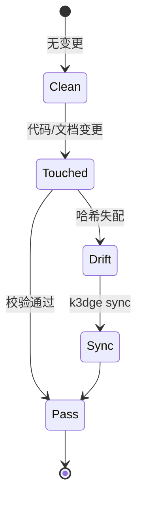

# Domain Specification: engine

- **Status**: Active
- **Module Path**: `src/k3dge/engine`
- **Contract Hash**: `sha256:c64bc0295cebe7b0725e6f32658d4d6ab7e19eb88198dad209346013a00376a6`
- **Last Updated**: 2026-08-27

## 1. Domain Boundary & Responsibilities
- **In Scope**:
  - 解析并校验 `.agent/manifest.json`（域路由、包根、忽略规则）。
  - 提取当前 Git 工作区相对 `merge-base(main, HEAD)` 的变更文件列表。
  - 校验 `spec.md` 的 L0 结构完整性（必需章节）。
  - 从域源码提取公开接口签名并计算归一化哈希（L1 契约）。
  - 判定 `src/<domain>` 与 `docs/specs/<domain>` 之间的一致性，生成 `GateReport`。
  - 里程碑生命周期治理：扫描 `docs/tasks/` 的 `Status/Milestone`、全域回退检验（`regression`，旧合规被新闸误判的退化）、物理归档至 `archive/<id>/`。
  - 版本三件套镜像（`VERSION_MISMATCH`）。canonical 全缺不阻断；无 `VERSION_MISSING`。
  - 自举仓脚手架字节锁（`TEMPLATE_DRIFT`）：`engine.pairs.PAIRS` 比对 `templates/assets`，不 import `k3dge.templates`（ADR 0018）。
  - 空 `manifest.domains` 报 `NO_DOMAINS`（下游空壳不得假绿）。
- **Out of Scope**:
  - 终端彩色渲染与 CLI 解析（由 `cli` 域负责）。
  - spec 接口块的生成与回写（由 `sync` 域负责）。
  - 项目脚手架初始化（由 `templates` 域负责）。下游仓不跑 `TEMPLATE_DRIFT`。

## 2. Public Interfaces & Type Contracts
<!-- k3dge:interfaces-start -->
```python
extract_ts_interface(path: Path) -> str
class ContractExtractor
    can_handle(self, path: Path) -> bool
    extract(self, path: Path, include_doc: bool=False) -> str
class PythonExtractor(ContractExtractor)
    can_handle(self, path: Path) -> bool
    extract(self, path: Path, include_doc: bool=False) -> str
class TypeScriptExtractor(ContractExtractor)
    can_handle(self, path: Path) -> bool
    extract(self, path: Path, include_doc: bool=False) -> str
extract_python_interface(source: str, include_doc: bool=False) -> str
extract_typescript_interface(path: Path) -> Optional[str]
normalize(interface: str) -> str
compute_hash(interface: str) -> str
collect_domain_interface(src_dir: Path, manifest=None, workspace_root: Path | None=None, include_doc: bool=False) -> str
verify_contract(src_dir: Path, spec_content: str, manifest=None, workspace_root: Path | None=None) -> Tuple[bool, Optional[str], str]
class GitError(RuntimeError)
resolve_base(workspace: Path) -> str
get_changed_files(workspace: Path) -> List[str]
class ConsistencyEngine
    evaluate(self, run_tests: bool=False, force_full: bool=False) -> GateReport
class ManifestError(ValueError)
class Manifest
    @classmethod
    load(cls, workspace: Path) -> 'Manifest'
    domain_for_src(self, path: str) -> Optional[str]
    domain_for_spec(self, path: str) -> Optional[str]
    src_path(self, domain: str) -> Optional[str]
    spec_path(self, domain: str) -> Optional[str]
    is_ignored(self, path: str) -> bool
    under_package_root(self, path: str) -> bool
parse_frontmatter(content: str) -> dict[str, str]
get_current_milestone(workspace: Path) -> str
set_current_milestone(workspace: Path, milestone_id: str) -> None
bump_milestone(workspace: Path) -> str
scan_unfilled_guides(workspace: Path) -> List[str]
class MilestoneTask
    path: Path
    slug: str
    status: str
    milestone: str
class TaskIndex
    path: Path
    title: str
    status: str
    milestone: str
    priority: str
list_tasks(workspace: Path, milestone_id: Optional[str]=None, status: Optional[str]=None) -> List[TaskIndex]
scan_milestone_tasks(workspace: Path, milestone_id: str) -> List[MilestoneTask]
create_task(workspace: Path, title: str, *, typ: str='fix', slug: Optional[str]=None, milestone: Optional[str]=None, priority: str='P2') -> Tuple[bool, str, Optional[Path]]
mark_task_done(workspace: Path, ident: str) -> Tuple[bool, str, Optional[Path]]
run_milestone_alignment(workspace: Path, milestone_id: str) -> Tuple[bool, str, List[MilestoneTask]]
seal_milestone(workspace: Path, milestone_id: str) -> Tuple[bool, str]
class Violation
    rule_id: str
    message: str
    domain: Optional[str] = None
    file_path: Optional[str] = None
    format(self) -> str
class GateReport
    passed: bool
    changed_files: Tuple[str, ...] = ()
    modified_domains: Tuple[str, ...] = ()
    violations: Tuple[Violation, ...] = ()
    render(self) -> str
validate_structure(content: str) -> List[str]
extract_contract_hash(content: str) -> Optional[str]
parse_version(v: str) -> Tuple[int, int, int]
format_version(major: int, minor: int, patch: int) -> str
get_pyproject_version(workspace: Path) -> str | None
get_manifest_version(workspace: Path) -> str | None
get_init_version(workspace: Path) -> str | None
get_version(workspace: Path) -> str | None
validate_versions(workspace: Path) -> list[Violation]
bump_version(workspace: Path, part: str='patch', set_version: str | None=None) -> str
append_changelog(workspace: Path, new_version: str, notes: str | None=None, change_type: str | None=None) -> Path
consume_unreleased(workspace: Path) -> str
```
<!-- k3dge:interfaces-end -->

## 3. State Machine & Invariants



- `GateReport.passed == True` 当且仅当 `violations` 为空。
- 变更集以 merge-base 为基准，覆盖 committed + staged + unstaged + untracked。`force_full=True` 时 git 不可用仍校验全部域。
- **L1 契约范围（Python）**：模块顶层公开函数/类签名（含 `property`/`classmethod`/`staticmethod`/`abstractmethod`/`final`/`cached_property`）。不覆盖：`__init__.py`、嵌套 class、动态 `__all__`、函数体与注释。TypeScript 为可选 extra、尽力而为，严格度低于 Python。
- **L2 执行集** = 各域 `manifest.tests` 目录；Verification Matrix 只保证所列测试文件存在。`milestone align` 调用 `evaluate(run_tests=True, force_full=True)`，不复制 L2。
- 非 `package_root` 且非 `docs/specs/` 的文件不计入门禁范围（如 pyproject、ADR、tasks）。
- 里程碑 Status 只认 `idea|deferred|in-progress|done` 与终态 `done`，不验状态边。seal 要求 reviews 含 `<!-- k3dge:align-pass:<id> -->` 且无 `align-stub`。guides 只拦 `<!-- k3dge:guide-stub -->`。

## 4. Verification Matrix
| Scenario ID | Level | Input Condition | Expected Outcome | Test File |
| --- | --- | --- | --- | --- |
| TC-ENG-01 | L1 | 变更公开签名但未同步 spec | 违反 CONTRACT_DRIFT | `tests/unit/engine/test_evaluator.py` |
| TC-ENG-02 | L0 | spec 缺失必需章节 | 违反 SPEC_MISSING_SECTION | `tests/unit/engine/test_schema.py` |
| TC-ENG-03 | L1 | spec 缺少 Contract Hash | 违反 CONTRACT_HASH_MISSING | `tests/unit/engine/test_contract.py` |
| TC-ENG-04 | L1 | 接口哈希与代码一致 | 无违反 | `tests/unit/engine/test_contract.py` |
| TC-ENG-05 | L1 | milestone 状态机扫描与归档 | 正确解析 `Status/Milestone` 并物理归档 | `tests/unit/engine/test_milestone.py` |
| TC-ENG-06 | L1 | 版本三件套不一致 | 违反 `VERSION_MISMATCH`（canonical 全缺不阻断；无 `VERSION_MISSING`） | `tests/unit/engine/test_version.py` |
| TC-ENG-07 | L1 | `manifest.domains` 为空 | 违反 `NO_DOMAINS` | `tests/unit/engine/test_evaluator.py` |
| TC-ENG-08 | L1 | `docs/guides/*.md` 含 `<!-- k3dge:guide-stub -->` | seal 阻断，`scan_unfilled_guides` 非空 | `tests/unit/engine/test_milestone.py` |
| TC-ENG-09 | L1 | `CHANGELOG.md ## [Unreleased]` 正文的追加与提取 | `mark_task_done` 追加 subsection、 `consume_unreleased` 原子提取并清空、失败时 WARN | `tests/unit/engine/test_milestone.py` + `tests/unit/engine/test_version.py` |
| TC-ENG-10 | L1 | `pipeline.toml` 或 `.mcp.json` 损坏/缺解析器 | `.mcp.json` 损坏 WARN 不覆盖、 `pipeline.toml` 解析失败返回错、缺 `tomllib/tomli` 跳过 peer 合并不假失败 | `tests/unit/cli/test_main.py` + `tests/unit/templates/test_scaffold.py` |
