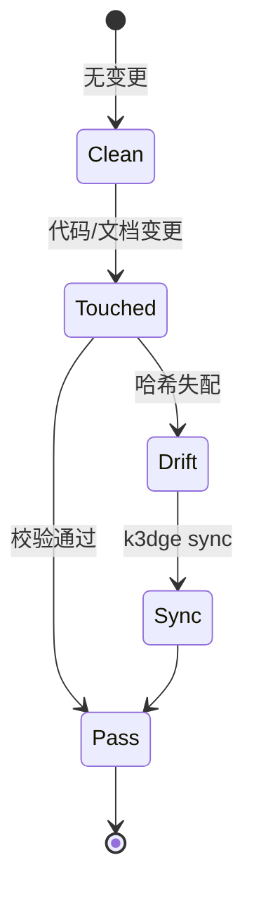

# Domain Specification: engine

- **Status**: Active
- **Module Path**: `src/k3dge/engine`
- **Contract Hash**: `sha256:427b228336d6e91eaf85fe41e5a851f4c95fb9989a1b47413431c85cbf4367b9`
- **Last Updated**: 2026-09-18

## 1. Domain Boundary & Responsibilities
- **In Scope**:
  - 解析并校验 `.agent/manifest.json`（域路由、包根、忽略规则）。
  - 提取当前 Git 工作区相对 `merge-base(main, HEAD)` 的变更文件列表。
  - 校验 `spec.md` 的 L0 结构完整性（必需章节）。
  - 从域源码提取公开接口签名并计算归一化哈希（L1 契约）。
  - 判定 `src/<domain>` 与 `docs/specs/<domain>` 之间的一致性，生成 `GateReport`。
  - 里程碑生命周期治理：扫描 `docs/tasks/` 的 `Status/Milestone`、全域回退检验（`regression`，旧合规被新闸误判的退化）、tasks 物理归档至 `docs/tasks/archive/<id>/`、本里程碑 reviews 归档至 `docs/reviews/archive/<id>/` 并改写 `docs/reviews/LEFTOVERS.md` 相对链接。**约定＝里程碑任务留 `docs/tasks/` 顶层，由 `milestone seal` 封板时 batch archive**；提前手工归档会让顶扫看不到任务，align/seal 经 `premature_archive_hint` 给可操作提示（不再只报 `No tasks found`）。closure 清单记 bump 后**终版**。
  - 版本三件套镜像（`VERSION_MISMATCH`）。canonical 全缺不阻断；无 `VERSION_MISSING`。
  - 自举仓脚手架字节锁（`TEMPLATE_DRIFT`）：`engine.pairs.PAIRS` 比对 `templates/assets`，不 import `k3dge.templates`（ADR-0001）。
  - 协议治理：`docs/protocols/*.md`（`audit_default.md` / `verify_default.md`）为 pipeline manual fallback；类型写法在各 `docs/<type>/AUTHORING.md`；结构闸是 `docs/<type>/.schema.json`。`engine.doc_catalog` 解析该 JSON、建薄索引、提供 `list_docs` / `where_doc` / `grep_docs`（正文只回 path/line）。`engine.protocol.write_incident` 把持续偏离写入 `docs/incidents/`。
  - 空 `manifest.domains` 报 `NO_DOMAINS`（下游空壳不得假绿）。
  - 其余引擎面：`markers`（钉语法 v2 解析/校验）、`nextstep`（`[NEXT]` 状态机边 + 纵深指针）、`audit_trigger`（审计触发/闭环计数）、`audit_checklist`、`audit_flow`（审计线消费侧）、`worktree`（审计线 worktree）、`pipeline_runner`（peer 出向 MCP/降级）、`pipeline_schema`（`pipeline.toml` 结构闸）、`gates`（硬闸契约加载）、`adr_gate`（封版 ADR 闸）、`process_audit`（证据链完整性/可追溯闸）、`search`（受控检索）。
- **Out of Scope**:
  - 终端彩色渲染与 CLI 解析（由 `cli` 域负责）。
  - spec 接口块的生成与回写（由 `sync` 域负责）。
  - 项目脚手架初始化（由 `templates` 域负责）。下游仓不跑 `TEMPLATE_DRIFT`。

## 2. Public Interfaces & Type Contracts
<!-- k3dge:interfaces-start -->
```python
from __future__ import annotations
from pathlib import Path
from typing import List
from typing import Optional
adrs_all_accepted(workspace: Path) -> Optional[str]
adr_landed(workspace: Path) -> Optional[str]
reconcile_supersedes(workspace: Path) -> Optional[str]
from __future__ import annotations
from pathlib import Path
from typing import List
from typing import Optional
from typing import Tuple
from k3dge.engine import gates
from k3dge.engine.evaluator import ConsistencyEngine
from k3dge.engine.task_index import MilestoneTask
from k3dge.engine.task_index import scan_milestone_tasks
run_milestone_alignment(workspace: Path, milestone_id: str) -> Tuple[bool, str, List[MilestoneTask]]
from __future__ import annotations
from pathlib import Path
from typing import Optional
CHECK_LIST_PATH = '.agent/audit_checklist.json'
build_checklist(workspace: Path, milestone_id: Optional[str]=None) -> dict
read_checklist(workspace: Path) -> Optional[dict]
ensure_checklist(workspace: Path) -> dict
reset_for_audit(workspace: Path, milestone_id: Optional[str]=None) -> dict
get_verify_attempts(workspace: Path) -> int
bump_verify_attempt(workspace: Path) -> int
reset_verify_attempts(workspace: Path) -> None
from __future__ import annotations
from pathlib import Path
from typing import Dict
from typing import Optional
from k3dge.engine import report_table
from k3dge.engine.pipeline_runner import run_action
STATE_REL = '.agent/audit_jobs.json'
submit_audit(workspace: Path, milestone_id: str, targets: Optional[list]=None, io=None, role: str='audit') -> dict
collect_audit(workspace: Path, milestone_id: str, job_id: Optional[str]=None, io=None) -> dict
push_present(workspace: Path, job_key: str, commit: str='', io=None) -> dict
advance_line(workspace: Path, job_key: str, by: str='manual', io=None) -> dict
peer_status(workspace: Path, job_id: str, io=None) -> dict
open_ratchet_jobs(workspace: Path) -> list
show_job(workspace: Path, job_key: str='') -> dict
materialize(workspace: Path, job_key: str='', rev: str='', dest: str='') -> dict
prune_finished(workspace: Path) -> dict
from __future__ import annotations
from pathlib import Path
from k3dge.engine import report_table
from __future__ import annotations
from pathlib import Path
from typing import List
from typing import Tuple
from k3dge.engine import gates
from k3dge.engine.milestone_pointer import get_current_milestone
from k3dge.engine.task_index import scan_milestone_tasks
compute_audit_suggestion(workspace: Path) -> Tuple[bool, List[str]]
audit_closed(workspace: Path, milestone_id: str) -> bool
from __future__ import annotations
from pathlib import Path
from k3dge.engine.task_index import TITLE_RE
from __future__ import annotations
from pathlib import Path
from typing import List
from typing import Optional
from typing import Tuple
INTERFACE_START = '<!\x2d\x2d k3dge:interfaces\x2dstart \x2d\x2d>'
INTERFACE_END = '<!\x2d\x2d k3dge:interfaces\x2dend \x2d\x2d>'
class ContractExtractor
    can_handle(self, path: Path) -> bool
    extract(self, path: Path, include_doc: bool=False) -> str
class PythonExtractor(ContractExtractor)
    can_handle(self, path: Path) -> bool
    extract(self, path: Path, include_doc: bool=False) -> str
register_extractor(ext: ContractExtractor, *, override: bool=False) -> None
extract_python_interface(source: str, include_doc: bool=False) -> str
normalize(interface: str) -> str
compute_hash(interface: str) -> str
collect_domain_interface(src_dir: Path, manifest=None, workspace_root: Path | None=None, include_doc: bool=False) -> str
verify_contract(src_dir: Path, spec_content: str, manifest=None, workspace_root: Path | None=None) -> Tuple[bool, Optional[str], str]
symbol_diff(spec_content: str, src_dir: Path, manifest=None, workspace_root: Path | None=None) -> dict
from __future__ import annotations
from pathlib import Path
from typing import List
BASE_CANDIDATES = ('origin/main', 'origin/master', 'main', 'master')
class GitError(RuntimeError)
resolve_base(workspace: Path) -> str
get_changed_files(workspace: Path) -> List[str]
from __future__ import annotations
from pathlib import Path
from typing import List
from typing import Optional
from typing import Tuple
run_doc_audit(workspace: Path, *, io=None) -> Tuple[str, str]
from __future__ import annotations
from pathlib import Path
from typing import Any
from typing import Dict
from typing import Iterable
from typing import List
from typing import Optional
from typing import Tuple
from k3dge.engine.models import Violation
from k3dge.engine.pure_schema import check_section_order
from k3dge.engine.pure_schema import parse_doc_schema
SCHEMA_FILE = '.schema.json'
INDEX_REL = 'docs/generated/docs-index.json'
AUTHORING_FILE = 'AUTHORING.md'
AUX_NAMES = frozenset({'README.md', '_template.md', 'AUTHORING.md', 'summary.md', 'SUMMARY.md', 'LEFTOVERS.md', 'leftovers.md'})
SKIP_TYPES = frozenset({'generated'})
iter_doc_types(workspace: Path) -> List[str]
iter_managed_files(workspace: Path, typ: str, *, include_archive: bool=False) -> List[Path]
build_card(workspace: Path, typ: str, path: Path) -> dict
build_docs_index(workspace: Path, *, include_archive: bool=False) -> dict
write_docs_index(workspace: Path) -> Path
list_docs(workspace: Path, *, typ: Optional[str]=None, ident: Optional[str]=None, q: Optional[str]=None, include_archive: bool=False) -> List[dict]
where_doc(workspace: Path, ident: str) -> List[dict]
GREP_MAX_FILES = 20
GREP_MAX_LINES_PER_FILE = 8
grep_docs(workspace: Path, query: str, *, typ: Optional[str]=None, line: bool=False, include_archive: bool=False, max_files: int=GREP_MAX_FILES, ignore_case: bool=True) -> List[dict]
validate_docs(workspace: Path, types: Optional[Iterable[str]]=None) -> List[Violation]
validate_docs_index(workspace: Path) -> List[Violation]
analyze_adr_coverage(workspace: Path) -> dict
from __future__ import annotations
from pathlib import Path
from typing import List
from typing import Optional
from typing import Set
from k3dge.engine import contract
from k3dge.engine import diff
from k3dge.engine import spec_schema
from k3dge.engine.diff import GitError
from k3dge.engine.manifest import Manifest
from k3dge.engine.manifest import ManifestError
from k3dge.engine.models import GateReport
from k3dge.engine.models import Violation
from k3dge.engine.pairs import PAIRS
class ConsistencyEngine
    evaluate(self, run_tests: bool=False, force_full: bool=False, staged: bool=False) -> GateReport
from __future__ import annotations
from pathlib import Path
from typing import Any
emit(workspace: Path, evt: str, **data: Any) -> None
read_events(workspace: Path, last: int=20) -> list[dict[str, Any]]
from __future__ import annotations
from pathlib import Path
from typing import Any
from typing import Dict
from typing import List
from typing import Optional
from typing import Tuple
CONFIG_REL = '.agent/extractors.toml'
PLUGDIR_REL = '.agent/extractors'
MARKER = '# GENERATED by `k3dge extractor sync`'
DEFAULT_LANGS: Dict[str, Dict[str, Any]] = {'typescript': {'grammar': 'tree_sitter_typescript', 'package': 'tree-sitter-typescript', 'lang_func': 'language_typescript', 'lang_name': 'typescript', 'suffixes': ['.ts', '.tsx', '.js'], 'wrapper': ['export_statement'], 'wrapper_kw': 'export', 'fn': ['function_declaration', 'method_definition'], 'container': ['class_declaration'], 'body': ['class_body'], 'member': ['method_definition', 'public_field_definition', 'field_definition'], 'type': ['interface_declaration', 'type_alias_declaration', 'enum_declaration'], 'lexical_nodes': ['lexical_declaration'], 'lexical_markers': ['=>', 'function'], 'lexical': True}, 'go': {'grammar': 'tree_sitter_go', 'package': 'tree-sitter-go', 'lang_func': 'language', 'lang_name': 'go', 'suffixes': ['.go'], 'wrapper': [], 'wrapper_kw': '', 'fn': ['function_declaration', 'method_declaration'], 'container': [], 'body': [], 'member': [], 'type': ['type_declaration', 'const_declaration'], 'lexical_nodes': [], 'lexical_markers': [], 'lexical': False}, 'rust': {'grammar': 'tree_sitter_rust', 'package': 'tree-sitter-rust', 'lang_func': 'language', 'lang_name': 'rust', 'suffixes': ['.rs'], 'wrapper': [], 'wrapper_kw': '', 'fn': ['function_item'], 'container': ['impl_item', 'trait_item'], 'body': ['declaration_list'], 'member': ['function_item', 'function_signature_item', 'const_item', 'type_item', 'associated_type'], 'type': ['struct_item', 'enum_item', 'const_item', 'type_item'], 'lexical_nodes': [], 'lexical_markers': [], 'lexical': False}, 'c': {'grammar': 'tree_sitter_c', 'package': 'tree-sitter-c', 'lang_func': 'language', 'lang_name': 'c', 'suffixes': ['.c', '.h'], 'wrapper': [], 'wrapper_kw': '', 'fn': ['function_definition'], 'container': [], 'body': [], 'member': [], 'type': ['type_definition', 'struct_specifier', 'enum_specifier', 'preproc_def'], 'lexical_nodes': [], 'lexical_markers': [], 'lexical': False}}
class ExtractorConfigError(ValueError)
resolve_languages(workspace: Path) -> Dict[str, Dict[str, Any]]
render_plugin(name: str, row: Dict[str, Any]) -> str
sync_extractors(workspace: Path) -> Dict[str, Any]
describe_extractors(workspace: Path) -> List[str]
from __future__ import annotations
from pathlib import Path
from typing import Any
from typing import Dict
class Rejection(str)
rejection(message: Any, fallback_gate_id: str) -> Rejection
REL = '.agent/gates.toml'
INTERNAL_GATE_IDS: tuple = ('unknown_gate_id', 'unknown_action_id', 'audit_report_missing', 'audit_open_declined', 'milestone_id_invalid', 'no_tasks', 'invalid_task_status', 'align_failed', 'archive_failed')
DEFAULTS: Dict[str, Any] = {'audit_trigger': {'c2_nesting_max': 5, 'volume_max': 8}, 'search': {'context_max': 3}, 'markers': {'max_note': 80, 'max_note_pending': 500}, 'output': {'default_lines': 10}, 'checks': {'seal': {'preconditions': ['tasks_all_done', 'audit_closed', 'evidence_chain', 'align_pass', 'guides_filled', 'adrs_all_accepted', 'adr_landed'], 'actions': ['full_matrix', 'archive', 'closure_note', 'prune']}, 'align': {'preconditions': ['tasks_all_done'], 'actions': ['full_matrix']}}}
load(workspace: Path) -> Dict[str, Any]
get(workspace: Path, section: str, key: str) -> Any
preconditions(workspace: Path, kind: str) -> list
actions(workspace: Path, kind: str) -> list
from __future__ import annotations
from pathlib import Path
from typing import Any
from typing import Dict
from typing import List
from typing import Optional
MANIFEST_PATH = '.agent/manifest.json'
class ManifestError(ValueError)
class Manifest
    depends_on(self, domain: str) -> List[str]
    @classmethod
    load(cls, workspace: Path) -> 'Manifest'
    domain_for_src(self, path: str) -> Optional[str]
    domain_for_spec(self, path: str) -> Optional[str]
    src_path(self, domain: str) -> Optional[str]
    spec_path(self, domain: str) -> Optional[str]
    is_ignored(self, path: str) -> bool
    under_package_root(self, path: str) -> bool
from __future__ import annotations
from dataclasses import dataclass
from pathlib import Path
from typing import Iterable
from typing import List
from typing import Sequence
from typing import Tuple
KINDS = ('pending', 'leftover', 'disputed', 'fixnote', 'fixed')
OPEN_KINDS = frozenset({'pending', 'disputed', 'fixnote'})
SCOPES = ('line', 'file', 'repo')
SIDECAR = 'AUDIT.md'
MARKER_RE = re.compile('(?:#|//|<!--)[ \\t]*k3dit:(?P<kind>pending|leftover|disputed|fixnote|fixed)[ \\t]+(?P<id>[A-Za-z0-9][A-Za-z0-9._#-]*)(?:[ \\t]*@(?P<scope>line|file|repo))?' + _ATTRS + '[ \\t]*(?P<note>[^\\n]*?)[ \\t]*(?:-->)?[ \\t]*$', re.M)
MARKER_RE_MD = re.compile('<!--[ \\t]*k3dit:(?P<kind>pending|leftover|disputed|fixnote|fixed)[ \\t]+(?P<id>[A-Za-z0-9][A-Za-z0-9._#-]*)(?:[ \\t]*@(?P<scope>line|file|repo))?' + _ATTRS + '(?P<note>[^\\n]*?)[ \\t]*-->[ \\t]*$', re.M)
class Marker
    file: str
    line: int
    kind: str
    id: str
    scope: str
    note: str
    sev: str = ''
    prio: str = ''
    type: str = ''
    key(self) -> Tuple[str, str]
head_block_end(lines: Sequence[str]) -> int
parse_text(rel: str, text: str, *, max_note: int=_MAX_NOTE, max_note_pending: int=_MAX_NOTE_PENDING) -> Tuple[List[Marker], List[str]]
parse_sidecar(text: str) -> Tuple[List[Marker], List[str]]
extract(workspace: Path, roots: Sequence[str]=('src', 'docs')) -> Tuple[List[Marker], List[str]]
validate(workspace: Path, markers: Sequence[Marker]) -> List[str]
counts(markers: Iterable[Marker]) -> dict
open_samples(markers: Sequence[Marker]) -> List[str]
closure_ok(markers: Sequence[Marker]) -> Tuple[bool, dict]
from __future__ import annotations
from pathlib import Path
from typing import Any
from typing import Dict
from typing import Optional
from typing import Set
load_mcp_document(workspace: Path) -> Optional[Dict[str, Any]]
load_mcp_endpoints(workspace: Path) -> Dict[str, Any]
mcp_server_names(workspace: Path) -> Optional[Set[str]]
from __future__ import annotations
from pathlib import Path
from typing import List
from typing import Optional
from typing import Tuple
from k3dge.engine import gates
scan_pending_findings(workspace: Path) -> Tuple[int, List[str]]
persist_external_audit_report(workspace: Path, milestone_id: str, content: str, scope: str='external', kind: str='audit') -> Path
run_audit_flow(workspace: Path, milestone_id: str, *, prompter: Optional[_Prompt]=None, max_verify_attempts: int=3) -> Tuple[str, str]
from __future__ import annotations
from __future__ import annotations
from pathlib import Path
from typing import Optional
get_current_milestone(workspace: Path) -> str
set_current_milestone(workspace: Path, milestone_id: str) -> None
bump_milestone(workspace: Path) -> str
from __future__ import annotations
from dataclasses import dataclass
from typing import Optional
from typing import Tuple
class Violation
    rule_id: str
    message: str
    domain: Optional[str] = None
    file_path: Optional[str] = None
    detail: Optional[dict] = None
    format(self) -> str
class GateReport
    passed: bool
    changed_files: Tuple[str, ...] = ()
    modified_domains: Tuple[str, ...] = ()
    violations: Tuple[Violation, ...] = ()
    render(self) -> str
from __future__ import annotations
from dataclasses import dataclass
from pathlib import Path
from typing import Optional
from typing import TextIO
STATE_OPTIONS: dict = {'normal': {'note': '常规提交门禁通过', 'pointers': ['AGENTS.md §12']}, 'pending_findings': {'ask': '有 findings 钉在代码/文档里；继续处理这些 pending？', 'if_y': '修完删 `k3dit:pending <ID>` 标记；有意留改成 `k3dit:leftover <ID>` 指针（处置仍以 12 列报告 + tasks 为准，标记只是指针）', 'if_n': 'stop', 'pointers': ['peer_contract §8', 'k3dge ADR-0025']}, 'ratchet_open': {'note': '有在办棘轮工单（k3dge ADR-0025）：进程不等人，但账必须可见', 'if_y': 'k3dge audit status <job> 查对端；席位侧一圈见契约 §1.4（Hall pin-only：判读落钉→修翻 fixnote→复核翻 fixed→Hall 拔→sign-report）', 'pointers': ['k3dge audit status <id>', 'peer_contract §1.4', 'k3dge ADR-0025 §2.7']}, 'doc_audit': {'note': 'docs/ 有改动：check 是静态硬闸（T-01），doc-audit 在其**之后**跑、不阻断——`k3dge doc-audit` 出报告(k3dit)+建里程碑 task（本轮不改，封板轮也得闭环）', 'pointers': ['k3dge ADR-0022 §2.2', 'k3dge doc-audit']}, 'audit_suggested': {'ask': '要审吗？', 'if_y': 'k3dge milestone audit <id>（必审，待修=0 才谈封板）', 'if_n': 'stop（继续干活）', 'pointers': ['k3dge ADR-0004 §2.1.5', 'k3dge milestone audit <id>']}, 'seal_ready': {'ask': '里程碑 <id>：审计已闭环（待修=0），封板？', 'if_y': 'k3dge milestone seal <id>（align→归档+版本+指针）', 'if_n': 'stop（里程碑继续挂着，不封）', 'pointers': ['k3dge ADR-0004 §2.1.4', 'docs/reviews/']}, 'audit_needed': {'note': '未审计不可封板（封=归档+版本+指针，非界限）：先 k3dge milestone audit <id>', 'pointers': ['k3dge ADR-0004 §2.1.6', 'k3dge milestone audit <id>']}, 'audit_open': {'ask': '里程碑 <id>：发现 <n> 项待修，agent 修？', 'if_y': '修完重跑 k3dge milestone audit <id>（重审）', 'if_n': 'stop / 转人工干预', 'pointers': ['k3dge ADR-0022', 'k3dge milestone audit <id>']}, 'escalated': {'note': 'verify 连续 >3 次未闭环，转人工干预：k3dge milestone audit-submit <id> 或人工复核', 'pointers': ['k3dge milestone audit-submit <id>', 'docs/incidents/']}, 'sealed': {'note': '已封板（归档+版本+指针）；收摊在压缩上下文：见 docs/reviews/*-closure.md → 更新设计文档 → 提交里程碑', 'pointers': ['docs/reviews/*-closure.md', 'k3dge ADR-0004 §2.1.4']}, 'seal_declined': {'note': '已放弃封板（当普通提交结束）', 'pointers': ['AGENTS.md §12']}, 'rejected': {'note': '操作被拒（原因见上）', 'pointers': ['AGENTS.md §12', 'k3dge milestone status <id>']}, 'new_domain': {'ask': '新建 src/ 域未在 manifest 注册？', 'if_y': '补 manifest + spec + tests，再 k3dge sync 回写契约', 'if_n': 'stop', 'pointers': ['k3dge ADR-0005 §2.8', 'k3dge sync']}}
GATE_NEXT: dict = {'audit_closed': ('audit_needed', ''), 'audit_report_missing': ('rejected', 'audit_missing'), 'audit_open_declined': ('rejected', 'audit_open_declined'), 'tasks_all_done': ('rejected', 'tasks_pending')}
REJECTION_NOTES: dict = {'audit_missing': '审计缺失：先落盘报告（k3dge milestone audit-submit <id>）或 k3dge milestone audit <id>', 'audit_open_declined': 'stop / 转人工干预（待修未修复且 agent 拒绝修复）', 'tasks_pending': '票据未全 done：先干活或改挂里程碑，再谈 align/seal'}
class NextStep
    state: str
    milestone: str
    pending: Optional[int] = None
    note: Optional[str] = None
    ask: Optional[str] = None
    if_y: Optional[str] = None
    if_n: Optional[str] = None
    reasons: Optional[list] = None
    pointers: Optional[list] = None
    @classmethod
    from_state(cls, state: str, milestone: str, *, pending: Optional[int]=None, reasons: Optional[list]=None) -> 'NextStep'
    render_cli(self) -> str
    render_mcp(self) -> dict
persist(workspace: Path, ns: NextStep) -> None
emit(workspace: Path, ns: NextStep, *, stream: Optional[TextIO]=None) -> str
load_persisted(workspace: Path) -> Optional[dict]
next_for_rejection(milestone: str, message, gate_id: Optional[str]=None) -> NextStep
ask_text(state: str, milestone: str, *, n: Optional[int]=None) -> str
from __future__ import annotations
PAIRS: list[tuple[str, str]] = [('gate.py', 'scripts/gate.py'), ('gate.sh', 'scripts/gate.sh'), ('gate.ps1', 'scripts/gate.ps1'), ('init.sh', 'scripts/init.sh'), ('init.ps1', 'scripts/init.ps1'), ('k3dge-init-wrapper.sh', 'k3dge-init.sh'), ('k3dge-init-wrapper.ps1', 'k3dge-init.ps1'), ('generate-docs.sh', 'scripts/generate-docs.sh'), ('generate-docs.ps1', 'scripts/generate-docs.ps1'), ('agents.md', 'AGENTS.md'), ('agent-readme.md', '.agent/README.md'), ('extractors-readme.md', '.agent/extractors/README.md'), ('rules/00-core-discipline.md', '.agent/rules/00-core-discipline.md'), ('rules/01-docs-structure.md', '.agent/rules/01-docs-structure.md'), ('rules/02-simplification.md', '.agent/rules/02-simplification.md'), ('rules/03-self-contained.md', '.agent/rules/03-self-contained.md'), ('rules/04-milestone.md', '.agent/rules/04-milestone.md'), ('rules/05-branches.md', '.agent/rules/05-branches.md'), ('rules/06-memo.md', '.agent/rules/06-memo.md'), ('rules/07-audit.md', '.agent/rules/07-audit.md'), ('rules/08-design-discipline.md', '.agent/rules/08-design-discipline.md'), ('rules/09-absorption.md', '.agent/rules/09-absorption.md'), ('rules/10-structure-over-prose.md', '.agent/rules/10-structure-over-prose.md'), ('rules/11-next-sidecar.md', '.agent/rules/11-next-sidecar.md'), ('rules/12-introduction-discipline.md', '.agent/rules/12-introduction-discipline.md'), ('docs.toml.template', '.agent/docs.toml'), ('pipeline.toml.template', '.agent/pipeline.toml'), ('spec.md.template', 'docs/specs/_template/spec.md'), ('tasks-readme.md', 'docs/tasks/README.md'), ('reviews-readme.md', 'docs/reviews/README.md'), ('tasks/_template.md', 'docs/tasks/_template.md'), ('memo/_template.md', 'docs/memo/_template.md'), ('branches/_template.md', 'docs/branches/_template.md'), ('adr/_template.md', 'docs/adr/_template.md'), ('adr/AUTHORING.md', 'docs/adr/AUTHORING.md'), ('adr/.schema.json', 'docs/adr/.schema.json'), ('tasks/AUTHORING.md', 'docs/tasks/AUTHORING.md'), ('memo/AUTHORING.md', 'docs/memo/AUTHORING.md'), ('branches/AUTHORING.md', 'docs/branches/AUTHORING.md'), ('incidents/AUTHORING.md', 'docs/incidents/AUTHORING.md'), ('tasks/.schema.json', 'docs/tasks/.schema.json'), ('memo/.schema.json', 'docs/memo/.schema.json'), ('branches/.schema.json', 'docs/branches/.schema.json'), ('incidents/.schema.json', 'docs/incidents/.schema.json'), ('pre-commit.yaml.template', '.pre-commit-config.yaml'), ('branches-readme.md', 'docs/branches/README.md'), ('memo-readme.md', 'docs/memo/README.md'), ('downstream.md', 'docs/guides/downstream.md'), ('protocols/audit_default.md', 'docs/protocols/audit_default.md'), ('protocols/verify_default.md', 'docs/protocols/verify_default.md')]
from __future__ import annotations
from dataclasses import dataclass
from dataclasses import field
from pathlib import Path
from typing import Any
from typing import Dict
from typing import List
from typing import Optional
from typing import Tuple
from k3dge.engine.mcp_json import load_mcp_endpoints
class TransportResult
    ok: bool
    provider: Optional[str]
    detail: str
    skipped: bool = False
    downgrades: List[str] = field(default_factory=list)
    payload: str = ''
load_pipeline_config(workspace: Path) -> dict
resolve_role(pipeline: dict, name: str) -> str
resolve_action(pipeline: dict, action_ref: str) -> Optional[List[dict]]
resolve_endpoint_command(workspace: Path, endpoint: dict) -> Tuple[Optional[str], str]
build_server_params(workspace: Path, endpoint: dict, command: str) -> dict
call_mcp_tool(params: dict, tool: str, arguments: dict, timeout: int) -> Tuple[bool, str, List[str], str]
probe_servers(workspace: Path, timeout: int=20) -> List[Tuple[str, bool, str, List[str]]]
run_action(workspace: Path, action_ref: str, *, io=None, timeout_default: int=60, arguments: Optional[dict]=None) -> TransportResult
from __future__ import annotations
from pathlib import Path
from typing import List
from typing import Tuple
PipelineViolation = Tuple[str, str]
validate_pipeline_config(workspace: Path) -> List[PipelineViolation]
from __future__ import annotations
from pathlib import Path
from typing import Optional
evidence_chain_error(workspace: Path, milestone_id: str) -> Optional[str]
from __future__ import annotations
class Prompt
    @classmethod
    default(cls) -> 'Prompt'
    isatty(self) -> bool
    ask(self, question: str, *, countdown=None, default_yes=False) -> bool
from __future__ import annotations
from pathlib import Path
write_incident(workspace: Path, target: str | None, task_type: str | None, task_id: str, detail: str) -> Path
from __future__ import annotations
from pathlib import Path
from typing import List
from typing import Optional
from typing import Tuple
from k3dge.engine.pure_schema import parse_frontmatter_pairs
Ref = Tuple[str, str]
strip_fences(text: str) -> str
strip_code_spans(text: str) -> str
check_dangling_adr(workspace: Path, rel: str, text: str) -> List[Ref]
check_report_pointer(workspace: Path, rel: str, text: str) -> List[Ref]
check_footnotes(rel: str, text: str) -> List[Ref]
check_task_consistency(rel: str, text: str) -> List[Ref]
check_task_body_meta_redundant(rel: str, text: str) -> List[Ref]
check_supersede_unreconciled(workspace: Path, rel: str, text: str) -> List[Ref]
check_adr_consistency(rel: str, text: str) -> List[Ref]
check_markdown_bytes(raw: bytes, rel: str) -> List[Ref]
check_markdown_text(text: str, rel: str) -> List[Ref]
find_orphan_specs(workspace: Path, manifest_spec_paths: List[str]) -> List[Ref]
find_orphan_tests(workspace: Path) -> List[Ref]
find_orphan_adrs(workspace: Path) -> List[Ref]
from __future__ import annotations
from pathlib import Path
from typing import Any
from typing import Dict
from typing import Iterable
from typing import List
from typing import Optional
from typing import Tuple
AUX_NAMES = frozenset({'README.md', '_template.md', 'AUTHORING.md', 'summary.md', 'SUMMARY.md', 'LEFTOVERS.md', 'leftovers.md'})
Check = Tuple[str, str, str]
parse_doc_schema(text: str) -> Optional[dict]
parse_frontmatter_pairs(content: str) -> List[tuple]
parse_headers(text: str) -> Dict[str, str]
check_section_order(text: str) -> Optional[Tuple[str, str]]
code_for(codes: Dict[str, Any], key: str, default: str) -> str
check_filename(filename_pat: Optional[str], codes: Dict[str, Any], schema_rel: str, filename: str) -> Tuple[List[Check], str, bool]
check_h1(h1_pat: Optional[str], codes: Dict[str, Any], text: str, filename: str, ident: str) -> List[Check]
check_sections_when(sections_when: Optional[Dict[str, Any]], codes: Dict[str, Any], filename: str, text: str) -> List[Check]
check_sections(sections: Optional[List[str]], codes: Dict[str, Any], filename: str, text: str) -> List[Check]
check_section_ordering(enabled: Any, codes: Dict[str, Any], filename: str, text: str) -> List[Check]
check_frontmatter(fm_spec: Optional[Dict[str, Any]], codes: Dict[str, Any], filename: str, text: str) -> List[Check]
check_headers(hdr_spec: Optional[Dict[str, Any]], codes: Dict[str, Any], filename: str, text: str) -> List[Check]
check_index_ref(index_text: str, token: str, codes: Dict[str, Any], index_rel: str, filename: str) -> List[Check]
check_content(schema: Dict[str, Any], filename: str, text: str, ident: str) -> List[Check]
check_file(schema: Dict[str, Any], filename: str, text: str, *, schema_rel: str='.schema.json') -> Tuple[List[Check], str, bool]
from __future__ import annotations
from typing import Dict
from typing import List
from typing import Optional
from typing import Tuple
TABLE_HEADER = 'ID|日期|严重度|优先级|类型|问题描述|位置|状态|处置|验证|复审|验收'
STATUSES = ('待修', '有意留', '已修')
has_table(text: str) -> bool
find_table(text: str, required: Tuple[str, ...]=('ID', '状态'))
parse_rows(text: str, required: Tuple[str, ...]=('ID', '状态')) -> Tuple[Optional[List[str]], List[Tuple[int, Dict[str, str]]]]
count_statuses(text: str) -> Dict[str, object]
from __future__ import annotations
from pathlib import Path
from typing import List
from typing import Optional
from typing import Tuple
from __future__ import annotations
from pathlib import Path
from typing import List
from typing import Optional
from typing import Tuple
from k3dge.engine import adr_gate
from k3dge.engine import gates
from k3dge.engine import process_audit
from k3dge.engine.milestone_pointer import bump_milestone
from k3dge.engine.task_index import MilestoneTask
from k3dge.engine.task_index import scan_milestone_tasks
GUIDE_STUB_RE = re.compile('<!--\\s*k3dge:guide-stub\\s*-->', re.IGNORECASE)
scan_unfilled_guides(workspace: Path) -> List[str]
seal_preconditions_error(workspace: Path, milestone_id: str) -> Optional[gates.Rejection]
seal_milestone(workspace: Path, milestone_id: str) -> Tuple[bool, str]
from __future__ import annotations
from pathlib import Path
from typing import Optional
from typing import Tuple
from k3dge.engine import gates
from k3dge.engine.align import run_milestone_alignment
from k3dge.engine.seal import seal_milestone
from k3dge.engine.seal import seal_preconditions_error
run_seal_flow(workspace: Path, milestone_id: str, *, prompter: Optional[_Prompt]=None, skip_enter_prompt: bool=False) -> Tuple[str, str]
from __future__ import annotations
from dataclasses import dataclass
from pathlib import Path
from typing import Dict
from typing import List
from typing import Optional
from k3dge.engine import gates
INDEX_REL = 'docs/generated/symbol-index.json'
class Location
    file: str
    line: Optional[int] = None
    snippet: Optional[str] = None
    render(self) -> str
index_path(workspace: Path) -> Path
build_symbol_index(workspace: Path) -> Dict[str, List[dict]]
write_symbol_index(workspace: Path) -> Path
where(workspace: Path, symbol: str) -> List[Location]
search(workspace: Path, query: str, *, snippet: bool=True, context: int=2, max_snippet: int=240) -> List[Location]
from __future__ import annotations
from typing import List
from typing import Optional
from typing import Tuple
REQUIRED_SECTIONS: List[Tuple[str, 're.Pattern[str]']] = [('Domain Boundary & Responsibilities', re.compile('^#{2,3}\\s+.*Domain Boundary', re.MULTILINE)), ('Public Interfaces & Type Contracts', re.compile('^#{2,3}\\s+.*Public Interfaces', re.MULTILINE)), ('Verification Matrix', re.compile('^#{2,3}\\s+.*Verification Matrix', re.MULTILINE))]
CONTRACT_HASH_RE = re.compile('\\*\\*Contract Hash\\*\\*:\\s*`?sha256:([0-9a-f]{64})`?', re.IGNORECASE)
validate_structure(content: str) -> List[str]
extract_contract_hash(content: str) -> Optional[str]
from __future__ import annotations
from enum import Enum
from typing import Dict
from typing import List
from typing import NamedTuple
from typing import Optional
from typing import Sequence
from typing import Set
class TaskState(Enum)
    IDEA = 'idea'
    DEFERRED = 'deferred'
    IN_PROGRESS = 'in-progress'
    DONE = 'done'
class TaskMove(Enum)
    DEFER = 'defer'
    START = 'start'
    FINISH = 'finish'
class Transition(NamedTuple)
    source: TaskState
    move: TaskMove
    target: TaskState
INITIAL: TaskState = TaskState.IDEA
TERMINAL_STATES: frozenset = frozenset({TaskState.DONE})
TRANSITIONS: tuple = (Transition(TaskState.IDEA, TaskMove.DEFER, TaskState.DEFERRED), Transition(TaskState.IDEA, TaskMove.START, TaskState.IN_PROGRESS), Transition(TaskState.IDEA, TaskMove.FINISH, TaskState.DONE), Transition(TaskState.DEFERRED, TaskMove.START, TaskState.IN_PROGRESS), Transition(TaskState.DEFERRED, TaskMove.FINISH, TaskState.DONE), Transition(TaskState.IN_PROGRESS, TaskMove.FINISH, TaskState.DONE))
resolve(state: TaskState, move: TaskMove) -> Optional[TaskState]
check_completeness(transitions: Sequence[Transition], states: Set[TaskState], terminals: frozenset, initial: TaskState) -> List[str]
completeness_violations() -> List[str]
summary() -> Dict[str, object]
from __future__ import annotations
from graphlib import CycleError
from graphlib import TopologicalSorter
from pathlib import Path
from typing import Dict
from typing import List
blocking_graph(workspace: Path) -> Dict[str, List[str]]
blocking_cycles(workspace: Path) -> Dict[str, object]
critical_path(workspace: Path) -> Dict[str, object]
summary(workspace: Path) -> Dict[str, object]
from __future__ import annotations
from dataclasses import dataclass
from pathlib import Path
from typing import List
from typing import Optional
STATUS_RE = re.compile('-\\s+\\*\\*Status\\*\\*:\\s*([\\w-]+)', re.IGNORECASE)
MILESTONE_RE = re.compile('-\\s+\\*\\*Milestone\\*\\*:\\s*([^\\n\\r]+)', re.IGNORECASE)
PRIORITY_RE = re.compile('-\\s+\\*\\*Priority\\*\\*:\\s*(\\S+)', re.IGNORECASE)
TITLE_RE = re.compile('^#\\s+(.+)$', re.MULTILINE)
parse_frontmatter(content: str) -> dict[str, str]
class MilestoneTask
    path: Path
    slug: str
    status: str
    milestone: str
class TaskIndex
    path: Path
    title: str
    status: str
    milestone: str
    priority: str
list_tasks(workspace: Path, milestone_id: Optional[str]=None, status: Optional[str]=None) -> List[TaskIndex]
archived_milestone_tasks(workspace: Path, milestone_id: str) -> List[TaskIndex]
premature_archive_hint(workspace: Path, milestone_id: str) -> Optional[str]
scan_milestone_tasks(workspace: Path, milestone_id: str) -> List[MilestoneTask]
from __future__ import annotations
from pathlib import Path
from typing import List
from typing import Optional
from typing import Tuple
from k3dge.engine import report_table
from k3dge.engine.milestone_pointer import get_current_milestone
from k3dge.engine.task_index import MILESTONE_RE
from k3dge.engine.task_index import TITLE_RE
from k3dge.engine.task_index import parse_frontmatter
create_task(workspace: Path, title: str, *, typ: str='fix', slug: Optional[str]=None, milestone: Optional[str]=None, priority: str='P2', report: Optional[str]=None, context: Optional[str]=None) -> Tuple[bool, str, Optional[Path]]
mark_task_done(workspace: Path, ident: str) -> Tuple[bool, str, Optional[Path]]
from __future__ import annotations
from pathlib import Path
from typing import Tuple
from k3dge.engine.models import Violation
parse_version(v: str) -> Tuple[int, int, int]
format_version(major: int, minor: int, patch: int) -> str
get_pyproject_version(workspace: Path) -> str | None
get_manifest_version(workspace: Path) -> str | None
get_init_version(workspace: Path) -> str | None
get_version(workspace: Path) -> str | None
validate_versions(workspace: Path) -> list[Violation]
bump_version(workspace: Path, part: str='patch', set_version: str | None=None) -> str
append_changelog(workspace: Path, new_version: str, notes: str | None=None, change_type: str | None=None) -> Path
consume_unreleased(workspace: Path) -> str
from __future__ import annotations
from pathlib import Path
from typing import Optional
from k3dge.engine.markers import Marker
from k3dge.engine.markers import extract
from k3dge.engine.markers import parse_text
branch_name(job: str) -> str
worktree_path(workspace: Path, job: str) -> Path
ensure(workspace: Path, job: str, base: Optional[str]=None) -> Path
present(workspace: Path, job: str, commit: Optional[str]=None) -> list
advance(workspace: Path, job: str) -> Optional[str]
strip_pins(workspace: Path, job: str) -> dict
merge_back(workspace: Path, job: str, accept_dirty: tuple=()) -> dict
prune(workspace: Path, job: str) -> dict
remove(workspace: Path, job: str) -> None
pin_baseline(workspace: Path, name: str, oid: str) -> bool
materialize(workspace: Path, rev: str, dest: Path) -> Path
```
<!-- k3dge:interfaces-end -->

## 3. State Machine & Invariants



- `GateReport.passed == True` 当且仅当 `violations` 为空。
- 变更集以 merge-base 为基准，覆盖 committed + staged + unstaged + untracked。`force_full=True` 时 git 不可用仍校验全部域。
- **L1 契约范围（Python）**：模块顶层公开函数/类签名（含 `property`/`classmethod`/`staticmethod`/`abstractmethod`/`final`/`cached_property`）。不覆盖：`__init__.py`、嵌套 class、动态 `__all__`、函数体与注释。TypeScript 为可选 extra、尽力而为，严格度低于 Python。
- **L2 执行集** = 各域 `manifest.tests` 目录；Verification Matrix 只保证所列测试文件存在。`milestone align` 调用 `evaluate(run_tests=True, force_full=True)`，不复制 L2。
- 非 `package_root` 且非 `docs/specs/` 的文件不计入门禁范围（如 pyproject、ADR、tasks）。
- 里程碑 Status 只认 `idea|deferred|in-progress|done` 与终态 `done`，不验状态边。seal 要求 reviews 含 `<!-- k3dge:align-pass:<id> -->` 且无 `align-stub`。guides 只拦 `<!-- k3dge:guide-stub -->`。seal 将本里程碑 living reviews 移入 `docs/reviews/archive/<id>/`（文件名属其他里程碑的留下），并把 `docs/reviews/LEFTOVERS.md` 中 `](file.md)` / `](./file.md)` 改写成 `](archive/<id>/file.md)`；失败回滚移动并还原 LEFTOVERS.md。`LEFTOVERS.md` 是辅助面，不进 `k3dge doc list`。

## 4. Verification Matrix
| Scenario ID | Level | Input Condition | Expected Outcome | Test File |
| --- | --- | --- | --- | --- |
| TC-ENG-01 | L1 | 变更公开签名但未同步 spec | 违反 CONTRACT_DRIFT | `tests/unit/engine/test_evaluator.py::test_contract_drift_detected` |
| TC-ENG-02 | L0 | spec 缺失必需章节 | 违反 SPEC_MISSING_SECTION | `tests/unit/engine/test_schema.py::test_missing_sections` |
| TC-ENG-03 | L1 | spec 缺少 Contract Hash | 违反 CONTRACT_HASH_MISSING | `tests/unit/engine/test_contract.py::test_verify_contract_missing_hash` |
| TC-ENG-04 | L1 | 接口哈希与代码一致 | 无违反 | `tests/unit/engine/test_contract.py::test_verify_contract_matches` |
| TC-ENG-05 | L1 | milestone 状态机扫描与归档 | 正确解析 `Status/Milestone`；tasks 与本里程碑 reviews 物理归档；leftovers href 改写；他里程碑 reviews 留下 | `tests/unit/engine/test_milestone.py::test_seal_archives_to_archive_dir` |
| TC-ENG-06 | L1 | 版本三件套不一致 | 违反 `VERSION_MISMATCH`（canonical 全缺不阻断；无 `VERSION_MISSING`） | `tests/unit/engine/test_version.py::test_validate_mismatch_pyproject_vs_manifest` |
| TC-ENG-07 | L1 | `manifest.domains` 为空 | 违反 `NO_DOMAINS` | `tests/unit/engine/test_evaluator.py::test_empty_domains_is_violation` |
| TC-ENG-08 | L1 | `docs/guides/*.md` 含 `<!-- k3dge:guide-stub -->` | seal 阻断，`scan_unfilled_guides` 非空 | `tests/unit/engine/test_milestone.py::test_seal_rejects_unfilled_guides` |
| TC-ENG-09 | L1 | `CHANGELOG.md ## [Unreleased]` 正文的追加与提取 | `mark_task_done` 追加 subsection、 `consume_unreleased` 原子提取并清空、失败时 WARN | `tests/unit/engine/test_version.py::test_append_changelog` |
| TC-ENG-10 | L1 | `pipeline.toml` 或 `.mcp.json` 损坏/缺解析器 | `.mcp.json` 损坏 WARN 不覆盖、 `pipeline.toml` 解析失败返回错、缺 `tomllib/tomli` 跳过 peer 合并不假失败 | `tests/unit/cli/test_mcp.py::test_sync_and_task_create_done` |
| TC-ENG-11 | L1 | `pipeline.toml` 的 `mcp` transport 缺 `tool` | 违反 `PIPELINE_SCHEMA_INVALID` | `tests/unit/engine/test_pipeline_schema.py::test_valid_config_passes` |
| TC-ENG-12 | L1 | `pipelines.<hook>.stages` 引用未声明的 action | 违反 `PIPELINE_UNRESOLVED_STAGE` | `tests/unit/engine/test_pipeline_schema.py::test_valid_config_passes` |
| TC-ENG-13 | L1 | `manual` transport 的 `protocol` 指向磁盘不存在文件 | 违反 `PIPELINE_PROTOCOL_NOT_FOUND` | `tests/unit/engine/test_pipeline_schema.py::test_valid_config_passes` |
| TC-ENG-14 | L1 | `.agent/pipeline.toml` 文件不存在 | 优雅跳过，无违反 | `tests/unit/engine/test_pipeline_schema.py::test_valid_config_passes` |
| TC-ENG-15 | L1 | `write_incident` 持续偏离上报 `docs/incidents/` | incident 文件落 `docs/incidents/`，内容含偏离描述 | `tests/unit/engine/test_protocol.py` |
| TC-ENG-16 | L1 | `docs/<type>/.schema.json` 与文件名/章节不符 | `DOC_SCHEMA_INVALID` 或类型 `codes` | `tests/unit/engine/test_doc_catalog.py::test_collision` |
| TC-ENG-17 | L1 | `k3dge doc list` 不返回 README/`_template.md`/archive | 卡片仅正文 path | `tests/unit/engine/test_doc_catalog.py::test_list_excludes_aux_and_archive` |
| TC-ENG-18 | L1 | `grep_docs` 扫正文 | 仅 `path` 或 `path+line`，无 snippet | `tests/unit/engine/test_doc_catalog.py::test_grep_returns_path_only` |
| TC-ENG-19 | L1 | 闸核模块 import 生命周期/门面 | 不变量测试红（gate ↛ lifecycle） | `tests/unit/engine/test_gate_imports.py::test_gate_cluster_imports_no_lifecycle` |
| TC-ENG-20 | L1 | `.mcp.json` 缺/坏/合法 | `load_mcp_endpoints` 得 `{}` 或 map；`mcp_server_names` 缺文件为 None | `tests/unit/engine/test_mcp_json.py::test_missing_file` |

## 5. Fact-Source Gate Matrix (三元门禁矩阵)

`k3dge` 的事实源门禁由三条独立支柱构成，覆盖空间路由、接口契约与生命周期协同。三者互为正交，任一支柱失败即 `GateReport.passed = False`：

| 支柱 | 事实源 | 违规码 | 拦截点 |
| --- | --- | --- | --- |
| 空间与域路由 | `.agent/manifest.json` | `MANIFEST_INVALID` | `engine/evaluator` |
| 代码接口契约 | `docs/specs/*/spec.md` | `CONTRACT_DRIFT` | `engine/contract` |
| 协同与生命周期 | `.agent/pipeline.toml` | `PIPELINE_*` | `engine/pipeline_schema` |

### 5.1 pipeline.toml 语义门禁（`engine/pipeline_schema`）

纯静态、零物理探测：不连 MCP Server、不执行 CLI、不触网。仅做结构合法性 + 内部符号引用（`stage → peer[.actions.<a>]`）+ `manual.protocol` 文件物理存在性。文件不存在则优雅跳过（下游最小化工程可无此文件）；一旦存在则 100% 严格。

| 规则码 | 触发条件 | 拦截点 |
| --- | --- | --- |
| `PIPELINE_SYNTAX_ERROR` | `.agent/pipeline.toml` 无法通过 TOML 解析器（缺引号/格式错乱/缺 `tomllib`/`tomli`） | `k3dge check` / CI |
| `PIPELINE_SCHEMA_INVALID` | `peers` 结构非法；或 `transports` 中 provider 必填字段缺失（`mcp` 漏 `tool`、`cli` 漏 `command`、`manual` 漏 `protocol`、`provider` 越界、空 `transports`） | `k3dge check` / CI |
| `PIPELINE_UNRESOLVED_STAGE` | `pipelines.<hook>.stages` 条目无法在 `peers` 或 `peers.<p>.actions` 中解析（拦截 Phantom Orchestration 虚假编排） | `k3dge check` / CI |
| `PIPELINE_PROTOCOL_NOT_FOUND` | `manual` transport 的 `protocol` Markdown 路径在磁盘上不存在（消除 404 悬空引用） | `k3dge check` / CI |
